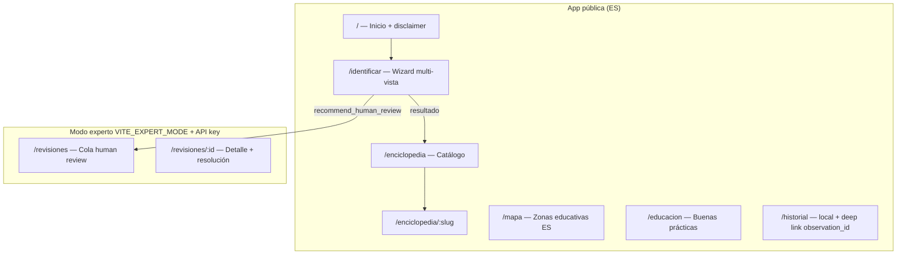
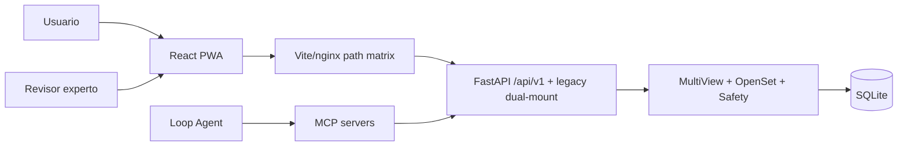
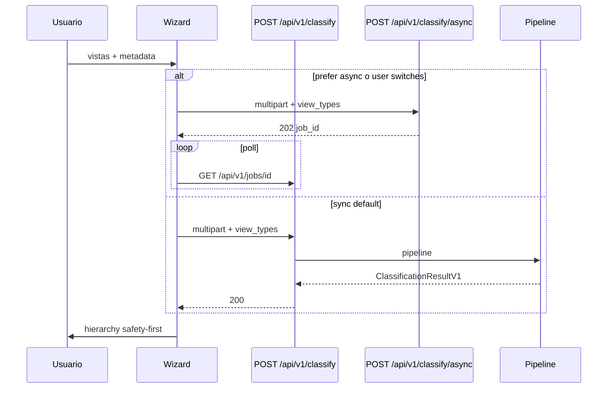
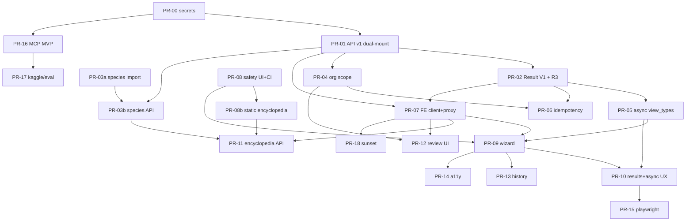

# VisionSetil — Rediseño completo de app + APIs + MCPs (Loop Engineering industrial)

| Campo | Valor |
|-------|--------|
| **Título** | Rediseño industrial VisionSetil: UX safety-first, API v1 unificada, MCPs de agente |
| **Autor** | Loop Engineering / TBD |
| **Fecha** | 2026-07-16 |
| **Estado** | Draft |
| **Versión doc** | 0.3.0 (compat body dual-mount + form metadata + mapper) |
| **Producto** | VisionSetil (mushroom-photo-id) v0.3.0 → v0.4.x |
| **Referencias fundacionales** | `VISION.md`, `ARCHITECTURE.md`, `RULES.md` (R1–R7), `MEMORY.md`, `docs/SAFETY_POLICY.md`, `docs/ROADMAP.md`, skills `.grok/skills/*` |

---

## Overview

VisionSetil es un sistema **safety-first** de identificación **orientativa** de setas a partir de fotografías multi-vista y metadatos de campo. Nunca da consejo de consumo. El producto ya tiene un backend FastAPI rico (pipeline multi-vista, open-set rejection, human review, jobs async) y un frontend React PWA en español; sin embargo, el FE solo consume un subconjunto del backend (`POST /classify` + feedback + health), la enciclopedia vive en datos estáticos desacoplados del catálogo servidor, no existe consola de revisión humana, y las rutas de clasificación se solapan (`/classify` vs `/observations/{id}/classify` vs `classify-advanced`).

Este documento propone un **rediseño completo** (UX + arquitectura FE + contrato API versionado + superficie MCP) alineado con R1–R7 y el roadmap N+1…N+4, descompuesto en **PRs incrementales mergeables** para el bucle industrial: *design → implement → evaluate*.

**Solución propuesta en una frase:** unificar el contrato bajo `/api/v1` (con matriz de proxy FE explícita), guiar al usuario con un **wizard multi-vista canónica**, jerarquizar resultados por seguridad, migrar contenido de enciclopedia FE→BE de forma faseada, exponer consola experta de human-review (`VITE_EXPERT_MODE` + API key existente), y dotar a los agentes de MCPs con secretos solo por entorno — empezando por **PR-00 de scrub de credenciales**.

---

## Background & Motivation

### Estado actual verificado en código

| Capa | Realidad hoy | Dolor |
|------|--------------|--------|
| **Backend entry** | `backend/app/main.py` monta 12 routers sin prefijo de versión; OpenAPI `title="mushroom-photo-id"` | Breaking changes difíciles |
| **Classify simple (FE)** | `POST /classify` → crea `Observation`, multi-view classifier, mapea a `SimpleClassificationResult` | FE no envía `view_types`; historial solo en `localStorage` |
| **Classify advanced** | `POST /observations/{id}/classify` (**MockMushroomClassifier**) y `.../classify-advanced` (pipeline real) | Duplicación; mock en path “prod-looking” (riesgo R3); safety tests apuntan al mock |
| **Species** | Solo `GET /species/poisonous`; `mock_species_catalog.json` mínimo | Enciclopedia FE (~1500+ líneas ES en `mushroomDatabase.ts` + extended/additional) no usa backend |
| **Human review** | CRUD + batch-assign + stats + export JSON + safety language filter | **Sin UI** en frontend; list/get sin filtro `organization_id` |
| **Jobs** | `POST /classify/async`, `GET /jobs/{id}`, `.../result` (org-scoped) | FE axios timeout 60s síncrono; no polling; async **no acepta `view_types`**; result = dump de `ClassificationResponse` |
| **FE proxy** | `baseURL = VITE_API_URL \|\| '/api'`; Vite `rewrite: /api → ''` → `POST /api/classify` llega a BE `POST /classify` | Cualquier montaje `/api/v1` en BE sin reescribir proxy **rompe** el path |
| **FE API client** | Solo `classifyImages`, `submitFeedback`, `checkHealth` | Sin observations, species, jobs, human-reviews |
| **Design system** | Tokens CSS en `styles/global.css` (incl. `--safe` verde) | Usado como “edible OK”; sin Tailwind; vitest sí, Playwright no en `package.json` |
| **MCP** | `.cline/mcp_settings.json` solo Kaggle; **credenciales reales en archivo trackeado**; `.gitignore` no ignora el file | Exposición activa de secretos (CI gitleaks); superficie insuficiente para Loop Engineering |
| **Auth** | `APIKeyMiddleware`: `API_KEYS="key"` o `key:org_id` → `request.state.organization_id` | **No hay scopes/roles** (`reviewer`, etc.) |
| **DB** | SQLite + SQLAlchemy 2 (`Observation`, `ObservationImage`, `HumanReviewRequest`, `ClassificationJob` con `organization_id`) | `GET /observations` devuelve **todas** las filas sin filtro org; Postgres = fase N+4 |

### Pain points de producto / seguridad

1. **Falsa confianza en UI de resultados.** `ResultCard.tsx` mapea `edibility: 'edible'` → **«Comestible»** y `safety_level: 'safe'` → **«Segura»** 🟢 — violación de framing R1 / SAFETY_POLICY (aunque el BE suele emitir `unsafe_to_consume`, el mapping es hazard y dead code peligroso).
2. **Enciclopedia + prosa estática** con filtros y textos de comestibilidad en `mushroomDatabase.ts` / `extendedSpecies.ts` / `additionalSpecies.ts` (superficie R1 mucho mayor que un solo componente).
3. **Upload libre** sin wizard canónico; backend ya acepta `view_types` en `/classify`.
4. **Open-set** first-class en BE pero secundario en UX de “éxito”.
5. **Credenciales Kaggle en config trackeada** + agentes sin tools de dominio seguros.

### Motivación

- Cerrar N+2 (FE/gateway), preparar N+3 (review loop) y N+4 (async real / Postgres) sin big-bang.
- PRs pequeños, contratos tipados, gates de safety en CI.
- Loop Engineering con MCP + skills, **sin secretos en git**.

---

## Goals & Non-Goals

### Goals

1. UX safety-first ES: wizard multi-vista, jerarquía de resultado, disclaimers no omitibles.
2. Contrato API `/api/v1` con **path matrix** FE/proxy/prod/MCP coherente.
3. FE: cliente tipado, design tokens, tests + safety-copy CI temprano.
4. Enciclopedia: **estrategia de contenido** (import FE→BE) faseada, no endpoints vacíos.
5. Consola human-review con auth realista (flag + API key existente).
6. MCP industrial; **PR-00 scrub de secretos primero**.
7. PR plan con tamaños, tracks paralelos BE/FE y gates de safety.

### Non-Goals

- Reentrenar modelos ML en este tramo.
- Multi-tenant completo / SSO / RBAC fino (solo org_id existente).
- Postgres/Celery obligatorios (N+4).
- i18n multi-idioma.
- Integración mushroom.id sin decisión de producto.
- WebSocket de progreso en el MVP de este rediseño (KD-15).
- Inventar API key scopes `reviewer` en este programa (KD-14).

---

## Proposed Design

### A. Product / UX redesign

#### A.1 Information architecture (IA) safety-first



| Principio | Implementación UX |
|-----------|-------------------|
| Safety over accuracy | Banner sticky + footer; deadly full-screen alert |
| Conservative | `rejected` = éxito de seguridad, no error de app |
| Multi-view | Wizard 4 slots; mínimo viable gills+front |
| Transparent | Confianza + razones open-set visibles |
| No consumo | **Solo labels de riesgo/toxicidad**; nunca “comestible OK” / “segura para comer” (KD-13) |

#### A.2 Wizard multi-vista

Alinear con `CANONICAL_VIEWS = ("gills", "front", "habitat", "detail")` y form field `view_types` (sync **y** async).

**Slots:**

| Slot | Label UX (ES) | Prioridad |
|------|---------------|-----------|
| `gills` | Laminillas / himenio | **Mínimo recomendado** (mejora evidencia) |
| `front` | Sombrero / perfil | **Mínimo recomendado** |
| `habitat` | Hábitat / entorno | **Recomendado** — mejora evidencia y metadata; **no** hard-reject automático solo por falta de foto de hábitat |
| `detail` | Detalle pie/base o macro | Recomendado |

**Submit rules (MVP):**

- Permitir envío con **≥1 imagen**; advertir si faltan gills o front.
- No bloquear solo por falta de `habitat`/`detail`; checklist pre-API de `missing_evidence` esperable.
- Open-set en BE usa confianza/margen/penalización de evidencia (`open_set_rejection.py`); faltantes de vistas bajan evidence score y pueden contribuir a rechazo, **sin** regla documentada “must have habitat image or reject”.

**Pasos:** safety ack → slots de vistas → fotos extra opcionales (máx 10) → **metadatos ampliados** → revisión → classify.

**Metadatos — tres capas distintas (no confundir):**

| Campo | FE client hoy | `Observation` model / `ObservationCreate` JSON | `POST /classify` & `/classify/async` **Form** hoy |
|-------|---------------|------------------------------------------------|---------------------------------------------------|
| `title` | sí | sí | sí |
| `country`, `region` | sí | sí | sí |
| `habitat`, `substrate`, `smell`, `notes` | sí | sí | sí |
| `view_types` | **no** (enviar) | vía `ObservationImage.view_type` | sí en `/classify`; **no** en `/classify/async` aún |
| `persist` | n/a | n/a | sí solo sync |
| `nearby_trees` | **no** | sí (JSON list) | **no** (`_build_observation` hardcodea `[]`) |
| `color_change_on_cut` | **no** | sí | **no** |
| `altitude_m` | **no** | sí | **no** |
| `approx_location` | **no** | sí | **no** |
| `observed_at` | **no** | sí | **no** |
| `latitude` / `longitude` | **no** | sí | **no** |

**Política de expansión (KD-20):**

1. **PR-05 / PR-09b (BE, obligatorio antes o con el wizard):** extender Form multipart de **ambos** `POST /classify` y `POST /classify/async` (+ dual-mount) con:
   - ya existentes + `view_types` (async)
   - `nearby_trees` (string JSON array o CSV; parse en `_build_observation`)
   - `color_change_on_cut`, `altitude_m`, `approx_location`, `observed_at` (ISO date string), `latitude`, `longitude` (float strings)
2. Tests BE: form fields se persisten en `Observation` y llegan al pipeline metadata encoder.
3. **PR-09 (FE):** solo envía FormData keys que el BE ya acepta; no “silent no-op”.
4. Lat/lon: opcionales + aviso privacidad en UI; strip EXIF sigue siendo independiente.

Siempre enviar `view_types` CSV alineado al orden de `images`.

#### A.3 Jerarquía de pantalla de resultado

Orden fijo:

1. Safety block — `final_warning`, copy canónico `orientation_only` / `unsafe_to_consume`
2. Decision — `accepted` | `rejected` + reasons
3. Risk state — enum de `ALLOWED_RISK_STATES` (no mapping a “Segura”)
4. Top-k — científico primario; **`risk_label`** (nunca “edible OK”)
5. Evidencia — missing / quality / questions
6. Lookalikes peligrosos
7. Educación / CTA human-review / feedback

#### A.4 Enciclopedia, mapa, educación — **estrategia de contenido**

**Problema de paridad:** el FE tiene contenido educativo ES grande; el BE solo poisonous + mock catalog mínimo. Un `GET /species` “seed from mock JSON” **no** sustituye la enciclopedia actual.

**Estrategia elegida (KD-7 / KD-13): import FE estático → seed BE (ES) → FE lee API, con fase de rewrite risk-first en estático.**

| Fase | Qué | PR |
|------|-----|-----|
| **E0** | Rewrite risk labels + ban strings en estático FE (sin esperar API) | PR-08 / PR-08b |
| **E1** | **Canonical:** `scripts/export_fe_species_json.mjs` (o `.ts`) → `data/species_fe_export.json` (artefacto JSON versionado/CI) → `scripts/import_fe_species_to_backend.py` → `backend/app/data/species_catalog_es.json` + seed. **No** parsear TS como input canónico (opcional sugar). Asserts: count ≥ N, slug único | PR-03a |
| **E2** | `GET /api/v1/species`, `/{slug}`, `/poisonous` sirviendo el catálogo importado; filtros por **risk**, familia, hábitat, estación — **sin dimensión comestible** | PR-03b |
| **E3** | FE consume API + snapshot offline generado; deprecar edición manual de `mushroomDatabase.ts` | PR-11 |
| **E4** (post-MVP) | Enriquecer con species_index / taxonomy DB; imágenes propias vs Wikipedia | backlog |

**Schema mínimo para paridad `SpeciesDetail`:**

```text
slug, scientific_name, common_names[], family,
tagline, description, habitat, season,
morphology: { cap, stem, hymenium },
risk_label: deadly|poisonous|toxic|unknown_or_risky|not_for_consumption_guidance,
toxicity_notes?, key_features[], dangerous_lookalikes[],
categories[], icon?, featured?,
source: "fe_import_v1" | "poisonous_json" | "species_index"
```

**Legacy edibility** del FE se mapea en el import a `risk_label` (nunca se expone como permiso de consumo):

| EdibilityLevel FE legacy | risk_label API |
|--------------------------|----------------|
| `mortifero` | `deadly` |
| `toxico` | `toxic` / `poisonous` |
| `no_recomendado`, `desconocido` | `unknown_or_risky` |
| `excelente`, `buen_comestible`, `comestible_con_cautela` | `not_for_consumption_guidance` (+ disclaimer en ficha) |

**Snapshot offline budget:** target ≤ 2 MB gzip; si excede, snapshot = list cards + lazy detail from API / chunk by letter.

**Mapa:** permanece estático (`mushroomZones.ts`) en este programa.  
**Educación:** ampliar módulos multi-vista / open-set / no consumo; sin recetas.

#### A.5 Consola human-review

- Rutas `/revisiones`, `/revisiones/:id` detrás de `VITE_EXPERT_MODE=1`.
- Auth v1: misma API key que classify cuando `API_KEYS` está activo (**sin scopes inventados** — KD-14).
- UI: lista (status/priority/assigned), detalle (imágenes + metadata + last classification), resolución, batch assign, stats.
- **Export:** cablear `GET /human-reviews/export/json` (ya existe en `routes_human_review.py`).

#### A.6 Accesibilidad, mobile, PWA

- WCAG 2.1 AA gradual; focus trap cámara; `role="alert"` deadly.
- `prefers-reduced-motion`.
- PWA: shell + species snapshot; classify requiere red.
- ES primario.

---

### B. Frontend architecture redesign

#### B.1 Estructura objetivo

```
frontend/src/
  app/                 # providers, router, error boundaries
  pages/
  features/
    identify/          # wizard state machine
    results/           # hierarchy components
    encyclopedia/
    review/
    history/
  components/ui/       # RiskBadge, DeadlyAlert, OrientationBanner
  api/
    client.ts          # axios + request-id; baseURL matrix
    types.ts           # V1 types
    endpoints/
  state/
  data/                # generated snapshot only (post E3)
  styles/              # tokens; risk scale replaces edible-green
  test/
```

#### B.2 State

- Context + state machine identify: `safety_ack → views → metadata → review → submitting → result | error`.
- Historial: **localStorage** + opcional deep link `?observation_id=` (KD-17); sin auth de usuario en este programa.
- TanStack Query: opcional post-MVP (no bloqueante).

#### B.3 Typed API layer + path matrix

Ver **C.1 Path mapping matrix**. Cliente:

| Función | Path canónico (tras proxy rewrite o absolute) |
|---------|-----------------------------------------------|
| `classifyImages` | `POST {API}/classify` |
| `classifyAsync` | `POST {API}/classify/async` |
| `getJob` / `getJobResult` | `GET {API}/jobs/{id}` … |
| observations / species / human-reviews / feedback | bajo mismo prefijo |
| `health` | **unversioned** `GET /health` (proxy exception o absolute) |

#### B.4 Design system: tokens (no Tailwind)

Mantener CSS tokens. Evolución:

- Dejar de usar `--safe` para “comestible OK”.
- Introducir `--risk-unknown`, `--risk-toxic`, `--risk-deadly`.
- Dark mode se mantiene.

#### B.5 Testing

| Capa | Tool | Notas |
|------|------|-------|
| Unit/component | vitest + Testing Library | risk mappers, wizard, ban strings |
| Safety-copy CI | script + job | **con PR-08**, no esperar PR-15 |
| Contract smoke | golden JSON / OpenAPI | **con PR-02**; FE types check con PR-07 |
| E2E | **añadir Playwright** en PR-15 | smoke identify + rejected + deadly |

#### B.6 Performance + classify timing (cliente)

| Métrica | Objetivo |
|---------|----------|
| JS critical gzip | ≤ 150 KB |
| Code-split | encyclopedia, map, review, leaflet |
| LCP mobile | ≤ 2.5 s shell |
| Snapshot | ≤ 2 MB gzip |

**Algoritmo classify FE (PR-10) — sin doble carga GPU por defecto:**

```text
1. Prefer async cuando: Prefer: respond-async, device slow, o flag VITE_CLASSIFY_ASYNC=1
2. Default sync: POST /classify (timeout axios 60s)
3. A t=8s: UI “Sigue procesando…” (no cancelar sync; no lanzar async en paralelo)
4. Si el usuario elige “Cambiar a segundo plano” antes de respuesta:
   - cancelar request sync (AbortController)
   - POST /classify/async con mismos bytes/metadata/view_types
   - poll GET /jobs/{id} cada 1–2s hasta completed|failed
5. Nunca sync+async concurrentes con las mismas imágenes
```

---

### C. API redesign / improvements

#### C.1 Versionado, layout y **Path mapping matrix**

**Canonical mount (elegido):** backend registra dominio en `prefix="/api/v1"`. Handlers legacy dual-mounted en root **sin redirect** (Issue 5).

```
/api/v1/*            # contrato estable
/classify            # dual-mount legacy (same handler) + Deprecation headers
/health, /readyz     # unversioned ops
/metrics
/uploads/*
```

##### Path mapping matrix

| Entorno | Cliente llama | Proxy / gateway | Backend recibe | Notas |
|---------|---------------|-----------------|----------------|-------|
| **Dev FE hoy** | `POST /api/classify` (`baseURL='/api'`) | Vite rewrite `/api` → `''` | `POST /classify` | Estado actual |
| **Dev FE target** | `POST /api/v1/classify` (`baseURL='/api/v1'`) | Vite: **dejar de strippear a vacío**; rewrite identidad `/api`→`/api` **o** proxy solo `/api` sin strip de `/v1` | `POST /api/v1/classify` | Coordinar PR-01 + cambio `vite.config.ts` en PR-07 |
| **Dev alt** | `VITE_API_URL=http://localhost:8000/api/v1` | sin proxy | `POST /api/v1/classify` | Útil para MCP/tools |
| **Prod nginx** | browser `/api/v1/*` | `location /api/ { proxy_pass http://backend; }` **sin** strip de `/api` | `/api/v1/*` | Si hoy strippea `/api`, hay que cambiar config o montar BE en `/v1` — **elegimos no strippear** |
| **Health dev** | `GET /api/health` (FE helper, **no** vía `baseURL` v1) | Proxy **específico primero** → rewrite a `/health` | `GET /health` | Ver abajo: `checkHealth` no debe usar axios `baseURL='/api/v1'` |
| **MCP** | `VISIONSETIL_BASE_URL=http://127.0.0.1:8000` + paths `/api/v1/...` y `/health` | n/a | directo | No usar prefijo `/api` del Vite |

**Cambio Vite concreto (PR-07, deps PR-01) — orden de keys importa:**

En http-proxy / Vite, las rutas **más específicas deben ir antes** del prefijo amplio `/api`. Si `/api` se registra primero, `/api/health` se reenvía como `/api/health` al BE → 404.

```ts
// client: baseURL = import.meta.env.VITE_API_URL || '/api/v1'
// checkHealth: NO client.get('/health')  → eso iría a /api/v1/health

proxy: {
  // 1) Específicos PRIMERO
  '/api/health': {
    target: 'http://localhost:8000',
    changeOrigin: true,
    rewrite: () => '/health',
  },
  '/api/readyz': {
    target: 'http://localhost:8000',
    changeOrigin: true,
    rewrite: () => '/readyz',
  },
  // 2) Amplio DESPUÉS — sin strip de /api (BE sirve /api/v1/*)
  '/api': {
    target: 'http://localhost:8000',
    changeOrigin: true,
  },
}
```

**Alternativa equivalente (un solo proxy):**

```ts
'/api': {
  target: 'http://localhost:8000',
  changeOrigin: true,
  rewrite: (path) => {
    if (path === '/api/health' || path.startsWith('/api/health?')) return '/health'
    if (path === '/api/readyz' || path.startsWith('/api/readyz?')) return '/readyz'
    return path // /api/v1/... intacto
  },
}
```

**`checkHealth` FE (PR-07) — URL definitiva:**

```ts
// Preferido en dev con proxy:
await axios.get('/api/health', { timeout: 5000 })  // instancia SIN baseURL v1
// o: fetch(`${window.location.origin}/api/health`)
// Si VITE_API_URL es absoluto http://host:8000/api/v1:
//   healthUrl = new URL(VITE_API_URL).origin + '/health'
```

Smoke en PR-07: `checkHealth() === true` contra stack dev.

**`PUBLIC_PATHS`** en `api_key_auth.py`: mantener `/health`, `/readyz`, docs. OpenAPI paths con prefix `/api/v1`.

#### C.2 Unificación classify

| Modo | Endpoint canónico | Uso |
|------|-------------------|-----|
| Sync | `POST /api/v1/classify` | multipart + metadata + `view_types` → **`ClassificationResultV1` (+ aliases de sunset, ver abajo)** |
| Async | `POST /api/v1/classify/async` | **slash path** (no colon); 202 + job; **mismos form fields que sync**, incl. `view_types` |
| Observation | `POST /api/v1/observations` → images → `POST .../classify` | Expertos; **mismo pipeline** que sync (no mock) |

**R3 — mock / fallback (alinear con código existente, KD-19):**

- `POST .../classify` (observation) **debe** invocar el mismo servicio que `/classify` (`get_multi_view_classifier` / advanced pipeline).
- El knobs real del repo es `settings.model_fallback_to_mock` (`config.py`, default hoy **True** en dev) usado por `multi_view_classifier.py` cuando faltan pesos.
- **No introducir un segundo flag** `ALLOW_MOCK_CLASSIFIER` como fuente de verdad. Si se desea el nombre, es **alias de env** del mismo setting (p.ej. leer ambos → un solo bool).
- **Targets:**
  - **dev/CI sin pesos:** `model_fallback_to_mock=true` permitido; logs WARNING; UI no implica certeza de prod.
  - **staging/prod:** `MODEL_FALLBACK_TO_MOCK=false` (fail closed: error/503 claro, no predicciones mock silenciosas). Opcional: `readyz_fail_on_mock_models=true` para que `/readyz` falle si el stack es mock.
- Safety tests: paths prod `/classify` y `/api/v1/classify` + observation unificado; unit tests del mock por separado.

##### Compatibilidad de **cuerpo** JSON en dual-mount (KD-21) — **elegido: aliases de sunset**

Dual-mount de **URL** no basta: el FE actual usa `predictions[].species` y `predictions[].edibility` (`types.ts`, `ResultCard.tsx`). Un V1 puro en legacy rompe entre PR-02 y PR-07/08.

| Opción | Descripción | Decisión |
|--------|-------------|----------|
| **A — Aliases en respuesta (elegida)** | Un solo mapper `_map_to_v1` emite campos canónicos **y** aliases deprecados durante el sunset | **Sí** |
| B — Dual schema (legacy Simple vs v1 puro) | Dos mappers / dos response models por path | Más código; divergencia de tests |
| C — Release train acoplado PR-02+07+08 | Flag `CLASSIFY_RESPONSE_V1` | Frágil en monorepo local; no elegido como primario |

**Política A (sunset ≥2 sprints, removidos en PR-18):**

```python
class SpeciesPredictionV1(BaseModel):
    taxon: str
    species: str  # ALIAS sunset: always == taxon (FE legacy)
    common_name: str | None = None
    confidence: float
    risk_label: RiskLabel
    edibility: str  # ALIAS sunset: NEVER consumable; always non-permission value
    # ...
```

Reglas de aliases:

1. `species` := `taxon` (siempre idénticos mientras exista el alias).
2. `edibility` (deprecated) := valor **no consumible** derivado de `risk_label` solo para no romper tipos FE viejos:
   - `deadly` → `"deadly"`
   - `poisonous` / `toxic` → `"poisonous"` / `"toxic"`
   - resto → **`"dangerous_or_unknown"`** (nunca `"edible"`, nunca `"safe"`).
3. Campos canónicos nuevos (`taxon`, `risk_label`, `status`, `safety_level`) siempre presentes.
4. OpenAPI marca `species` y `edibility` como `deprecated: true`.
5. Headers: `Deprecation: true`, `Link: </api/v1/classify>; rel="successor-version"` en paths legacy.
6. FE PR-07/08 debe migrar a `taxon` + `risk_label`; tests de ban-string prohíben renderizar `edibility` como “Comestible”.
7. PR-18 elimina aliases cuando `legacy_classify_total≈0` y FE no lee `species`/`edibility`.

**Mismo body** en `/classify` dual-mount y `/api/v1/classify` durante el sunset (un handler, un schema con aliases). Tras PR-18, schema puro sin aliases.

**Deprecación de paths (dual-mount URL, NO 308):**

| Legacy path | Acción |
|-------------|--------|
| `POST /classify`, `POST /classify/async` | Mismo handler + headers Deprecation/Link + body con aliases |
| `POST /observations/{id}/classify-advanced` | Alias de `.../classify` unificado |
| Sunset paths + aliases | PR-18 tras telemetría y FE migrado |

**No usar HTTP 308/307 en multipart POST.**

#### C.3 Contrato `ClassificationResultV1` + tabla de mapeo

Constantes BE (`app/core/safety.py`):

- `status` = `ORIENTATION_ONLY_STATUS` → `"orientation_only"`
- `safety_level` = `UNSAFE_TO_CONSUME` → `"unsafe_to_consume"`
- `risk_state` ∈ `ALLOWED_RISK_STATES`:
  - `needs_more_evidence`
  - `needs_expert_review`
  - `high_risk_lookalikes`
  - `unknown_or_out_of_distribution`
- `final_warning` = `FINAL_WARNING` (texto canónico)

```python
class SpeciesPredictionV1(BaseModel):
    taxon: str
    species: str  # sunset alias == taxon (KD-21); remove PR-18
    common_name: str | None = None
    confidence: float
    rank: str | None = None  # species|genus|unknown
    risk_label: Literal[
        "deadly", "poisonous", "toxic",
        "unknown_or_risky", "dangerous_or_unknown",
        "not_for_consumption_guidance",
    ]
    edibility: str  # sunset alias only; never edible/safe (KD-21)
    lookalikes: list[str] = []
    explanation: str | None = None

class ClassificationResultV1(BaseModel):
    request_id: str
    observation_id: int | None
    processing_time_ms: int
    status: Literal["orientation_only"] = "orientation_only"
    safety_level: Literal["unsafe_to_consume"] = "unsafe_to_consume"
    final_warning: str
    risk_state: str  # constrained to ALLOWED_RISK_STATES
    decision: Literal["accepted", "rejected"]
    rejection_reason: str | None = None
    open_set: OpenSetResponse | None = None
    predictions: list[SpeciesPredictionV1]
    missing_evidence: list[str] = []
    quality_warnings: list[str] = []
    warnings: list[str] = []
    dangerous_lookalikes: list[str] = []
    questions_for_user: list[str] = []
    explanation: str | None = None
    recommend_human_review: bool = False
    human_review: HumanReviewResponse | None = None
    model_stack: ModelStackResponse | None = None
    trace: TraceResponse | None = None  # detail=full only
    message: str | None = None  # PRIMARY_MESSAGE
```

##### `risk_label` pure mapper (PR-02, unit-tested)

Ubicación propuesta: `backend/app/core/risk_label.py` (o `services/risk_label_mapper.py`).

```python
RiskLabel = Literal[
    "deadly", "poisonous", "toxic",
    "unknown_or_risky", "dangerous_or_unknown",
    "not_for_consumption_guidance",
]

def map_risk_label(
    *,
    taxon: str,
    risk_level: str | None,
    edibility_label: str | None,
    deadly_taxa: set[str],
    poisonous_taxa: set[str],
    high_risk_genera: set[str] | None = None,
) -> RiskLabel:
    """Ordered rules — never returns consumable-permission labels."""
    t = (taxon or "").strip()
    tl = t.lower()
    genus = tl.split()[0] if tl else ""

    # 1) Catalog / list wins (deadly before poisonous)
    if tl in {x.lower() for x in deadly_taxa} or any(
        tl.startswith(x.lower()) for x in deadly_taxa
    ):
        return "deadly"
    if high_risk_genera and genus in {g.lower() for g in high_risk_genera}:
        # genus elevation is risk signal, not species ID
        if genus in {"amanita", "galerina", "cortinarius", "lepiota", "gyromitra"}:
            return "poisonous"  # conservative; UI still unsafe_to_consume
    if tl in {x.lower() for x in poisonous_taxa}:
        return "poisonous"

    # 2) Explicit risk_level from ranker/catalog
    rl = (risk_level or "").lower().strip()
    if rl in ("deadly", "poisonous", "toxic"):
        return rl  # type: ignore[return-value]
    if rl in ("high", "critical"):
        return "unknown_or_risky"
    if rl in ("low", "medium", "unknown"):
        pass  # fall through

    # 3) edibility_label from SafetyLayer (often dangerous_or_unknown)
    el = (edibility_label or "").lower().strip()
    if el in (
        "deadly", "poisonous", "toxic",
        "unknown_or_risky", "dangerous_or_unknown",
        "not_for_consumption_guidance",
    ):
        return el  # type: ignore[return-value]
    # 4) Never trust edible/safe-like strings
    if el in ("edible", "safe", "safe_to_eat", "comestible", "excelente"):
        return "dangerous_or_unknown"

    # 5) Default conservative
    return "dangerous_or_unknown"


def deprecated_edibility_alias(risk_label: RiskLabel) -> str:
    """Sunset FE field — never edible/safe."""
    if risk_label == "deadly":
        return "deadly"
    if risk_label in ("poisonous", "toxic"):
        return risk_label
    return "dangerous_or_unknown"
```

**Unit tests (PR-02):** deadly taxon → `deadly`; high risk_level → `unknown_or_risky`; `edibility_label=edible` → `dangerous_or_unknown`; default empty → `dangerous_or_unknown`; alias `species==taxon`; alias edibility never edible.

##### Field mapping: `ClassificationResponse` → `ClassificationResultV1` → FE

| ClassificationResponse | ClassificationResultV1 | FE display |
|------------------------|------------------------|------------|
| (generated) | `request_id` | correlation / feedback |
| `observation_id` | `observation_id` | history deep link |
| `status` | `status` (force orientation_only) | banner copy |
| `safety_level` | `safety_level` (force unsafe_to_consume) | never “Segura” |
| `risk_state` | `risk_state` | badge riesgo |
| `open_set.is_unknown_or_uncertain` | `decision=rejected` | rejection banner |
| `open_set.reason` / reasons | `rejection_reason` + `open_set` | texto rechazo |
| `top_candidates[]` / `candidates[]` | `predictions[]` | top-k list |
| `candidate.taxon` | `predictions[].taxon` **and** `.species` (alias) | científico; legacy FE lee `species` |
| `candidate` common if any / catalog | `predictions[].common_name` | **poblar** (hoy `_map_to_simple` lo deja null) |
| `candidate.confidence` | `predictions[].confidence` | barra + interpretación |
| `candidate.risk_level` + `edibility_label` + taxon lists | `predictions[].risk_label` via `map_risk_label` | risk badge only |
| (derived) | `predictions[].edibility` = `deprecated_edibility_alias(risk_label)` | sunset only; PR-08 no “Comestible” |
| `candidate.lookalikes` | per-pred + rollup `dangerous_lookalikes` | sección lookalikes |
| `missing_evidence` | same | checklist |
| `quality_assessment.quality_warnings` | `quality_warnings` | warnings UI |
| `warnings` | `warnings` | list |
| `dangerous_lookalikes` | same | critical list |
| `questions_for_user` | same | follow-ups |
| `explanation` | `explanation` | education |
| `human_review.recommended` | `recommend_human_review` | CTA |
| `human_review` | `human_review` | expert |
| `model_stack` | `model_stack` | detail panel |
| `trace` | `trace` if detail=full | expert/debug |
| `final_warning` | `final_warning` | sticky |
| `message` | `message` | secondary |
| — | `processing_time_ms` | perf debug |

**Job result:** `GET /jobs/{id}/result` y `job.result` almacenan el **mismo** schema V1 (+ aliases de sunset) vía `_map_to_v1`. Sync y async comparten response model.

**Post PR-18:** eliminar `species`/`edibility` del schema; FE solo `taxon`/`risk_label`.

#### C.4 Error model

RFC 7807-ish problem+json con `request_id`. Códigos: `validation`, `unsupported_media`, `rate_limited`, `unauthorized`, `not_found`, `conflict_job_running`, `conflict_idempotency_in_flight`, `safety_policy_violation`, `service_unavailable_models`.

#### C.5 Paginación

Envelope `{ items, total, limit, offset }` en observations, species, human-reviews.

#### C.6 Species catalog API

Endpoints tras import (PR-03b):

| Método | Ruta | Descripción |
|--------|------|-------------|
| GET | `/api/v1/species` | Lista + q + risk + family |
| GET | `/api/v1/species/{slug}` | Detalle ES |
| GET | `/api/v1/species/poisonous` | Compat |
| GET | `/api/v1/species/lookalikes/{taxon}` | Lookalikes |

**Slug (KD-16):** `slugify(scientific_name)` ASCII lower (e.g. `amanita-phalloides`); common name solo search, no primary key.

#### C.7 Jobs / progreso

- Path: `POST /api/v1/classify/async` (y dual-mount legacy `/classify/async`).
- Form: mismos campos que sync + **`view_types`**; persistir `ObservationImage.view_type` en upload.
- Worker: `view_types` from images/DB; result = `ClassificationResultV1`.
- Columns nuevas: `stage`, `percent` (opcional null).
- Polling: `GET /api/v1/jobs/{id}`.
- **WebSocket: fuera de MVP** (KD-15); backlog GW-3.

#### C.8 Idempotency (detalle)

| Aspecto | Spec |
|---------|------|
| Header | `Idempotency-Key` (UUID/client) en `POST /classify`, `/classify/async`, `POST /observations` |
| Scope | único por `organization_id` + key |
| Fingerprint | SHA-256 de (sorted image content digests + canonical JSON metadata + view_types) |
| Hit completed | devolver **misma** response body + mismos `observation_id` / `request_id` (replay); no re-ejecutar pipeline |
| In-flight | si primera request aún corre: **409** `conflict_idempotency_in_flight` con `Retry-After` o job_id si async |
| Mismatch | misma key, distinto fingerprint → **422** |
| Storage | tabla `IdempotencyRecord(key, org_id, fingerprint, status, response_json, observation_id, created_at)` |
| TTL | 24h; purge periódico (startup task o cron script) |
| Side effects | imágenes/observation se crean solo en primer accept del lock; retries no duplican filas |
| Tests | double-submit sync; in-flight; mismatch fingerprint |

#### C.9 Auth (realista)

- `APIKeyMiddleware` actual: `key` o `key:org_id` → `organization_id`.
- FE: `VITE_API_KEY` cuando auth enabled.
- **Expert console v1 (KD-14):** `VITE_EXPERT_MODE=1` + misma API key; **sin** scopes `reviewer`. Documentar “no RBAC fino aún”.
- Mutaciones human-review: cuando auth enabled, requieren key válida (igual que classify); cuando auth disabled (dev), abiertas con org `default`.
- Futuro (fuera de scope): mapa scopes / SSO.

#### C.10 Org-scope checklist (PR-04)

| Superficie | Comportamiento |
|------------|----------------|
| `GET/POST /observations` | filter/set `organization_id` del request |
| `GET /observations/{id}` | 404 si otra org (no 403 para no filtrar existencia) |
| `POST .../images` | verificar observation.org == caller.org |
| `POST .../classify`, request-human-review | mismo ownership |
| `GET/PATCH /human-reviews*` | filter por org; batch-assign/export/stats scoped |
| `GET /human-reviews/export/json` | scoped |
| Jobs | ya scoped — mantener |
| Auth disabled | todo `organization_id="default"` |
| Tests | cross-org 404 matrix |

---

### D. MCP improvements

> **CRÍTICO:** Nunca copiar valores de keys en este doc ni en el repo. **PR-00** es el primer merge del programa.

#### D.0 PR-00 — Secret scrub (inmediato)

1. **Rotar** la Kaggle API key expuesta en el account de Kaggle (operación humana; no documentar el valor).
2. Dejar de trackear secretos: añadir `.cline/mcp_settings.json` a `.gitignore`.
3. Commit `.cline/mcp_settings.example.json` solo con placeholders `${env:KAGGLE_USERNAME}` / `${env:KAGGLE_KEY}`.
4. Si el file ya está en historial git remoto: seguir playbook de rotación + purga (operational follow-up).
5. Verificar gitleaks CI verde.

#### D.1 Servidores MCP

| Server | Runtime | Mutaciones |
|--------|---------|------------|
| **visionsetil-api** | Python package `mcp_servers/visionsetil_api` (`uv run`) | off default (`VISIONSETIL_ALLOW_MUTATIONS=0`) |
| **mycology-knowledge** | Python read-only | none |
| **kaggle-ops** | Node existing MCP **o** thin wrapper | read-only default; mutate only si `KAGGLE_ALLOW_MUTATIONS=1` |
| **eval-metrics** | Python read-only | none; graceful empty si no hay `eval/reports/*` |

Layout repo:

```
mcp_servers/
  visionsetil_api/
  mycology_knowledge/
  eval_metrics/
  README.md
```

#### D.2 MVP tool list (PR-16)

| Server | Tool | Notes |
|--------|------|-------|
| visionsetil-api | `health_check` | GET /health |
| visionsetil-api | `get_openapi_snippet` | tag filter |
| visionsetil-api | `list_poisonous_species` | read |
| mycology-knowledge | `check_copy_safety(text)` | misma severidad que BE forbidden list + ES variants; **no más débil** |
| mycology-knowledge | `get_canonical_views` | |
| mycology-knowledge | `get_safety_rules_summary` | R1/R7 pointers |
| eval-metrics | `latest_metrics_report` | if file exists else `{status:"empty"}` |
| kaggle-ops (PR-17) | `kernel_status`, `fetch_kernel_log` | read-only first |
| kaggle-ops | `push_kernel` | only with allowlist env |

`classify_images` / `update_human_review`: post-MVP tools, gated.

`VISIONSETIL_BASE_URL` apunta a host BE directo (`http://127.0.0.1:8000`), paths `/api/v1/...`.

---

### E. Backend / data / ops alignment

#### E.1 Backend changes for FE redesign

1. PR-00 secrets hygiene (repo).
2. `/api/v1` + dual-mount legacy + path matrix docs.
3. `ClassificationResultV1` + `_map_to_v1` + sunset aliases (KD-21) + `map_risk_label`; unify mock path via `model_fallback_to_mock` (R3).
4. Species: canonical FE JSON export → catalog API (phased).
4b. Form multipart extended metadata on classify/async (KD-20).
5. Org-scope full checklist.
6. Jobs: `view_types`, V1 result, `stage`/`percent`.
7. Idempotency store detail.
8. OpenAPI title VisionSetil; contract smoke tests.
9. Export human-reviews already exists — expose under v1.

#### E.2 Static FE → backend

Ver A.4 fases E0–E3. Script de import + snapshot export bidireccional para offline.

#### E.3 SQLite → Postgres

No bloqueante; `DATABASE_URL`; Alembic antes de multi-instance.

#### E.4 CI

| Job | Cuándo |
|-----|--------|
| gitleaks / secret scan | ya + PR-00 |
| backend pytest + safety | continuo; ampliar en PR-02 |
| FE safety-copy grep | **PR-08** |
| FE lint/build/vitest | existente `frontend-build`; ampliar |
| contract smoke | PR-02 / PR-07 |
| Playwright | PR-15 (añadir dep) |
| docker | opcional |

---

### F. Architecture diagrams

#### System context



#### Identify sequence



---

## API / Interface Changes

### Antes

```
POST /classify                     → SimpleClassificationResult
POST /classify/async               → ClassificationJobRead (sin view_types)
POST /observations/{id}/classify   → ClassificationResponse (MOCK)
POST /observations/{id}/classify-advanced → ClassificationResponse
GET  /species/poisonous
GET  /human-reviews
GET  /human-reviews/export/json    # existe, FE no usa
```

### Después (v1 + dual-mount)

```
POST   /api/v1/classify
POST   /api/v1/classify/async          # slash; + view_types; result V1
GET    /api/v1/jobs/{job_id}
GET    /api/v1/jobs/{job_id}/result    # ClassificationResultV1
GET    /api/v1/observations
POST   /api/v1/observations
GET    /api/v1/observations/{id}
POST   /api/v1/observations/{id}/images
POST   /api/v1/observations/{id}/classify   # mismo pipeline prod
POST   /api/v1/observations/{id}/request-human-review
GET    /api/v1/species
GET    /api/v1/species/{slug}
GET    /api/v1/species/poisonous
GET    /api/v1/human-reviews
GET    /api/v1/human-reviews/export/json
PATCH  /api/v1/human-reviews/{id}
POST   /api/v1/human-reviews/batch-assign
GET    /api/v1/human-reviews/stats/summary
POST   /api/v1/feedback
GET    /api/v1/models/status
GET    /health
GET    /readyz
# legacy dual-mount (no 308): /classify, /classify/async, ...
```

### FE types

```ts
export type Decision = 'accepted' | 'rejected'
export type RiskState =
  | 'needs_more_evidence'
  | 'needs_expert_review'
  | 'high_risk_lookalikes'
  | 'unknown_or_out_of_distribution'
export type RiskLabel =
  | 'deadly' | 'poisonous' | 'toxic'
  | 'unknown_or_risky' | 'dangerous_or_unknown'
  | 'not_for_consumption_guidance'

export interface ClassificationResultV1 {
  request_id: string
  observation_id: number | null
  status: 'orientation_only'
  safety_level: 'unsafe_to_consume'
  risk_state: RiskState
  decision: Decision
  predictions: Array<{
    taxon: string
    species: string // sunset alias === taxon until PR-18
    common_name: string | null
    confidence: number
    risk_label: RiskLabel
    edibility: string // sunset only; never edible/safe
  }>
  // ...
}
```

---

## Data Model Changes

| Cambio | Detalle |
|--------|---------|
| `IdempotencyRecord` | key, org_id, fingerprint, status, response_json, observation_id, created_at |
| `ClassificationJob.stage` / `percent` | progress polling |
| Species catalog file/table | seed from FE import ES |
| `Observation.client_request_id` | optional |

Migraciones additive en SQLite `init_db`; Alembic antes de Postgres.

---

## Alternatives Considered

### Design system / stack (sin cambio)

| | Tokens CSS (**elegido**) | Tailwind rewrite |
|--|--------------------------|------------------|
| Esfuerzo / riesgo | Medio / bajo | Alto |

| | Vite PWA (**elegido**) | Next.js |
|--|------------------------|---------|
| Fit actual | Sí | Migración grande |

### API shim strategy (**nuevo**)

| | Dual-mount same handler + **body aliases** (**elegido**, KD-21) | Dual schema Simple vs V1 por path | HTTP 308 | Big-bang V1 puro |
|--|------------------------------------------------------------------|-----------------------------------|----------|------------------|
| Multipart URL | Seguro | Seguro | **Frágil** | Rompe FE |
| JSON body FE actual | `species`/`edibility` aliases | Compatible pero 2 mappers | N/A | Rompe hasta FE |
| Telemetría / sunset | Headers + PR-18 drop aliases | Más complejo | — | N/A |
| Esfuerzo | Bajo–medio | Medio–alto | Bajo riesgoso | Alto |

| | Dual-mount same handler (**paths**) | HTTP 308/307 redirect | Big-bang solo v1 |
|--|--------------------------------------|----------------------|------------------|
| Multipart POST | Seguro | **Frágil** (body/method) | Rompe FE actual |
| Telemetría legacy | Fácil (`legacy_classify_total`) | Difícil | N/A |
| Esfuerzo | Bajo (include router 2×) | Bajo pero arriesgado | Alto |

### Encyclopedia data strategy (**nuevo**)

| | Import FE→BE + API (**elegido**, faseado) | Solo rewrite estático FE | API mock-only seed |
|--|-------------------------------------------|--------------------------|--------------------|
| Paridad ES | Alta tras E1–E3 | Alta inmediata, dos fuentes | Baja — inutilizable |
| Source of truth | BE tras E3 | FE forever | Falsa “API” |
| Esfuerzo | M+L | S–M | S pero desperdicio |

### Classify entry

| | Convenience `/classify` + observation lifecycle (**elegido**) | Solo observation-first |
|--|--------------------------------------------------------------|------------------------|
| UX móvil | Una request | Más round-trips |
| Expertos | Observation path disponible | OK |

### Async transport

| | Polling jobs existente (**elegido** MVP) | WS progress |
|--|------------------------------------------|-------------|
| Complejidad | Baja | Media (infra) |
| Encaje código | Ya hay jobs | Nuevo |

### MCP

Multi-server + env secrets (**elegido**) vs monolito.

---

## Security & Privacy

| Amenaza | Severidad | Mitigación |
|---------|-----------|------------|
| Credenciales en git (MCP) | **Crítica** | **PR-00** rotate + gitignore + example only |
| Lenguaje consumo UI/API | **Crítica** | PR-08/08b; `risk_label`; CI ban list ES/EN |
| Cross-org data leak | Alta | Org-scope checklist PR-04 + tests |
| Multipart redirect abuse | Media | Dual-mount no 308 |
| Upload / path traversal | Alta | Existente magic bytes |
| EXIF GPS | Media | Strip opcional + aviso |
| Expert sin RBAC | Media aceptada | Flag + API key; documentar límite |

---

## Observability

- `X-Request-ID` end-to-end.
- Metrics: classify latency, reject rate, **`legacy_classify_total`**, human_review rate, idempotency hits.
- `/readyz` + models status para expert UI.
- Alerting drift/queue = N+3.

---

## Rollout Plan

**Flags:** `VITE_API_URL` / base `/api/v1`, `VITE_IDENTIFY_WIZARD`, `VITE_EXPERT_MODE`, `VITE_SPECIES_FROM_API`, `VITE_CLASSIFY_ASYNC`, BE `ENABLE_LEGACY_DUAL_MOUNT=1`.

**Staged:** PR-00 → BE v1 dual-mount → FE path matrix → safety copy → wizard → species import → expert UI.

**Rollback:** flags + dual-mount legacy; snapshot offline.

**Safety gate:** no merge si fallan `test_classification_safety` o FE safety-copy.

---

## Risks

| Riesgo | Sev | Mitigación |
|--------|-----|------------|
| Proxy path mismatch | Crítica | Path matrix + smoke e2e dev |
| Encyclopedia import incompleto | Alta | E0 rewrite primero; E1 script con tests de count |
| BackgroundTasks multi-worker | Alta | Documentar; Celery N+4 |
| Mock path residual | Alta | PR-02 unifica; `model_fallback_to_mock=false` en prod |
| Body break FE mid-PR | Alta | KD-21 aliases hasta PR-07/08/18 |
| Metadata Form silent no-op | Media | KD-20 + PR-05 before PR-09 |
| Secret history en remoto | Alta | Rotate + ops purge |

---

## Open Questions

*(Solo residuales no bloqueantes; blocking convertidos a KD-13…KD-17)*

1. ~~Edibility dimension~~ → **KD-13**
2. ~~Expert auth~~ → **KD-14**
3. ¿Siempre async en prod CPU o solo umbral/Prefer? (default: sync + opt-in async / slow device)
4. ~~WebSocket~~ → **KD-15**
5. ~~Slug~~ → **KD-16**
6. ~~Historial servidor auth~~ → **KD-17**
7. ¿Mapa a backend en este programa? **No** (estático).
8. Rotación remota git history de keys: **ops follow-up** (no bloquea diseño).
9. Nombre OpenAPI: **VisionSetil API** (recomendado).
10. TanStack Query: **post-MVP**.

---

## Key Decisions

| ID | Decisión | Rationale |
|----|-----------|-----------|
| KD-1 | API bajo `/api/v1` + **dual-mount legacy** (no 308) | Multipart-safe; D4 migration |
| KD-2 | `ClassificationResultV1` unificado; safety constants de `safety.py` | R1; un shape sync/async |
| KD-3 | Wizard multi-vista + `view_types` en sync **y** async | Backend readiness; evidencia |
| KD-4 | Result hierarchy safety-first; no “Comestible/Segura” permiso | SAFETY_POLICY |
| KD-5 | CSS tokens, no Tailwind | Coste/riesgo |
| KD-6 | Vite SPA PWA, no Next | Fit stack |
| KD-7 | Enciclopedia: **import FE ES → BE seed → API**; E0 risk rewrite en estático primero | Paridad de contenido real |
| KD-8 | Human-review UI bajo expert flag | BE listo |
| KD-9 | MCP multi-server; env secrets; **PR-00 primero** | O5; exposición activa |
| KD-10 | Postgres/Celery no bloquean | ROADMAP N+4 |
| KD-11 | FE state: Context + state machine | Complejidad adecuada |
| KD-12 | Contract + safety-copy CI tempranos | Industrial loop |
| **KD-13** | Enciclopedia/UI: **solo dimensión de riesgo**; sin filtros “comestible”; legacy edibility → `risk_label` en import | Cierra OQ-1; R1 |
| **KD-14** | Expert v1 = `VITE_EXPERT_MODE` + API key existente (`key`/`key:org`); **sin scopes reviewer** | Middleware real; evita auth inventada |
| **KD-15** | WebSocket progreso **fuera de MVP**; polling jobs | Reduce scope; jobs ya existen |
| **KD-16** | Slug = slugify(scientific_name) | Estable, i18n-safe |
| **KD-17** | Historial localStorage + deep link `observation_id`; sin cuentas de usuario en este programa | OQ-6; PR-13 viable |
| **KD-18** | Path matrix: BE `/api/v1`, Vite proxy **sin strip de `/api`**, `baseURL='/api/v1'`, health unversioned con rewrite **antes** de `/api` | path + health order |
| **KD-19** | Observation classify = pipeline prod; mock/fallback solo vía **`model_fallback_to_mock`** (prod/staging `false`; dev/CI `true` OK). No segundo flag; alias env opcional | R3; alinea `config.py` |
| **KD-20** | Metadata wizard: ampliar Form BE en classify+async **antes/con** FE; tabla model vs Form | evita silent no-op |
| **KD-21** | Dual-mount body: **aliases** `species`≡`taxon` + `edibility` no consumible durante sunset; un handler/schema; remove PR-18 | FE live no rompe entre PR-02 y PR-07 |

---

## References

- `VISION.md`, `ARCHITECTURE.md`, `RULES.md`, `MEMORY.md`
- `docs/SAFETY_POLICY.md`, `docs/ROADMAP.md`, `docs/human_review_workflow.md`, `docs/open_set_rejection.md`
- `backend/app/main.py`, `api/routes_*.py`, `db/schemas.py`, `core/safety.py`, `middleware/api_key_auth.py`
- `backend/app/services/view_classifier.py` (`CANONICAL_VIEWS`)
- `frontend/vite.config.ts` (proxy rewrite), `src/api/client.ts`, `pages/*`, `components/ResultCard.tsx`
- `frontend/src/data/mushroomDatabase.ts` (+ extended/additional)
- `.grok/skills/frontend-visionsetil`, `mycology-safety`
- `.cline/mcp_settings.json` — **scrub in PR-00; never paste secrets**

---

## PR Plan

Tamaños: **S** &lt;0.5d · **M** 1–2d · **L** 3–5d · **XL** &gt;5d  
Tracks: **BE** / **FE** / **OPS** pueden paralelizarse cuando se indica.

### PR-00 — OPS: Secret scrub MCP + gitignore + example (S) — **FIRST**
- **Files:** `.gitignore`, `.cline/mcp_settings.example.json`, remove/untrack `.cline/mcp_settings.json`, `docs/configuration.md` (rotate guidance, **no key values**)
- **Deps:** ninguna
- **Desc:** Rotar key Kaggle (humano); dejar de trackear secretos; example env-only; gitleaks verde

### PR-01 — BE: `/api/v1` dual-mount + OpenAPI + problem+json (M)
- **Files:** `main.py`, routers include, `core/errors.py`, `api_key_auth.PUBLIC_PATHS` if needed, smoke tests, path matrix note in ARCHITECTURE
- **Deps:** PR-00 (recomendado merge order)
- **Desc:** Mount `/api/v1`; **same handlers** on legacy paths; `Deprecation`+`Link` headers; **no 308**; title VisionSetil; metric hook `legacy_classify_total`

### PR-02 — BE: ClassificationResultV1 + aliases sunset + risk_label mapper + R3 unify (L)
- **Files:** `schemas.py`, `core/risk_label.py` (mapper puro), `routes_classify.py`, `routes_classification.py`, `task_queue.py`, `config.py` (document `model_fallback_to_mock` prod default), tests mapper + safety + golden
- **Deps:** PR-01
- **Desc:** `_map_to_v1` con `taxon`+`species`, `risk_label`+`edibility` alias; `map_risk_label` unit tests; observation classify = prod pipeline; fallback solo `model_fallback_to_mock`; contract smoke

### PR-03a — BE/OPS: FE species JSON export (canonical) → BE seed (L)
- **Files:** `scripts/export_fe_species_json.mjs`, `data/species_fe_export.json` (canonical artifact), `scripts/import_fe_species_to_backend.py`, `backend/app/data/species_catalog_es.json`, CI asserts count+unique slugs
- **Deps:** none (paralelo a PR-01/02); KD-13 mapping
- **Desc:** **JSON export is required input** to BE import (not TS parse). Optional TS reader only regenerates export.

### PR-03b — BE: Species catalog API list/detail/poisonous (M)
- **Files:** `routes_species.py`, `species_catalog.py`, tests
- **Deps:** PR-01, PR-03a
- **Desc:** Endpoints v1; slug scientific; filters risk/family

### PR-04 — BE: Org-scope checklist + GET observation + pagination (M)
- **Files:** `routes_observations.py`, `routes_images.py`, `routes_human_review.py`, tests cross-org 404
- **Deps:** PR-01
- **Desc:** Full checklist C.10; export scoped under v1

### PR-05 — BE: Async `view_types` + extended Form metadata + V1 job result + stage/percent (M–L)
- **Files:** `routes_jobs.py`, `routes_classify.py` (`_build_observation` Form fields), `task_queue.py`, `models.py`, tests form→Observation
- **Deps:** PR-02
- **Desc:** `view_types` en async; Form fields `nearby_trees`, `color_change_on_cut`, `altitude_m`, `approx_location`, `observed_at`, lat/lon (KD-20); persist view_type; result V1+aliases; **no WS**

### PR-06 — BE: Idempotency-Key store (M)
- **Files:** models, service, classify/async/observations, tests double-submit
- **Deps:** PR-02, PR-04
- **Desc:** Spec C.8

### PR-07 — FE: API client v1 + Vite proxy path matrix + health URL (M)
- **Files:** `vite.config.ts`, `api/client.ts`, `api/types.ts` (taxon+species, risk_label+edibility sunset), `api/endpoints/*`, `.env.example`
- **Deps:** PR-01, PR-02 (types)
- **Desc:** `baseURL='/api/v1'`; proxy sin strip; **`/api/health` y `/api/readyz` antes de `/api`**; `checkHealth` sin baseURL v1; smoke health

### PR-08 — FE: Safety copy ResultCard + risk tokens + **safety-copy CI** (M) — **paralelo a BE**
- **Files:** `ResultCard.tsx`, risk CSS tokens, vitest ban-strings, `.github/workflows` safety-copy job
- **Deps:** puede ir **en paralelo** con PR-01–02 (aliases mantienen `species`); ideal rebased on PR-07
- **Desc:** Preferir `risk_label`/`taxon`; no render “Comestible/Segura” aunque llegue alias edibility; CI grep

### PR-08b — FE: Encyclopedia static risk rewrite (all data files) (L)
- **Files:** `EncyclopediaPage.tsx`, `mushroomDatabase.ts`, `extendedSpecies.ts`, `additionalSpecies.ts`, labels, tests
- **Deps:** PR-08
- **Desc:** Filtros solo riesgo; reescribir prosa de consumo; cumple R1 sin esperar API

### PR-09 — FE: Identify wizard + metadata FormData + view_types (L)
- **Files:** `IdentifyPage`, `features/identify/*`, CameraCapture, UploadZone, MetadataForm, types metadata
- **Deps:** PR-07, PR-08, **PR-05** (BE Form must accept keys first)
- **Desc:** 4 slots; warnings gills+front; FormData solo keys soportados por BE tras PR-05

### PR-10 — FE: Result hierarchy + async UX algorithm (M)
- **Files:** `features/results/*`, jobs polling client
- **Deps:** PR-05, PR-09
- **Desc:** Hierarchy; 8s messaging; no dual GPU; abort→async path

### PR-11 — FE: Encyclopedia API-backed + offline snapshot (M)
- **Files:** Encyclopedia pages, generated snapshot, SW
- **Deps:** PR-03b, PR-07, PR-08b
- **Desc:** Fetch API; fallback snapshot; deprecate hand-edit static

### PR-12 — FE: Human review console + export (M)
- **Files:** Review pages, App routes, `VITE_EXPERT_MODE`
- **Deps:** PR-07, PR-04
- **Desc:** List/detail/batch/stats/**export json**; safety client hints

### PR-13 — FE: History local + observation_id deep link (S)
- **Files:** history feature
- **Deps:** PR-04, PR-07, PR-09
- **Desc:** KD-17; no user accounts

### PR-14 — FE: A11y + PWA + lazy map (M)
- **Files:** styles, SpainMap lazy, camera a11y
- **Deps:** PR-09 (wizard); soft-deps PR-11
- **Desc:** WCAG basico, budgets

### PR-15 — FE/CI: Playwright + expand CI (M)
- **Files:** `package.json` playwright, e2e specs, ci.yml
- **Deps:** PR-08–PR-10
- **Desc:** Smoke e2e; note vitest already present

### PR-16 — MCP: example + visionsetil-api + mycology MVP tools (M)
- **Files:** `mcp_servers/**`, example settings (no secrets)
- **Deps:** PR-00, PR-01+
- **Desc:** MVP tools D.2; mutations off

### PR-17 — MCP: kaggle-ops read-only + eval-metrics (S–M)
- **Files:** wrappers, README agents
- **Deps:** PR-16
- **Desc:** status/logs; push gated by env

### PR-18 — BE: Sunset legacy dual-mount paths **and** response aliases (S–M)
- **Files:** main.py, schemas (drop `species`/`edibility` aliases), docs, MEMORY.md, FE types cleanup if residual
- **Deps:** FE prod on v1 paths + reads `taxon`/`risk_label` only + `legacy_classify_total`≈0
- **Desc:** Remove root classify mounts; remove KD-21 aliases; OpenAPI pure V1

### Dependency graph



**Paralelismo útil:** PR-03a ∥ PR-01/02; PR-08 ∥ BE track; PR-04 ∥ PR-02; PR-16 tras PR-00 sin esperar FE.

---

## Revision Summary

- **v0.3.0 (2026-07-16):** Segunda pasada review: **KD-21** body aliases (`species`/`edibility`) en dual-mount; **KD-20** Form BE metadata + PR-05; `map_risk_label` puro + tests; mock = `model_fallback_to_mock` only; health proxy order + `checkHealth` URL; species import via **canonical JSON export**.
- **v0.2.0 (2026-07-16):** Primera pasada review: path matrix, PR-00, encyclopedia E0–E3, dual-mount no 308, async contract, V1 table, safety PRs, org checklist, PR plan, OQ→KD-13…19, etc.
