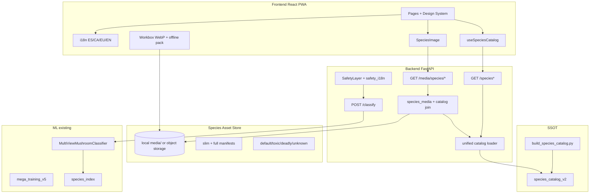
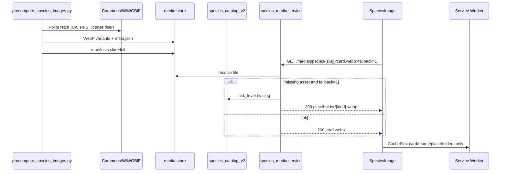
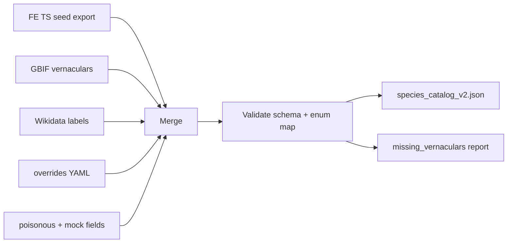
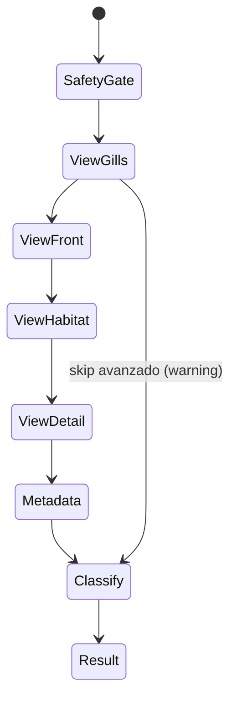
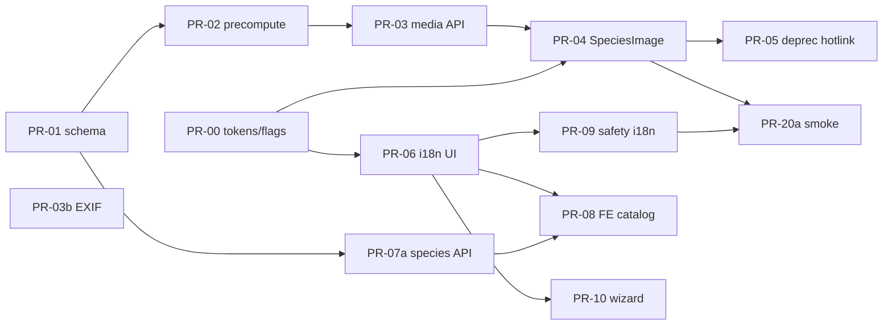

# MEGA PLAN — VisionSetil Professional Upgrade

| Campo | Valor |
| --- | --- |
| **Título** | VisionSetil: Upgrade profesional de producto e infraestructura |
| **Autor** | Engineering / Architecture (borrador) |
| **Fecha** | 2026-07-22 |
| **Estado** | Draft |
| **Repo** | https://github.com/AlonsoAlviraa/VisionSetil.git |
| **Versión del plan** | **1.1.1** (micro-fix: Workbox `/api/media` + naming P0 bar vs P0+) |
| **Audiencia** | Senior engineers, ML, product |
| **Equipo asumido** | 1–2 engineers full-stack + ML part-time; P0 slice ~4–6 semanas |

---

## Overview

VisionSetil es una PWA de identificación orientativa de setas (Iberia-first) con backend FastAPI + pipeline multi-vista (YOLOE, view classifier, DINOv3/SigLIP, open-set rejection, `mega_training_v5` ConvNeXtV2+LoRA+ArcFace) y frontend React 18 + Vite + TypeScript. El MVP de Fase 7 funciona, pero **no alcanza barra profesional**: las imágenes de enciclopedia se cargan por hotlink a Wikipedia ES / Wikimedia / GBIF (fallos frecuentes por 404, rate limits, CORS y taxones sin página), el catálogo de especies vive en **dos fuentes de verdad** (TS hardcodeado ~198 especies con `commonNames` **principalmente en español y strings EN ad-hoc sin locales estructurados** vs JSON backend mixto — mock catalog **6** entradas, poisonous **7**), no hay i18n de UI, y el modelo real a menudo cae a mock.

Este documento define un **upgrade multi-fase** centrado en fiabilidad de imagen, catálogo unificado multilingüe (ES / CA / EU / EN), frontend de calidad producción, madurez ML alineada al stack existente, y métricas de éxito por fase. Prioridad: **fiabilidad y seguridad > features flashy**.

**v1.1** cierra huecos de implementación: contrato de placeholders por riesgo vía join a catálogo, compliance legal de media, cutover dual-catalog con parity tests, taxonomía de vistas única (`CANONICAL_VIEWS`), slice P0 ejecutable para equipo pequeño, y decisiones por defecto D11–D16.

**v1.1.1** alinea URLs de media FE/SW/proxy (`/api/media`) y nombra de forma consistente **P0 bar** (slice sin wizard) vs **P0+** (catalog FE + guided Identify).

---

## Background & Motivation

### Estado actual (verificado en código)

| Área | Situación |
| --- | --- |
| **Stack FE** | React 18, Vite 5, TS, framer-motion, leaflet, `vite-plugin-pwa`, react-router-dom v7. Páginas: Home, Identify, Encyclopedia, Education, SpainMap, SpeciesDetail. |
| **Stack BE** | FastAPI, **11 routers** (`routes_*.py` montados en `main.py`: health, observations, images, classification, classify, species, models, human_review, metrics, feedback, jobs), SQLAlchemy + SQLite, middleware (API key, rate limit, security headers, request-id), `POST /classify`. |
| **Imágenes especies** | `frontend/src/api/mushroomImages.ts`: cascade client-side Wikipedia ES → Wikimedia → GBIF; cache en `Map` en memoria. También `HomePage.tsx` (hero `Cantharellus cibarius`) y `SpeciesDetailPage` gallery (`getWikiMediaImages` + `getMushroomImages`). Sin CDN, proxy, assets propios ni placeholder garantizado. |
| **Catálogo FE** | `mushroomDatabase.ts` + `additionalSpecies.ts` + `extendedSpecies.ts` (~198 `scientificName`). `commonNames` **principalmente español** con nombres EN ad-hoc mezclados (p.ej. “Bay Bolete”); **sin locales estructurados**. Descripciones hardcodeadas en ES. Rutas detalle: `encodeURIComponent(scientificName)` (no kebab-slug). |
| **Catálogo BE** | `mock_species_catalog.json` (**6** taxones, `common_names` EN/ES, `edibility_label: dangerous_or_unknown`, `risk_level` heterogéneo), `poisonous_species.json` (**7**, `risk_level: critical\|high`), `species_catalog.py` carga índice real de prototypes cuando existe. |
| **Vistas** | `CANONICAL_VIEWS = (gills, front, habitat, detail)` en `view_classifier.py` / `POST /classify` form `view_types` **comma-separated**. `image_storage._guess_view_type` usa taxonomía legacy distinta (`cap_top`, `gills_or_pores`, `stem`, `base`, `cross_section`, `environment`). FE `client.ts` **no envía** `view_types` hoy. |
| **i18n** | No hay `react-i18next`. UI chrome 100% español. ROADMAP BK-5 pedía EN/FR/DE/IT/PT; **producto Iberia: ES/CA/EU/EN**. |
| **ML** | `MultiViewMushroomClassifier` con fallback a mock si faltan pesos. Training: `kaggle/mega_training_v5.py`. Artefactos de referencia en `kaggle/kernel_output_v9/models/` (`label2idx.json`, `metrics.json`, …) — no siempre empaquetados para prod. |
| **Seguridad** | `docs/SAFETY_POLICY.md`, `core/safety.py` (constantes solo ES), `SafetyLayer`. Enciclopedia actual muestra “Excelente comestible” con badges verdes (`EDIBILITY_COLORS`) — **tensión** con policy de no “safe food”. |
| **Métricas** | `routes_metrics.py`: exposición **in-memory** estilo Prometheus (comentario: “for production, use prometheus_client”) — no pipeline Prometheus maduro. |
| **PWA** | Workbox: patrones `png|jpg|jpeg|svg|gif` (**no webp**), `maxEntries: 50` en images-cache. |

### Pain points críticos

1. **Imágenes rotas (P0)** — Cards sin foto, hotlinks 404, gallery multi-source frágil.
2. **Sin i18n real (P0)** — CA/EU/EN sin UI ni vernáculos estructurados.
3. **Dual source of truth** — FE ~198 vs BE mock 6 / poisonous 7; enums de riesgo incompatibles.
4. **Mock vs real** — `/readyz` puede reportar mock.
5. **UX incompleta** — Identify sin wizard 4-vistas; historial local débil; taxonomías de vista divergentes.
6. **Safety × edibility** — Badges “excelente comestible” verdes en enciclopedia pueden amplificarse con i18n si no se gobiernan por superficie.

### Motivación de producto

Una app de setas **no puede fallar visualmente** ni en **mensajes de seguridad multilingües**. Prioridad: Image Reliability + Species Catalog unificado + safety-by-surface antes de engagement.

---

## Goals & Non-Goals

### Goals

1. **Image Reliability System** con ≥99% de cards de enciclopedia mostrando imagen válida o placeholder de marca en ≤200 ms en **warm path medible** (ver §1.2).
2. **Catálogo unificado** con vernáculos **es / ca / eu / en**; nombre científico siempre en latín.
3. **i18n de UI** con selector y persistencia; reglas de copy **por superficie** (encyclopedia vs identify).
4. **Frontend profesional**: design system, estados loading/empty/error, a11y WCAG 2.1 AA en flujos críticos, PWA con WebP + media cache.
5. **ML path** incremental sobre multi_view + mega_training_v5 sin relajar Safety Policy.
6. **Features nuevas priorizadas** (P0 primero; P1 engagement en segundo programa).
7. **Calidad**: Playwright smoke, visual smoke de `SpeciesImage`, CI i18n deadly, Lighthouse targets.

### Non-Goals

- No recomendar consumo ni “safe to eat” / equivalentes en **ningún** locale en el flujo Identify/Result.
- No reescribir el stack (no Next.js, no nuevo framework ML, no multi-tenant).
- No i18n FR/DE/IT/PT ni **gl/pt** en este plan (backlog Iberia ampliado).
- No sustituir validación humana / micólogo.
- No CDN multi-región enterprise día 1.
- No app nativa iOS/Android.
- **No cuentas de usuario / sync cloud de favoritos** en este plan (favoritos solo `localStorage`).
- No copiar el corpus completo de fotos de especies al repositorio git (solo fixtures + placeholders).

---

## Proposed Design

### Visión de arquitectura objetivo



### Fases y programas

| Programa | Fases | Enfoque | Duración (1–2 eng.) |
| --- | --- | --- | --- |
| **P0 bar** (vertical slice) | 0–2 parcial | Tokens/flags, media, catalog seed, SpeciesImage, i18n chrome, safety i18n, deadly vernáculos **en API**, EXIF, smoke E2E | **~4–6 semanas** |
| **P0+** | 2 resto | FE unified catalog (PR-08), dual routes, **guided Identify (PR-10)**, classify hydration (PR-11) | +3–4 semanas |
| **P1 Engagement** | 3 | Favoritos, historial, lookalikes UI, filtros, share | +3–4 semanas |
| **P2 ML + Hardening** | 4–5 | Pesos reales, index, calibration, offline pack, E2E full | +4–6 semanas |

**Naming (normativo):** “P0” / “P0 bar” / “P0 vertical slice” = entregable del slice **sin** PR-10 ni PR-08. “P0+” = PR-08 + PR-10 (+ PR-11). No usar “P0” para guided Identify.

Ver **PR Plan** y **P0 vertical slice**.

---

## 1. Image Reliability System (diseño detallado)

### 1.1 Problema

`getMushroomImage` / gallery hotlink en cliente: sin control de calidad, licencia, CORS, ni offline. Home hero y detail gallery también dependen del cascade.

### 1.2 Objetivos y SLO (medibles)

| SLO | Target | Cómo se mide |
| --- | --- | --- |
| **Image render success** | ≥99% cards muestran imagen válida **o** placeholder de marca (nunca icono roto del browser) | Playwright: grid enciclopedia; assert `img.complete && naturalWidth>0` **o** placeholder `data-testid` |
| **Time-to-image (warm path)** | ≤200 ms p95 desde mount del card hasta paint de `card.webp` o placeholder | Playwright con **pre-seed**: HTTP cache + SW cache + manifest en memory; marcar `performance.measure('species-image')` |
| **Cold path first visit** | Skeleton ≤100 ms; imagen final ≤1.5 s p95 en throttling 4G | Lighthouse + Playwright network conditions |
| **Broken img rate** | &lt;0.5% `onError` que no recuperen placeholder | FE beacon `species_image_error` (mínimo viable aunque BE metrics retrasen) |
| **Git media budget** | `media/` tracked ≤ **5 MB** | CI fail si excede (fixtures only) |

**Warm path definido:** (1) slim manifest ya en memoria, (2) `card.webp` en Cache Storage o disk HTTP cache, (3) same-origin `/media/`. Cold path no está sujeto al umbral de 200 ms.

### 1.3 Arquitectura



### 1.4 Almacenamiento y layout

**D12 default:**  
- **Dev/CI:** `media/` en monorepo con **placeholders + ≤5 species fixtures**.  
- **Prod:** object storage (R2/S3 recomendado) + `SPECIES_MEDIA_CDN_BASE` opcional; API redirige solo a host allowlist.  
- Corpus completo **nunca** se commitea entero a git (artifact CI o bucket).

```
media/
  species/
    amanita-phalloides/   # fixtures only in git
      thumb.webp          # 160w
      card.webp           # 480w
      detail.webp         # 960w (prod corpus; optional in fixtures)
      lqip.webp           # 24w
      meta.json
  placeholders/
    default.webp
    toxic.webp
    deadly.webp
    unknown.webp
  manifests/
    species_images_slim_v1.json   # slug → {status} only — boot FE
    species_images_v1.json        # full meta index — ops/API
```

**Slug:** `scientific_name` → lowercase, espacios → `-`, strip no `[a-z0-9-]`.  
**Estimación storage realista (prod corpus, no git):**

| Concepto | Estimación revisada |
| --- | --- |
| card 480w WebP foto | 40–120 KB |
| detail 960w | 80–250 KB |
| thumb+lqip | 5–20 KB |
| **200 spp × 4 variants** | **~30–80 MB** (no ~16 MB) |
| Offline pack: card+thumb de featured+deadly (~40) | **~3–8 MB** |

### 1.5 Script de precompute + Media compliance

**Path:** `scripts/precompute_species_images.py`

#### Media compliance (normativo)

| Regla | Detalle |
| --- | --- |
| **User-Agent** | Obligatorio: `VisionSetilBot/1.0 (+https://github.com/AlonsoAlviraa/VisionSetil; contact: MEDIA_CONTACT_EMAIL)` |
| **Rate limit** | ≤1 rps Wikimedia; ≤2 rps GBIF; exponential backoff 429/503; jitter |
| **License allowlist** | Aceptar: `CC0`, `CC-BY`, `CC-BY-SA` (2.0–4.0), `Public domain`, `PD-US`, Wikimedia “own work” PD. **Rechazar:** All rights reserved, unlicensed, `CC-BY-ND` (si se re-encodea), unclear, missing license on GBIF media |
| **GBIF** | Guardar `gbif_occurrence_id`, `license` del media object, `rightsHolder`/`creator` si existen; no usar solo `identifier` |
| **meta.json** | `source`, `source_url`, `license`, `license_url`, `creator`, `attribution_text`, `gbif_occurrence_id?`, `sha256_source`, `sha256_derivatives`, `fetched_at`, `status` |
| **Atribución UX** | Componente `ImageAttribution` **obligatorio** en detalle; en **grids/cards**: icono info / long-press / footer de sección “créditos de imágenes” de la página (no se permite grid silencioso de no-PD). PD/CC0: atribución opcional pero `meta` se conserva |
| **Share-alike** | Derivatives WebP se documentan como adaptaciones; “Acerca de” enlaza política de medios |
| **Takedown / refresh** | Job trimestral `scripts/refresh_species_images.py`: re-HEAD source; si 404/410 o license fuera de allowlist → marcar `status=placeholder_only`, quitar derivatives públicos, log `takedown_events.jsonl`. Endpoint interno o script ops `revoke_slug(slug)` |
| **Idempotencia** | Skip si source sha estable salvo `--force` |

**Algoritmo de fuentes (server-side):** Commons search → Wikipedia pageimages EN/ES/CA → GBIF StillImage con license check. Fallo total → `placeholder_only` (nunca “roto”).

### 1.6 API backend de media — contrato de placeholders (Issue 1: **opción A**)

**Decisión D1b:** el servicio de media **hace join al catálogo unificado por `slug`** para resolver el kind de placeholder. No se confía en query `?risk=` del cliente para el fallback server-side (el cliente podría mentir); `SpeciesImage` puede pasar `riskLevel` solo para **paint síncrono de placeholder local** antes de la respuesta de red.

**Router:** `backend/app/api/routes_media.py`  
**Service:** `backend/app/services/species_media.py`

| Método | Ruta | Comportamiento |
| --- | --- | --- |
| `GET` | `/media/species/{slug}/{variant}` | `variant ∈ {thumb,card,detail,lqip}`. Si archivo existe → 200 WebP. Si no y `fallback=1` (**default true**) → **200** de placeholder kind resuelto vía catálogo. Si `fallback=0` y missing → **404**. |
| `GET` | `/media/placeholder/{kind}` | `kind ∈ {default,toxic,deadly,unknown}` — siempre 200. |
| `GET` | `/media/manifest` | Full manifest (ops); `Cache-Control` + ETag. |
| `GET` | `/media/manifest/slim` | Solo `slug→status` (&lt; **50 KB** target para ~200 spp). |

**Mapeo risk → placeholder kind (server):**

```
risk_level ∈ {deadly, critical}           → deadly
risk_level ∈ {high, toxic}                → toxic
risk_level ∈ {risky_lookalikes, medium}   → toxic   # cautela visual
edibility_code ∈ {mortifero}              → deadly
edibility_code ∈ {toxico}                 → toxic
else / slug unknown in catalog            → unknown (si slug inválido) o default
```

Slug inválido (no match `^[a-z0-9]+(-[a-z0-9]+)*$`) → **400**. Path traversal: resolve + `relative_to(media_root)` (mismo patrón que `image_storage._safe_target_path`).

**CDN redirect:** si `SPECIES_MEDIA_CDN_BASE` está set, 302 solo si URL resultante host ∈ allowlist parseada de ese base (validado en **settings load**). Nunca open redirect.

**Query params:** solo `fallback` y `v` (content hash opcional) afectan respuesta; resto ignorados (anti cache-poisoning de keys raras).

**Tests obligatorios:**

- Deadly taxon sin asset + `fallback=1` → body = deadly placeholder, status 200.
- Taxon ok → card bytes.
- Slug `../etc/passwd` → 400.
- CDN base host wrong → no redirect (config error at boot).

### 1.7 Componente frontend `SpeciesImage`

```tsx
type SpeciesImageVariant = 'thumb' | 'card' | 'detail' | 'lqip'

interface SpeciesImageProps {
  scientificName: string
  slug?: string // prefer when known
  variant?: SpeciesImageVariant
  riskLevel?: 'default' | 'toxic' | 'deadly' | 'unknown' // client optimistic placeholder only
  alt: string
  className?: string
  priority?: boolean
  showAttribution?: boolean // true on detail; false on card (page-level credits)
}
```

**Comportamiento:**

1. Resolver slug; URL canónica de media en el browser (ver **§1.7.1**):  
   `{MEDIA_PUBLIC_PREFIX}/species/{slug}/{variant}` con default **`MEDIA_PUBLIC_PREFIX = /api/media`**.
2. LQIP blur-up si disponible en slim manifest o path `lqip`.
3. `src` + `srcSet`:  
   `thumb 160w, card 480w, detail 960w`  
   `sizes` ejemplo card grid: `(max-width: 600px) 50vw, 240px`.
4. `onError` → placeholder same-origin  
   `{MEDIA_PUBLIC_PREFIX}/placeholder/{riskLevel|default}`  
   (default `/api/media/placeholder/default`); último recurso **inline SVG data-URI** branded.
5. Beacon opcional `species_image_error`.

#### 1.7.1 Canonical public media URL (FE + proxy + SW)

| Entorno | URL que ve el browser / Service Worker | Backend real |
| --- | --- | --- |
| **Dev (Vite default)** | `/api/media/...` | Proxy `vite.config.ts`: `'/api' → http://localhost:8000` (rewrite strip `/api`) → FastAPI `/media/...` |
| **Prod (recomendado)** | **`/api/media/...`** (mismo shape que dev) | Reverse proxy (nginx/Caddy/Cloudflare): `location /api/` strip prefix → FastAPI; **o** CDN en host allowlist vía `SPECIES_MEDIA_CDN_BASE` (302 desde API) |
| **Prod alt** | `/media/...` sin prefijo | Solo si el reverse proxy monta BE en root **y** `VITE_API_URL=''` + FE construye URLs sin `/api` — **desaconsejado**; si se usa, Workbox debe seguir el patrón opcional abajo |

**Regla:** un solo helper FE `speciesImageUrl(slug, variant)` lee `import.meta.env.VITE_MEDIA_PUBLIC_PREFIX ?? '/api/media'`. BE sigue montando rutas en `/media/*` (sin prefijo `/api`). El prefijo `/api` es **solo de edge/FE**, nunca parte del path interno FastAPI.

**DoD PR-04:** documentar en README frontend el mapping proxy; E2E/smoke usa las mismas URLs que producción local; Workbox patterns cubren el prefijo opcional (ver §1.8).

**Migración FE (explícita):**

| Superficie | PR | Estrategia |
| --- | --- | --- |
| `MushroomCard`, `FeaturedMushroomCard` | PR-04 | SpeciesImage |
| **`HomePage` hero** | PR-04 | SpeciesImage (`Cantharellus cibarius`) |
| `SpeciesDetailPage` hero | PR-04 | SpeciesImage detail/card |
| Gallery multi-imagen | **P1 diferido** | v1: **un hero confiable** + texto wiki opcional (`getWikiSummary` solo texto). No hotlink gallery. Multi-asset gallery = post-P0 (`detail` extras o `gallery[]` en meta futuro) |

### 1.8 Cache layers

| Capa | Qué | Política |
| --- | --- | --- |
| Slim manifest | slug→status | Fetch al boot; session memory; size budget &lt;50 KB |
| HTTP | variants | `Cache-Control: public, max-age=604800, immutable` cuando `v=sha` |
| SW | `{prefix}/species/**/card.webp`, `thumb`, placeholders (`prefix` = `/api/media` o `/media`) | CacheFirst; **maxEntries ≥ 250** (no 50); **incluir `\.webp$`** |
| SW | `detail.webp` | NetworkFirst o no precache (lazy) |
| Offline pack | featured + deadly cards | install-time subset |

**`vite.config.ts` workbox (obligatorio en PR-04/PR-19):**

El browser ve **`/api/media/...`** en el setup monorepo actual (`client` default `VITE_API_URL=/api`, proxy Vite). Un patrón solo `/media/` **no** calienta el cache de cards. Usar prefijo **opcional** `api/`:

```js
// conceptual — matches /api/media/... (dev+prod recomendado) AND /media/... (prod alt)
{
  urlPattern: /\/(?:api\/)?media\/(species|placeholder)\/.*\.webp$/i,
  handler: 'CacheFirst',
  options: {
    cacheName: 'species-media-webp',
    expiration: { maxEntries: 400, maxAgeSeconds: 30 * 86400 },
  },
}
{
  urlPattern: /\.webp$/i,
  handler: 'StaleWhileRevalidate',
  options: {
    cacheName: 'webp-assets',
    expiration: { maxEntries: 200, maxAgeSeconds: 30 * 86400 },
  },
}
```

**Warm-path harness (Playwright):** pre-seed Cache Storage con keys bajo `/api/media/species/.../card.webp` (no `/media/` a secas) salvo que el test fije otro `VITE_MEDIA_PUBLIC_PREFIX`.

### 1.9 Fallbacks (cadena)

```
GET {MEDIA_PUBLIC_PREFIX}/species/{slug}/card.webp
  (BE /media/... ; join catalog if missing → risk placeholder)
  → client onError → {MEDIA_PUBLIC_PREFIX}/placeholder/{riskLevel|default}
  → inline SVG data-URI (0 red)
```

### 1.10 Observabilidad de imágenes

- Extender el **`/metrics` in-memory actual** (o adoptar `prometheus_client` más adelante) con contadores texto: `species_media_served_total{variant,status}`.
- **Mínimo FE:** beacon/`console` contador de `onError` recuperados; E2E como gate de release.
- CI: HEAD check de fixtures + sample de manifest prod artifact.

### 1.11 Riesgos media

| Riesgo | Sev. | Mitigación |
| --- | --- | --- |
| Bloqueo Wikimedia | Media | UA + RPS + cache corpus |
| Licencia incorrecta | Alta | allowlist + takedown job |
| Repo bloat | Media | fixtures only; CI size budget 5 MB |
| Open redirect CDN | Alta | allowlist host at settings load |

---

## 2. Multilingual Species Catalog

### 2.1 Dual source of truth (estado)

| Fuente | N | Notas |
| --- | --- | --- |
| FE TS DBs | ~198 | SSOT de producto hoy |
| mock_species_catalog.json | 6 | ML mock presentation |
| poisonous_species.json | 7 | risk notes |
| species_index | variable | prototypes ML |

### 2.2 Schema `species_catalog_v2`

**Path:** `data/species_catalog/species_catalog_v2.json`  
**Schema:** `data/species_catalog/schema/species_catalog.schema.json`

Campos language-agnostic: `id`, `scientific_name`, `slug`, `family`, `genus`, `risk_level`, `edibility_code`, `categories`, `iberian_relevance`, `featured`, `icon`, `image_slug`, `ml_taxon_key`, `gbif_usage_key`, `wikidata_id`.

Textos por locale: `vernacular_names`, `tagline`, `description`, `morphology.*`, `habitat`, `season`, `key_features`, `toxicity_notes`.

#### JSON Schema rules (Issue 7)

| Campo | Regla |
| --- | --- |
| `vernacular_names.{es,ca,eu,en}` | **required keys**; cada valor es `string[]` (puede ser `[]` solo si `missing_vernacular_tickets` documenta — **empty string dentro del array prohibido**) |
| `tagline.{locale}` | required keys; string no vacío para `es`; ca/eu/en pueden omitirse en JSON **solo si** se usa fallback runtime (preferible: key presente con valor o ausente — **no `""`**) |
| `description` / `morphology` | **optional** por locale; v1: required complete para `es`; ca/eu/en required solo si `featured\|\|risk_level∈(deadly,high,critical)` |
| Forbidden | `null` en arrays de nombres; keys de locale inventadas |

#### Runtime resolver (unit-tested)

```
resolve_text(record, field, locale):
  for lang in [locale, "es", "en"] + other_available:
    if record[field] has non-empty lang: return it
  return null  # caller shows scientific name / hide block

resolve_vernaculars(record, locale):
  names = record.vernacular_names[locale] or []
  if names: return names  # order = display rank (primary first)
  fallback = resolve chain es → en → any non-empty list
  return fallback or []  # UI: scientific name only
```

**Locale precedence API:** query `?locale=` **gana** sobre `Accept-Language`. Si ambos ausentes → `es`. Locales inválidos → **400** con `{ "error": "invalid_locale", "supported": ["es","ca","eu","en"] }`.

**Search:** `q` matchea `scientific_name` + **vernáculos de todos los locales** + family (casefold, unaccent best-effort). Activo locale no limita el match de nombres (mejor recall); el **display** usa locale activo.

**Missing vernaculars UX:**

- Lista/card: mostrar *scientific name* en italic como título si no hay vernáculo local ni fallback.
- Badge opcional solo en dev: `missing_i18n`.
- Ticket workflow: `data/species_catalog/missing_vernaculars.yaml` generado por `check_i18n_catalog.py`; CI **falla** solo para deadly/high sin vernáculo en algún locale; resto → warning artifact.

**D11:** CA/EU en v1 = **vernáculos + taglines** para todas las especies exportadas; **descriptions/morphology completas** solo featured + deadly/high. Resto: fallback description a ES/EN sin badge en prod (badge solo `import.meta.env.DEV`).

### 2.3 Pipeline de construcción



### 2.4 API de especies

| Método | Ruta | Descripción |
| --- | --- | --- |
| `GET` | `/species` | Lista paginada |
| `GET` | `/species/{slug}` | Detalle |
| `GET` | `/species/by-scientific-name/{name}` | Lookup (para rutas legacy / classify) |
| `GET` | `/species/poisonous` | Compat enriquecida |
| `GET` | `/species/lookup?scientific_name=` | Alias |

#### Envelope de lista

```json
{
  "items": [ /* SpeciesSummary localized */ ],
  "total": 198,
  "limit": 50,
  "offset": 0,
  "catalog_version": "2.0.0",
  "locale": "es"
}
```

#### Errores

| Status | Body |
| --- | --- |
| 404 | `{ "error": "species_not_found", "slug": "..." }` |
| 400 | `{ "error": "invalid_locale" \| "invalid_query", "message": "..." }` |
| 429 | rate limit (middleware); headers `Retry-After` si se configuran |

Media pública: sin API key; classify/observations siguen con API key en prod.

### 2.5 Frontend hooks y migración

- `react-i18next` (ver Alternatives G).
- Locales UI: `frontend/src/locales/{es,ca,eu,en}/*.json`.
- Catalog: build-time JSON + API; flag `FEATURE_UNIFIED_CATALOG`.
- Language switcher en Header; `localStorage visionsetil_locale`.

### 2.6 Safety strings multilingües + edibility continuum (Issue 4)

#### D16 — Safety vs edibility por superficie

| Superficie | Edibility badges | Color | Copy |
| --- | --- | --- | --- |
| **Encyclopedia / Detail** | Permitidos códigos micológicos educativos (`edibility_code`) | Usa tokens **neutros/ámbar/rojo** para riesgo; **no verde “seguro”** — “excelente” usa teal/info no “food-safe green” | Labels i18n tipo: ES *“Interés culinario alto (solo referencia educativa)”* / EN *“High culinary interest (educational only)”* — **nunca** “safe to eat”. Banner co-localizado en toda vista de ficha: disclaimer no-consumo |
| **Identify / ResultCard / Share** | **No** mostrar “excelente comestible”. Solo risk / unknown / toxic / deadly + `unsafe_to_consume` | Rojo/ámbar/gris; **prohibido** verde semántico de “edible OK” | `safety_i18n` + blacklist |

**Blacklist tests (PR-09):** por locale, en payloads de **classify**, fallar si aparecen términos de confirmación de consumo (`safe to eat`, `seguro comer`, `es pot menjar`, `jan daiteke`, etc.). En encyclopedia strings, permitir raíces “comestible/edible” **solo** si el string de disclaimer de superficie está presente en el mismo componente (test de componente/snapshot).

`SafetyLayer` / `core/safety_i18n.py`: mensajes por locale; `locale` desde form classify o `Accept-Language`.

---

## 3. Frontend redesign y nuevas features

### 3.1 Design system (PR-00)

Tokens en `styles/tokens.css`; `components/ui/{Button,Input,Skeleton,Badge,EmptyState,ErrorState,ImageAttribution}`. Respetar `prefers-reduced-motion`.

### 3.2 Priorización

#### P0 bar (Must — vertical slice; ~4–6 semanas)

| Feature | PR | Notas |
| --- | --- | --- |
| Empty/error/skeleton + flags | PR-00 | Design system mínimo |
| SpeciesImage + media API | PR-04 | Incluye Home hero; Workbox `/api/media` |
| i18n UI ES/CA/EU/EN | PR-06 | Chrome + disclaimers |
| Safety i18n + surface rules | PR-09 | D16 |
| Vernáculos deadly en **API** | PR-07a | 100% deadly/high × 4 locales en backend; **aún no** rehidratan encyclopedia FE (eso es PR-08 / P0+) |
| EXIF strip uploads | PR-03b | Privacy |
| Smoke E2E | PR-20a | Images, locale switch, safety banner — **sin** wizard |

#### P0+ (Must — inmediatamente después del slice)

| Feature | PR | Notas |
| --- | --- | --- |
| FE unified catalog + dual routes | PR-08 | Vernáculos/API visibles en encyclopedia; snapshot fallback |
| Guided multi-view Identify | PR-10 | `CANONICAL_VIEWS` + `view_types` en `client.ts` |
| Classify hydration names/images | PR-11 | Should/Must de producto según capacidad |

#### P1 (Should — second program)

Favoritos localStorage, historial UX, lookalike compare, season/region filters, share card, dark polish, batch improvements, wiki text-only summary.

#### P2 (Could)

Offline pack ampliado, map enrichment, guided checklist, education i18n profunda, multi-image gallery curada.

### 3.3 Flujo Identify guiado + taxonomía de vistas (Issue 5)

**Decisión D5b — contrato único cliente→API: `CANONICAL_VIEWS`**

```
CANONICAL_VIEWS = gills | front | habitat | detail
```

- Form field existente: `view_types: str | None = Form(...)` — **comma-separated**, longitud = número de `images` (validado en `_parse_view_types` de `routes_classify.py`).
- **No** usar repeated `view_types[]`.
- FE `classifyImages(files, metadata, viewTypes?: string[])` debe hacer `view_types: viewTypes.join(',')`.

**Capa de mapeo legacy (solo storage/quality, no contrato FE):**

| CANONICAL | Heurísticas legacy `_guess_view_type` / quality |
| --- | --- |
| `gills` | `gills_or_pores` |
| `front` | `cap_top`, `stem` (perfil completo) |
| `habitat` | `environment` |
| `detail` | `base`, `cross_section` |

Al guardar observación: preferir label canónico del cliente; si solo hay guess legacy, mapear a canónico antes de multi_view. Quality checks que busquen `has_base_view` deben aceptar `detail` **o** legacy `base`.



### 3.4 Accesibilidad

Contraste AA; focus visible; `aria-live` en resultado; alt `"{commonName} ({scientificName})"` o solo scientific; tokens de color alineados a D16.

### 3.5 Routing slug (Issue 8)

**Canónico:** `/enciclopedia/amanita-phalloides`  
**Legacy:** `/enciclopedia/Amanita%20phalloides` y cualquier `decodeURIComponent` que parezca scientific name.

Implementación FE (PR-08):

1. Si param match slug kebab en catalog → render.
2. Else si `getByScientificName(decodeURIComponent(param))` → **`<Navigate replace>`** a `/enciclopedia/{slug}`.
3. Else empty state 404.

Opcional BE: no sirve HTML; SPA handles. Documentar en DoD PR-08; bookmarks no rompen.

### 3.6 PWA

Ver §1.8. Banner offline. No cachear POST `/classify` como éxito falso.

---

## 4. ML upgrade path

### 4.1 Principios

Extender stack actual; safety gates de `production_readiness.md` bloqueantes; honestidad mock/real.

### 4.2 Roadmap

| ID | Trabajo | Detalle |
| --- | --- | --- |
| ML-A | Pesos versionados | Empaquetar desde artefactos conocidos: `kaggle/kernel_output_v9/models/` (`label2idx.json`, `metrics.json`, `test_predictions.npz`, `training_history.json`) + path `settings.multi_view_weights_path` cuando el checkpoint completo esté disponible; documentar runbook si solo hay metrics sin full weights |
| ML-B | Índice ibérico | `build_species_index.py` prioriza catálogo unificado; join por `ml_taxon_key` o `scientific_name` + **tabla de sinónimos** `data/species_catalog/synonyms.yaml` |
| ML-C | Multi-view UX | FE envía `view_types` canónicos |
| ML-D | Calibración | Tras baseline table en eval report |
| ML-E | Lookalikes hydrate | Catalog vernáculos; synonym resolve |
| ML-F | Cobertura confusiones ibéricas | Training follow-up |
| ML-G | Safety ranker | Sin consumo |

### 4.3 Classify enriquecido (aditivo)

```ts
locale?: string
predictions: Array<SpeciesPrediction & {
  slug?: string
  common_names?: string[]
  risk_level?: string
  image_card_url?: string
  // edibility en identify: solo risk-oriented labels, no "excelente"
}>
dangerous_lookalikes_detailed?: Array<{...}>
```

Form: `locale`, `view_types` (comma-separated).

### 4.4 Métricas ML (realistas)

| Métrica | Target | Nota |
| --- | --- | --- |
| MAP@3 vs baseline interno | +≥5 pts | **Requiere baseline table** en `eval/reports` antes de gate PR-18 |
| false_safe_rate | **0** | Policy gate |
| toxic_not_flagged_rate | **0** | Policy gate |
| overconfident_wrong_rate | &lt;5% pilot | production_readiness |
| p95 latency 4 img GPU | &lt;150 ms inference | **Stretch** hasta profile en hardware real; no bloquear P0 producto |

---

## 5. Unified species data model + cutover contract

### 5.1 SSOT paths

```
data/species_catalog/
  species_catalog_v2.json
  schema/species_catalog.schema.json
  overrides/
  synonyms.yaml
  missing_vernaculars.yaml  # generated
  golden/parity_seed.json   # expected scientific names from FE export
scripts/build_species_catalog.py
scripts/check_catalog_parity.py
scripts/check_i18n_catalog.py
scripts/precompute_species_images.py
```

### 5.2 Field mapping FE TS → v2 (Issue 3)

| FE (`MushroomSpecies`) | v2 | Notas |
| --- | --- | --- |
| `scientificName` | `scientific_name` + `slug` + `ml_taxon_key` default | |
| `commonNames: string[]` | `vernacular_names.es` | EN ad-hoc en array FE → opcionalmente `vernacular_names.en` si detect language heuristic o overrides |
| `tagline` | `tagline.es` | |
| `description` | `description.es` | |
| `family` | `family` | |
| `habitat` / `season` / `cap` / `stem` / `hymenium` | `habitat.es`, `season.es`, `morphology.*.es` | |
| `edibility` | `edibility_code` | mismos códigos FE |
| `toxicity` | `toxicity_notes.es` | |
| `keyFeatures` | `key_features.es` | |
| `lookAlikes?: string[]` | `lookalikes[{scientific_name, note_key?}]` | parse “Taxon (nota)” best-effort |
| `categories` | `categories` | |
| `icon` / `featured` | `icon` / `featured` | |

### 5.3 Enum reconciliation

| Concepto | FE | mock_catalog | poisonous.json | **v2 canónico** |
| --- | --- | --- | --- | --- |
| Edibility UI codes | `excelente`…`mortifero` | `edibility_label: dangerous_or_unknown` | — | **`edibility_code`** = FE set; classify path **no** expone excelente como “safe” |
| Risk | implícito en edibility | `deadly`, `high`, `risky_lookalikes` | `critical`, `high` | **`risk_level`**: `deadly` \| `high` \| `medium` \| `low` \| `unknown` \| `risky_lookalikes` |
| Map poisonous `critical` | — | — | critical | → `risk_level: deadly` |
| Map mock `deadly` | — | deadly | — | `deadly` |
| Classify `edibility_label` | — | dangerous_or_unknown | — | Se mantiene en pipeline safety como `dangerous_or_unknown` / risk labels; **separado** de `edibility_code` educativo |

### 5.4 Parity tests (golden)

`scripts/check_catalog_parity.py` / pytest:

1. Mismo set de `scientific_name` (198) que seed export (symmetric diff vacío).
2. Por cada especie: `edibility_code`, `featured`, `categories` (set equal), `lookalikes` scientific names set, `family`.
3. `tagline.es` y `description.es` non-empty.
4. Checksum file `catalog_version` + sha256 artifact en CI.
5. Dual-run (flag on): sample N species API vs build JSON deep equal on localized es fields.

### 5.5 Feature flags y rollback

| Flag | Default | Comportamiento |
| --- | --- | --- |
| `FEATURE_SPECIES_MEDIA` | true tras PR-04 | SpeciesImage vs legacy cascade |
| `FEATURE_I18N` | true tras PR-06 | Switcher |
| `FEATURE_UNIFIED_CATALOG` | false→true tras parity verde | FE usa v2; **fallback hard** a `frontend/src/data/generated/species_catalog_snapshot.json` si fetch falla |
| `FEATURE_GUIDED_IDENTIFY` | true tras PR-10 | Wizard |
| `FEATURE_FLAGS` infra | PR-00 | `import.meta.env` + optional BE `/config` later |

**Estabilidad para borrar TS (PR-21):**

- Parity tests verdes 7 días en staging **o** 1 release.
- Encyclopedia empty rate 0 en E2E.
- Rollback: flag off + snapshot bundle; re-enable legacy import path mantenido hasta PR-21.

### 5.6 Synonym / ML join

`synonyms.yaml`: `Amanita phalloides: [Amanita phalloides, …]`  
Resolve: exact scientific → `ml_taxon_key` → synonym map → normalize spaces/case. Si no match: lookalike hydration omite entry con log.

---

## API / Interface Changes

### Media

Ver §1.6.

### Species

Ver §2.4 (envelope + errors).

### Classify

```ts
// client.ts
export async function classifyImages(
  files: File[],
  metadata?: ObservationMetadata,
  options?: { locale?: string; viewTypes?: Array<'gills'|'front'|'habitat'|'detail'> }
): Promise<ClassificationResult>
// form: view_types = options.viewTypes?.join(',')
// form: locale = options.locale
```

### FE species client

```ts
listSpecies(params) → { items, total, limit, offset, catalog_version, locale }
getSpecies(slug, locale) → SpeciesDetail | throws ApiError
speciesImageUrl(slug, variant) → string
// `${VITE_MEDIA_PUBLIC_PREFIX ?? '/api/media'}/species/${slug}/${variant}.webp`
```

---

## Data Model Changes

- Observation: opcional `locale`; `ObservationImage.view_type` almacena **canónico** preferente.
- Catálogo: JSON v2 (no SQLite v1).
- EXIF strip en `store_observation_images` (Pillow) antes de write.
- Storage estimates §1.4.

---

## Alternatives Considered

### A. Hotlink Wikipedia cliente (primario)
Rechazado: sin SLO.

### B. Proxy on-the-fly BE
Rechazado como primario: latencia/rate limits. Solo dev emergency.

### C. i18n UI sin vernáculos
Rechazado: no cumple requisito.

### D. Locales EN/FR/DE/IT/PT
Diferido: foco Iberia ES/CA/EU/EN.

### E. Catálogo solo API online
Rechazado como único modo: PWA offline peor. Híbrido build+API.

### F. API externa mushroom.id como core
Rechazado.

### G. i18n library: `react-i18next` vs Lingui vs native
- **react-i18next:** ecosistema grande, detector, plural, lazy namespaces — **elegido**.
- **Lingui:** excelente compile-time; más setup ICU; equipo ya no lo usa.
- **native (JSON + context):** mínimo deps pero reimplementa ICU/plural/lazy — no vale a 4 locales + growth.

### H. Catalog store: JSON vs SQLite vs Postgres
- **JSON versionado (elegido v1):** reviewable en git, ~198–500 spp trivial, CI schema.
- **SQLite:** mejor query full-text; migración y tool more; overkill ahora.
- **Postgres JSONB:** prod scale multi-tenant futuro (ROADMAP SC-1); no bloquea P0.

### I. Wikimedia Thumb API estable sin binarios propios
Pros: menos storage. Cons: dependencia red, ToS hotlink, sin offline pack, sin WebP control, rate limits en runtime. **Rechazado como primario**; aceptable como **fuente de ingesta** del precompute.

### J. Placeholders risk-agnostic + CSS overlay only
Simplifica media API pero empeora semántica visual deadly offline. **Rechazado** a favor de join catálogo (opción A §1.6).

---

## Security & Privacy Considerations

| Amenaza | Mitigación |
| --- | --- |
| Path traversal media | Slug regex + relative_to |
| Open redirect CDN | Validate `SPECIES_MEDIA_CDN_BASE` host allowlist at settings load |
| Cache poisoning query | Only `fallback`, `v` meaningful |
| Upload malware | Magic bytes existentes |
| SSRF | No fetch on request path in prod media |
| XSS vernáculos | React escape |
| Classify abuse | Rate limit + API key |
| Safety copy regression | Blacklist multi-locale + surface tests |
| PII GPS EXIF | **Strip EXIF** en upload (PR-03b / early) |
| License violation | Allowlist + takedown |
| Media public read abuse | Cache, rate limit optional on `/media` |

Auth: media público read; no user accounts (non-goal).

---

## Observability

| Señal | Notas honestas |
| --- | --- |
| `request_id` | Ya existe |
| `/metrics` | Extender exposición **in-memory** actual; no asumir Grafana/Prometheus prod hasta adopción `prometheus_client` |
| FE beacon | `species_image_error` mínimo |
| `/readyz` | catalog loaded, media root, classifier real/mock, `catalog_version` |
| Alertas | E2E image fail; mock en prod environment; safety CI fail |

---

## Rollout Plan

1. PR-00 flags/tokens → P0 media+i18n safety → staging.
2. Parity catalog → `FEATURE_UNIFIED_CATALOG=true` staging → dual-run.
3. Guided identify + view_types.
4. P1 engagement.
5. ML weights when artifacts ready; never claim real if mock.

**Rollback:** flags off; media fixtures; snapshot catalog; mock banner.

---

## Key Decisions

| # | Decisión | Rationale |
| --- | --- | --- |
| **D1** | Precompute + own media store (no hotlink primario) | SLO y profesionalismo |
| **D1b** | Placeholder risk vía **join catálogo por slug** (opción A); FE riskLevel solo optimista | Server always-200 correcto sin confiar en query cliente |
| **D2** | Locales ES, CA, EU, EN | Iberia product requirement |
| **D3** | SSOT JSON `species_catalog_v2` | Unifica FE/BE/ML metadata |
| **D4** | Híbrido FE build JSON + API | Offline + frescura |
| **D5** | Extender multi_view / mega_training_v5 | Menor riesgo |
| **D5b** | Contrato vistas = **CANONICAL_VIEWS** + form comma-separated; mapear legacy storage | Evita rotura guided ID |
| **D6** | Placeholders always-200 + inline SVG last resort | Images must not fail |
| **D7** | Safety i18n + blacklist por locale | Sin regresión consumo |
| **D8** | **P0 bar** = images + i18n chrome + safety + media + deadly vernáculos API (+ EXIF/smoke); **P0+** = FE catalog (PR-08) + guided Identify (PR-10) + hydration (PR-11); engagement = P1 | Reliability first; slice sin wizard ni encyclopedia unificada FE |
| **D9** | Slug kebab canónico; dual-route legacy scientific name | Bookmarks |
| **D10** | CDN opcional env redirect allowlisted | Simple day-1 |
| **D11** | CA/EU: vernáculos+taglines all; full descriptions only featured+deadly/high | Ejecutable v1 |
| **D12** | Dev: local `media/` fixtures; prod: R2/S3 (+CDN); git ≤5 MB | Evita bloat e inventos divergentes |
| **D13** | gl/pt y FR/DE/IT/PT = backlog | No diluir P0 |
| **D14** | No cloud user auth / sync favoritos | Scope control |
| **D15** | Placeholders = procedural gradient+icon hasta design pack | Ship sin diseñador |
| **D16** | Edibility educativo solo encyclopedia con disclaimer y **sin verde food-safe**; Identify solo risk labels | Resuelve tensión SAFETY_POLICY |

---

## Open Questions (no bloquean P0; defaults ya en D11–D16)

1. Proveedor exacto R2 vs S3 vs Cloudflare Images — **default D12** abstracto object storage.
2. Revisión nativa CA/EU de taglines — ¿voluntarios micológicos?
3. Presupuesto GPU re-entreno — ML programa P2.
4. Design pack de placeholders ilustrados — opcional post D15.
5. ¿Licencia agregada del dataset de catálogo en “Acerca de”?

---

## Success Metrics / DoD por fase

### Fase 0 — Fundaciones (PR-00)
- [ ] Tokens + EmptyState/Skeleton/ErrorState
- [ ] Feature flag helper documentado
- [ ] CI verde

### Fase 1 — Image Reliability
- [ ] ≥99% species status ok o placeholder_only en manifest de corpus/staging
- [ ] 0 broken images Playwright encyclopedia + **home hero**
- [ ] Warm path harness documentado (pre-seed cache)
- [ ] Workbox webp + maxEntries; pattern `/(?:api\/)?media\/...\.webp$/i` (default browser path `/api/media/`)
- [ ] Media compliance UA/license en script
- [ ] Git `media/` ≤5 MB

### Fase 2 — i18n + catálogo (checklist partido)
- [ ] **UI strings** 100% rutas principales en 4 locales
- [ ] **Vernáculos** 100% deadly/high en 4 locales (bloqueante CI)
- [ ] **Vernáculos** resto: ≥1 locale nativo o ticket en missing yaml (warning)
- [ ] **Descriptions CA/EU:** solo featured+deadly/high required; resto fallback ES/EN
- [ ] Dual route slug + legacy scientific name
- [ ] Parity golden 198 names
- [ ] Safety disclaimer + D16 tests 4 locales

### Fase 3 — P1 features
- [ ] Favoritos + historial
- [ ] Lookalike MVP
- [ ] Lighthouse Perf ≥85 / A11y ≥90 staging

### Fase 4 — ML
- [ ] ready real o banner degradado honesto
- [ ] Baseline table antes de gates MAP@3
- [ ] Safety gates 0 false_safe

### Fase 5 — Hardening
- [ ] Playwright smoke P0 (no requiere full wizard para primer job — ver PR-20a)
- [ ] Full E2E wizard + locale + safety
- [ ] Offline deadly visible

---

## Risks

| Riesgo | Sev. | Mitigación |
| --- | --- | --- |
| Scope creep 22 PRs | Alta | P0 slice Must only |
| Legal media | Alta | Compliance §1.5 + takedown |
| Catalog cutover empty encyclopedia | Alta | Snapshot fallback + parity |
| View taxonomy mix | Alta | D5b |
| Safety×i18n amplification | Crítica | D16 + tests |
| ML mock “prod” | Alta | ready honesty |

---

## References

- `docs/ROADMAP.md`, `SAFETY_POLICY.md`, `product_spec.md`, `ML_IMPROVEMENT_PROMPT.md`, `production_readiness.md`, `ARCHITECTURE.md`
- `frontend/src/api/mushroomImages.ts`, `pages/HomePage.tsx`, `pages/SpeciesDetailPage.tsx`
- `frontend/src/data/mushroomDatabase.ts` (+ additional/extended)
- `backend/app/main.py` (11 routers), `routes_classify.py` (`view_types` Form), `view_classifier.CANONICAL_VIEWS`, `image_storage._guess_view_type`
- `backend/app/api/routes_metrics.py` (in-memory metrics)
- `backend/app/data/mock_species_catalog.json`, `poisonous_species.json`
- `kaggle/kernel_output_v9/models/`, `kaggle/configs/mega_training_v5.json`

---

## Appendix A — Migration cutover checklist

1. Export FE → seed; commit golden scientific names list.
2. Enum map applied; poisonous critical→deadly.
3. Parity CI green.
4. `FEATURE_UNIFIED_CATALOG=false` ship snapshot generated.
5. Staging flag true; dual-run compare.
6. Fix diffs; monitor empty states.
7. Prod flag true; keep snapshot.
8. After stability window → PR-21 delete hand TS (keep generated only).

---

## PR Plan

Esfuerzo: **S** ≤1d, **M** 2–3d, **L** 4–8d, **XL** &gt;8d.  
Prioridad: **Must / Should / Could**.  
Equipo 1–2 eng.: ejecutar **P0 vertical slice** primero.

### P0 vertical slice = **P0 bar** (shippable professional bar)

Orden: **PR-00 → PR-01 → PR-02 → PR-03 → PR-03b → PR-04 → PR-06 → PR-09 → PR-07a → PR-20a**  
(Opcional paralelo: PR-05 after 04; PR-16 docs-only early.)

**Entrega (qué SÍ):** imágenes fiables (SpeciesImage + `/api/media` + Workbox), flags/tokens, i18n **chrome**, safety multi-locale (D16), catalog seed + **vernáculos deadly en API** (PR-07a), EXIF, smoke E2E.

**Fuera del slice (P0+, no reclamar en DoD del bar):**
- Encyclopedia FE alimentada por catálogo unificado / vernáculos en UI → **PR-08**
- Guided multi-view Identify wizard → **PR-10**
- Classify hydration → **PR-11**
- Favoritos/share/map/ML full → P1/P2

One-liner: *“Deadly vernaculars are API-ready in the P0 bar; FE encyclopedia display lands in PR-08 (P0+).”*

---

### PR-00 — Design tokens, UI states, feature flags
- **Título:** `chore(fe): design tokens, EmptyState/Skeleton, feature flags helper`
- **Esfuerzo:** S · **Prioridad:** Must · **Deps:** —
- **Archivos:** `styles/tokens.css`, `components/ui/*`, `lib/featureFlags.ts`, docs flags
- **Descripción:** Fase 0. Flags `FEATURE_*` leídos de `import.meta.env`.

### PR-01 — Catalog schema & seed export
- **Título:** `feat(catalog): species_catalog_v2 schema and FE seed export`
- **Esfuerzo:** M · **Must** · **Deps:** —
- **Archivos:** `data/species_catalog/**`, `scripts/build_species_catalog.py` (export), golden names, schema tests
- **Descripción:** Mapping §5.2; aún sin borrar TS.

### PR-02 — Media precompute + compliance + fixtures
- **Título:** `feat(media): precompute WebP pipeline with license allowlist and fixtures`
- **Esfuerzo:** L · **Must** · **Deps:** PR-01
- **Archivos:** `scripts/precompute_species_images.py`, `media/placeholders/*`, `media/species/*` (≤5 fixtures), CI size check
- **Descripción:** UA, RPS, allowlist, meta.json fields; no full corpus in git.

### PR-03 — Backend `/media/*` + catalog join placeholders
- **Título:** `feat(api): species media routes with catalog risk join and CDN allowlist`
- **Esfuerzo:** M · **Must** · **Deps:** PR-02, PR-01
- **Archivos:** `routes_media.py`, `species_media.py`, `config.py`, `main.py`, tests deadly fallback
- **Descripción:** Opción A §1.6; slim manifest endpoint.

### PR-03b — EXIF strip on observation uploads
- **Título:** `fix(privacy): strip EXIF on observation image upload`
- **Esfuerzo:** S · **Must** · **Deps:** — (puede merge en paralelo a PR-02; toca `image_storage.py`)
- **Archivos:** `image_storage.py`, tests
- **Descripción:** Antes era PR-22; privacy first.

### PR-04 — SpeciesImage + migrate cards + Home hero
- **Título:** `feat(fe): SpeciesImage with blur-up; migrate cards and Home hero`
- **Esfuerzo:** M · **Must** · **Deps:** PR-03, PR-00
- **Archivos:** `SpeciesImage.tsx`, `speciesImageUrl` helper, `MushroomCard`, `FeaturedMushroomCard`, **`HomePage.tsx`**, SpeciesDetail **hero**, vitest, **`vite.config.ts` workbox** (`/(?:api\/)?media\/...\.webp$/i`), README proxy/`VITE_MEDIA_PUBLIC_PREFIX`
- **Descripción:** Gallery multi-image **no** hotlink; hero only. Attribution component on detail. **DoD:** URLs browser = `/api/media/...` por default; SW cachea ese path; documentar reverse-proxy prod que preserve o reescriba de forma consistente con el helper.

### PR-05 — Deprecate client hotlink cascade
- **Título:** `chore(fe): deprecate mushroomImages hotlink cascade`
- **Esfuerzo:** S · **Should** · **Deps:** PR-04
- **Archivos:** `mushroomImages.ts`, eslint ban optional
- **Descripción:** Thin wrapper o delete paths no usados; wiki summary text may remain.

### PR-06 — i18n infrastructure UI
- **Título:** `feat(i18n): react-i18next es/ca/eu/en + language switcher`
- **Esfuerzo:** M · **Must** · **Deps:** PR-00
- **Archivos:** package.json, `locales/**`, Header, App, footer, nav
- **Descripción:** Persist locale; no species DB aún.

### PR-07a — Vernaculars pipeline MVP (deadly + overrides)
- **Título:** `feat(catalog): vernacular pipeline MVP and GET /species list/detail`
- **Esfuerzo:** L · **Must** (P0 bar / slice) · **Deps:** PR-01
- **Archivos:** build script GBIF/Wikidata/overrides, `routes_species.py`, localize helper, envelope+errors, tests
- **Descripción:** Full Wikidata polish can follow; deadly complete **on API**. Encyclopedia FE still on legacy TS until **PR-08 (P0+)** — do not claim UI vernaculars in slice DoD.

### PR-07b — Vernaculars completeness + missing tickets
- **Título:** `feat(catalog): full vernacular pass and missing_vernaculars CI`
- **Esfuerzo:** M · **Should** · **Deps:** PR-07a
- **Descripción:** Amplía cobertura no-deadly; CI warning vs fail rules.

### PR-08 — FE unified catalog + dual routes
- **Título:** `feat(fe): encyclopedia from unified catalog; legacy scientific URL redirect`
- **Esfuerzo:** L · **Must (P0+)** · **Deps:** PR-06, PR-07a, PR-04
- **Archivos:** hooks, Encyclopedia, Detail, generated snapshot, flag `FEATURE_UNIFIED_CATALOG`
- **DoD:** dual route; parity; fallback snapshot; **vernáculos visibles en UI** (cierra el gap API-only del bar).

### PR-09 — Safety i18n + D16 surface rules
- **Título:** `feat(safety): localized safety strings and per-surface edibility rules`
- **Esfuerzo:** M · **Must** (P0 bar) · **Deps:** PR-06
- **Archivos:** `safety_i18n.py`, SafetyLayer, ResultCard, encyclopedia badge labels tokens, blacklist tests 4 locales
- **Descripción:** Identify sin verde edible; encyclopedia educational wording.

### PR-10 — Guided multi-view Identify
- **Título:** `feat(fe): guided 4-view wizard; send view_types to /classify`
- **Esfuerzo:** L · **Must (P0+)** · **Deps:** PR-06
- **Archivos:** IdentifyPage, CameraCapture, UploadZone, **`client.ts` `view_types` join**, i18n
- **Descripción:** CANONICAL only; document legacy map in BE if needed. **No forma parte del P0 vertical slice.**

### PR-11 — Classify hydration names + images
- **Título:** `feat(api): hydrate classify with locale names and image URLs`
- **Esfuerzo:** M · **Should** · **Deps:** PR-03, PR-07a, PR-09
- **Archivos:** routes_classify mapping, types FE, ResultCard images via SpeciesImage

### PR-12 — Favorites + history UX
- **Esfuerzo:** M · **Should (P1)** · **Deps:** PR-06, PR-08

### PR-13 — Lookalike comparison UI
- **Esfuerzo:** M · **Should (P1)** · **Deps:** PR-04, PR-08

### PR-14 — Season/region filters + map
- **Esfuerzo:** M · **Could (P1)** · **Deps:** PR-08

### PR-15 — Share card + dark tokens polish
- **Esfuerzo:** M · **Could (P1)** · **Deps:** PR-09

### PR-16 — ML weights packaging + readyz honesty
- **Esfuerzo:** M · **Should (P2)** · **Deps:** —
- **Archivos:** model_registry, health, docs runbook; reference `kaggle/kernel_output_v9/models/`

### PR-17 — Species index join catalog + synonyms
- **Esfuerzo:** L · **Should (P2)** · **Deps:** PR-01, PR-16

### PR-18 — Open-set calibration + safety eval
- **Esfuerzo:** L · **Could (P2)** · **Deps:** PR-17 + **baseline table**
- **Nota:** latency GPU stretch; no bloquear producto P0.

### PR-19 — Offline encyclopedia pack PWA
- **Esfuerzo:** M · **Should (P2)** · **Deps:** PR-04, PR-08
- **Descripción:** Precache card/thumb featured+deadly; detail lazy.

### PR-20a — Playwright smoke P0 (early)
- **Título:** `test: Playwright smoke for encyclopedia images, locale switch, safety banner`
- **Esfuerzo:** M · **Must** · **Deps:** PR-04, PR-06, PR-09
- **Descripción:** **No depende de PR-10**. Warm-path image test optional.

### PR-20b — Playwright full E2E + visual + i18n CI
- **Esfuerzo:** M · **Should** · **Deps:** PR-10, PR-08, PR-20a
- **Archivos:** e2e wizard, `check_i18n_catalog.py`, media HEAD

### PR-21 — Remove hand-maintained FE TS catalog
- **Esfuerzo:** S · **Could (after stability)** · **Deps:** PR-08 + stability window §5.5
- **Descripción:** Delete manual additional/extended as SoT; keep generated.

### PR-22 — (reassigned) Media takedown job + quarterly refresh
- **Título:** `ops(media): refresh/takedown job for revoked Commons/GBIF assets`
- **Esfuerzo:** M · **Should** · **Deps:** PR-02
- **Descripción:** EXIF movido a PR-03b. Este PR cubre compliance ops restante.

---

### Grafo de dependencias (P0 slice resaltado)



---

_Fin del documento — VisionSetil Professional Upgrade **v1.1.1**_
