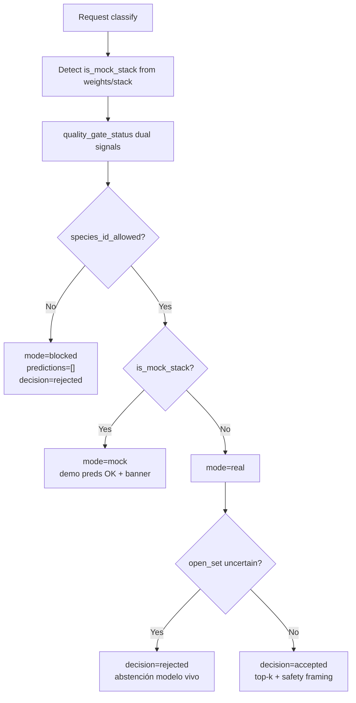
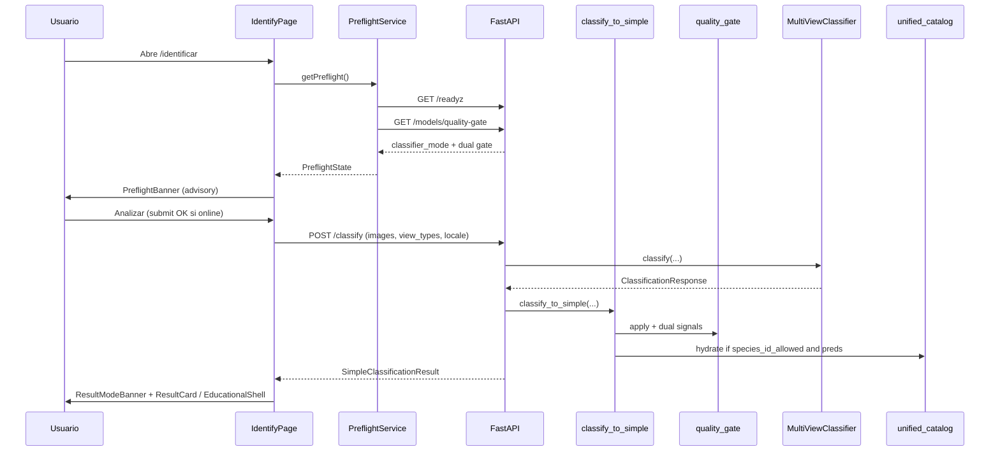
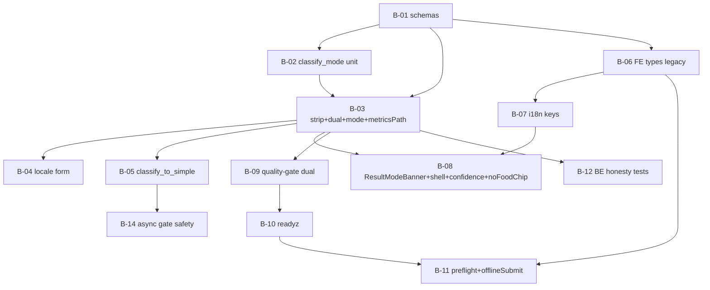

# VisionSetil Phase B — Honest Identify (MEGA PLAN)

| Campo | Valor |
| --- | --- |
| **Título** | Phase B: Identify honesto de extremo a extremo |
| **Autor** | Engineering / Architecture (borrador) |
| **Fecha** | 2026-07-22 |
| **Estado** | Closeout ready (rev 1.1.3 — B-52 rollout checklist + kill-switches) |
| **Repo** | `C:\Users\Mariano\Documents\ALONSOO\VISIONSETIL` |
| **Versión del plan** | **1.1.3** |
| **Audiencia** | Senior engineers (full-stack + ML), product |
| **Precedente** | Phase A (catálogo v2 ~520 spp, media `/media` + `SpeciesImage`, i18n ES/CA/EU/EN, pesos gitignored) |
| **Docs relacionados** | `docs/QUALITY_GATE.md`, `docs/SAFETY_POLICY.md`, `docs/ML_WEIGHTS_RUNBOOK.md`, `docs/MEGA_PLAN_PROFESSIONAL_UPGRADE.md` |
| **Programa PR** | **52 PRs** canónicos (B-01…B-52), tracks T0–T8 |

---

## Overview

Phase A dejó una enciclopedia creíble (catálogo unificado, media propia, i18n). Phase B cierra la brecha de producto: **Identify no puede mentir**. Hoy el backend aplica el quality gate (MAP@3 / deadly recall) y limpia predicciones, pero **descarta** el payload `quality_gate` antes de devolver `SimpleClassificationResult`; no existe un campo de primer orden `mode: real | mock | blocked`; el frontend no envía `locale`; no hay preflight UX que diga *por qué* el sistema se abstiene; el camino async (`POST /classify/async`) no aplica el mismo mapper ni gate — **agujero de seguridad/honestidad** (predicciones sin gate); y hay un test (`test_hydrate_image_card_url_uses_public_prefix`) que ya espera `_hydrate_prediction` — función **ausente** en `routes_classify.py`.

Este documento define un **programa de 52 PRs** (tracks T0–T8), cada uno mergeable e independientemente reviewable, para que Identify sea **honesto de extremo a extremo**: el usuario siempre ve si la clasificación es real, mock o bloqueada; por qué; y qué puede hacer sin IDs de especie falsos (educación, lookalikes, handoff a experto, cuaderno de campo). Cuando el gate pase y haya pesos reales, se muestran predicciones con framing de seguridad, hidratación de catálogo (vernáculos, media, riesgo) y evidencia multi-vista.

**Tesis de producto:** nunca silenciar el estado del modelo. La app no puede sentirse como «dos apps» (enciclopedia funciona; identify miente).

**MVP (camino crítico único):** contrato API + strip/attach gate + dual signals + **metrics-path SSOT (D-B12 en B-03)** + mode + FE types/legacy fallback + i18n mode/gate + ResultModeBanner + shell educativo blocked + confidence gating + preflight (readyz+gate) + **offline submit disable** + tests de matriz. Ver §Rollout y §PR Plan — **una sola lista ordenada**. Async gate **B-14** tras **B-05** (paralelo a FE, no tras B-08).

---

## Background & Motivation

### Estado verificado en código (2026-07-22)

| Área | Situación real |
| --- | --- |
| **`POST /classify`** | `backend/app/api/routes_classify.py`: acepta imágenes + metadata + `view_types` (comma-separated, `CANONICAL_VIEWS`). Mapea a `SimpleClassificationResult` vía `_map_to_simple`. |
| **Quality gate apply** | `_map_to_simple` llama `apply_quality_gate_to_simple_result`, **pero** hace strip del key: `return SimpleClassificationResult(**{k: v for k, v in gated.items() if k != "quality_gate"})` (L143–144). En pass path, `apply_quality_gate_to_simple_result` **ya** setea `quality_gate` (L120–122); el bug es solo el strip de salida. |
| **Schemas** | `SimpleClassificationResult` (`backend/app/db/schemas.py` L231–254): tiene `is_mock_stack: bool = True`, `ml_notes`, `confidence_margin`, `view_coverage`. **Falta** `mode`, `quality_gate`, `locale`, campos de hidratación en predicciones. |
| **Gate logic** | `backend/app/ml/quality_gate.py`: bloquea si MAP@3 < `model_min_acceptable_map_at_3` (0.20) o deadly recall < 0.90 o sin métricas. `model_block_species_id_when_below_gate=True` por defecto. Si gate **deshabilitado**, fuerza `species_id_allowed=True` y `verdict="ACCEPTABLE"` con reason `gate_disabled (...)` — **señal dual insuficiente hoy**. |
| **`is_mock_stack`** | Se calcula por stack/pesos (`routes_classify.py` L101–115 / `classifier.is_real`); **independiente** del gate. No debe derivarse de `mode`. |
| **Open-set** | `_map_to_simple` L86–90: `decision=rejected` si open-set uncertain — **ortogonal** a `mode` (puede ser `mode=real` + `decision=rejected`). |
| **Health** | `/readyz` reporta `classifier_mode` real/mock, catalog count, media root, `degraded`. **No** expone `quality_gate` nested. |
| **Models API** | `GET /models/quality-gate` → `quality_gate_status()`. Dashboard ML usa `/models/status` + `/readyz` + experiments. |
| **FE client** | `frontend/src/api/client.ts`: envía `view_types` si hay; **no** `locale`. `types.ts`: sin `mode` / `quality_gate`. **Sin dependencia `zod`** en `package.json`. |
| **Identify UI** | `IdentifyPage.tsx` + `MultiViewWizard` + `ResultCard` + `ModelInsightsPanel`. Con predicciones vacías (gate fail) no inventa top-k, pero sigue con stack-badge heuristics, **muestra confidence margin**, y **`FoodQualityChip`** en predicciones no rejected (ResultCard ~L208–214) — tensión con SAFETY_POLICY. |
| **Async (safety hole)** | `routes_jobs.py` + `task_queue.run_classification_job`: **sin** `view_types`/`locale` form; **sin** `_map_to_simple` / quality gate / mode; serializa **`ClassificationResponse` crudo** → puede devolver predicciones de especie **sin gate**. |
| **Advanced** | `POST /observations/{id}/classify-advanced` devuelve **`ClassificationResponse`** (familia de schema distinta a `SimpleClassificationResult`: candidates, open_set, human_review, trace…). No es “añadir un campo”; es adapter/wrapper o deprecación. |
| **Hidratación** | Test en `test_media_and_catalog.py` L209–220 importa `_hydrate_prediction` — **no existe**. Predicciones con `common_name=None` (L79). |
| **Métricas** | `routes_metrics.py`: `record_classification` **definido pero no cableado** desde classify routes hoy. Contadores mode/gate deben enganchar hooks existentes. |
| **Safety** | `docs/SAFETY_POLICY.md` + `core/safety_i18n.py`. Classify tests prohíben «safe to eat». |
| **i18n** | Claves `identify.*` / `result.*` existen; faltan `mode.*` / `gate.*` / `preflight.*`. |
| **Feature flags** | `frontend/src/lib/featureFlags.ts` (`VITE_FEATURE_*`). |
| **Historial / handoff** | Sin `mode`/`quality_gate`/`locale` explícitos. |
| **Join modelo↔catálogo** | `scripts/build_species_index_join.py` ligero; no CI label2idx↔catalog_v2 completo. |
| **Metrics path** | Comentario “worst honest gate” vs implementación sibling → industrial → **best MAP** entre kernel outputs (`quality_gate.py` L19–59). |

### Pain points

1. **Mentira por omisión:** gate actúa, FE no recibe estructura → rechazo opaco.
2. **Modo ambiguo:** heurísticas `is_mock_stack` / stack badge; sin enum de producto.
3. **Async ungated:** regresión de seguridad si alguien usa jobs.
4. **Confidence / food chips** en Identify aunque el stack sea demo o gate falle en edge cases.
5. **Enciclopedia rica / Identify pobre** sin hydrate.
6. **Sin preflight** de gate antes de subir 4 fotos.
7. **Test huérfano** de hidratación.

### Motivación

En micología de campo, una app que **inventa** o **simula** IDs de especie es peor que abstenerse. Fail-closed + honesty de modo es requisito de seguridad y confianza de producto.

---

## Goals & Non-Goals

### Goals

1. **Contrato honesto** en `SimpleClassificationResult`: `mode`, `quality_gate` (señales duales), `locale` echo, predicciones hidratadas cuando aplique.
2. **Preflight** advisory: FE consulta `/readyz` + `/models/quality-gate` y muestra banner (nunca hard-block por gate).
3. **UX de modos + abstención open-set** ortogonal: `ResultModeBanner`, shell educativo blocked, confidence solo `real` + `metrics_acceptable`.
4. **Paridad de honesty en async** (safety-critical) vía mapper compartido; form view_types/locale en track jobs.
5. **Puente catálogo–modelo**, lookalikes, safety-by-surface (**sin FoodQualityChip en Identify**).
6. **Observabilidad**: contadores mode/gate; logs estructurados; cablear `record_classification`.
7. **Tests** unit + Playwright blocked/mock + safety CI.
8. **Docs y rollout** con flags kill-switch de banners.

### Non-Goals

- Entrenar un modelo que pase el gate.
- Embarcar pesos en GitHub.
- Reescribir stack FE/BE.
- «Safe to eat» / consejos de consumo en cualquier locale en Identify/Result.
- App nativa, multi-tenant, i18n fuera de ES/CA/EU/EN.
- Sustituir micólogo humano.
- Hacer de `classify-advanced` el path de producto Identify (sigue admin/internal; ver D-B17).

---

## Key Decisions

| ID | Decisión | Rationale |
| --- | --- | --- |
| **D-B1** | `mode: Literal["real","mock","blocked"]` es el enum de **producto/honestidad**. `is_mock_stack` es **verdad de stack** (pesos/backends cargados), calculado como hoy, **nunca** sobrescrito desde `mode`. Compat FE: leer ambos. | Evita envenenar heurísticas cuando real+gate fail → `mode=blocked` pero `is_mock_stack=false`. |
| **D-B2** | **Siempre** devolver `quality_gate: QualityGatePayload` (pass y fail). Un solo PR elimina el strip y asegura attach (pass path ya setea gate). | Bug de producto; FE y preflight necesitan la misma estructura. |
| **D-B3** | **Fail-closed** por defecto (`model_block_species_id_when_below_gate=True`). Disable solo dev; en prod alertar. | Alineado con `QUALITY_GATE.md`. |
| **D-B4** | Derivación: `mode = blocked if not species_id_allowed else (mock if is_mock_stack else real)`. Orden **gate > mock > real**. | `species_id_allowed` es política de serve; ver D-B15 para métricas crudas. |
| **D-B5** | `locale` form opcional en `/classify`. **Invalid locale → HTTP 400** con lista soportada (paridad con species API / `_locale_from_request`). Default si omitido: `es`. Echo en `result.locale`. | Consistencia API; FE solo envía locales válidos de i18n. |
| **D-B6** | Preflight es **siempre advisory** respecto al gate. **Submit permitido si API online.** Preflight **nunca** hard-bloquea por gate/blocked. Solo offline/API-down deshabilita submit — **requerido en MVP B-11** (preflight + Identify submit UX). UX opcional: copy “Enviar de todos modos (verás abstención)”. | SSOT = respuesta classify; evita preflight stale + lenguaje contradictorio. |
| **D-B7** | Programa **granular ~52 PRs** (no fat PR). Solo se fusionan PRs **vacíos/duplicados** (strip+attach; no dos PRs de docs idénticos). **No** se colapsa a ~25 PRs: el usuario pidió mega-plan reviewable. | Reviewability + ownership sin slices vacíos. |
| **D-B8** | Hidratación **server-side** (`_hydrate_prediction` / `prediction_hydrate.py`). | Test huérfano; SSOT media URLs. |
| **D-B9** | Confidence UI **solo** si `mode=="real"` **y** `quality_gate.metrics_acceptable==true`. No basta `species_id_allowed` bajo gate-disabled. | Evita barras de confianza con métricas catastróficas en dev disable. |
| **D-B10** | Async/jobs reutilizan el **mismo** `classify_to_simple` que sync. Gate parity es **safety-critical** (temprano, post helper compartido), no polish T6 tardío. | Cierra agujero ungated. |
| **D-B11** | API: `reason_code` estable (inglés machine). FE i18n ES/CA/EU/EN para banners. BE deja de **duplicar** párrafos largos ES en `warnings` cuando FE consume mode/gate; mantiene **una** frase safety localizada vía `locale` + `get_safety_bundle` para clientes no-FE. | Evita double banner ES+i18n. |
| **D-B12** | Algoritmo de métricas del gate: **solo métricas del checkpoint en serve** (sibling del path de pesos **realmente cargados**), no “best MAP” global de kernels. Ver §Gate metrics algorithm. **Implementación honesty-critical en B-03** (junto dual signals); tests golden multi-métricas ampliados en B-20. | Nunca declarar ACCEPTABLE con métricas de otro modelo; no dejar best-MAP serve vivo durante el tren MVP. |
| **D-B13** | **Mock + gate pass (OQ1):** mostrar predicciones demo **con** banner mock y confidence N/A; **nunca** copy de “identificación de campo”. | Dev usable sin mentir. |
| **D-B14** | **Vistas mínimas (OQ3):** default **soft** (warnings; submit si ≥1 vista en wizard con required gaps como warning). Hard gate gills+front solo con flag `VITE_FEATURE_HARD_VIEW_MIN` / setting (off por default). | No bloquear explore; documentar recomendación. |
| **D-B15** | **Dual signal en QualityGatePayload:** `metrics_acceptable` (MAP/deadly crudos, **nunca** forzados por disable) + `species_id_allowed` (política) + `block_enabled`. `verdict` refleja **métricas** (`ACCEPTABLE`/`UNACCEPTABLE` según umbrales), no el bypass de disable. Si disable: `species_id_allowed=true`, `reason_code=gate_disabled`, `metrics_acceptable` puede ser false. | Preflight no miente sobre calidad del modelo. |
| **D-B16** | **Identify prohíbe `FoodQualityChip` y chrome verde de comestibilidad** en todos los modes. Solo risk chips + orientation copy. Encyclopedia puede seguir con food-quality bajo sus flags. | SAFETY_POLICY + surface D16. |
| **D-B17** | **Producto Identify usa solo `POST /classify` (y opcional async simple).** `classify-advanced` es admin/internal: documentar; wrapper honesty opcional post-MVP (no bloquea Phase B producto). | Schema family distinta (`ClassificationResponse`). |
| **D-B18** | **Job result envelope (OQ5):** `{ "schema_version": 2, "simple": <SimpleClassificationResult>, "raw": <ClassificationResponse|null> }`. FE/async producto solo lee `simple`. **`raw` se mantiene de forma indefinida** para admin/debug (siempre disponible ClassificationResponse completo). No hay plan de deprecación/eliminación de `raw`. | Producto honesto vía `simple`; ops conserva traza rica. |
| **D-B19** | **FE validation:** TypeScript types + narrow runtime guards (`mode in REAL_MOCK_BLOCKED`); **no** introducir `zod` en Phase B salvo decisión futura explícita. Contract tests BE↔FE en T7. | Sin nueva dep/bundle. |
| **D-B20** | **Legacy FE** (respuesta sin `mode`): si `mode` **ausente**, derivar (no usar defaults de schema como verdad): ver §Legacy FE algorithm. | Compat deploy parcial. |
| **D-B21** | **`in_catalog: bool`** único en predicciones (true/false); eliminar pareja `out_of_catalog` redundante. Badge FE: `!in_catalog`. | Evita desync. |
| **D-B22** | Campos `mode` y `quality_gate` **required** en schema nuevo; el mapper **siempre** los computa. No default “success” silencioso a real. Defaults Pydantic solo para tests incompletos; tests de forget-to-set. | Fail-safe operabilidad. |
| **D-B23** | **`metrics_path` exposure:** siempre path **completo** (absoluto o repo-relative resuelto) en `QualityGatePayload` y logs — **nunca** basename-only. | Decisión de usuario; facilita ops/debug del gate. |
| **D-B24** | **Job `raw` retention:** ver D-B18 — envelope dual permanente; sin sunset de `raw`. | Decisión de usuario. |
| **D-B25** | **label2idx ↔ catalog join (B-39):** ejecución **nightly + script on-demand**; **no** en cada PR/CI obligatorio. | Decisión de usuario; evita coste de CI sin bloquear honesty de identify. |

---

## Proposed Design

### 1. Modelo mental de modos (stack ⟂ gate ⟂ open-set)



### 2. Matriz normativa mode × decision

| mode | decision | Significado | predictions | confidence UI |
| --- | --- | --- | --- | --- |
| **blocked** | rejected | Quality gate / política: species ID no permitido | **siempre `[]`** | **oculto** |
| **mock** | accepted o rejected | Stack demo; gate policy permite ID | demo (D-B13) o vacías si open-set mock | **N/A** (oculto) |
| **real** | accepted | Modelo vivo, orientación | top-k hidratadas | visible si `metrics_acceptable` |
| **real** | rejected | Abstención open-set / evidencia (modelo **sí** permitido) | según open-set (puede `[]` o low conf) | de-emphasized / no “alta confianza” |

**Copy keys (FE i18n) — no mezclar:**

- `mode.blocked` / `gate.metricsLine` — “Identificación bloqueada: modelo bajo umbral”
- `mode.mock` — “Modo demo — sin pesos de campo”
- `mode.real` — “Modelo en vivo — solo orientación”
- `decision.rejected_open_set` — “El modelo se abstiene (incertidumbre / open-set)”
- `decision.rejected_gate` — alias UI de blocked (misma shell educativa)

`mode` **no** codifica open-set. `decision` + `open_set_reason` / `rejection_reason` sí.

### 3. Contrato de respuesta (target)

```python
# backend/app/db/schemas.py (target)

class ClassifyMode(str, Enum):
    real = "real"
    mock = "mock"
    blocked = "blocked"

class QualityGatePayload(BaseModel):
    species_id_allowed: bool       # policy (respects block_enabled)
    metrics_acceptable: bool       # raw MAP/deadly only — never forced by disable
    block_enabled: bool
    reason: str                    # short machine-readable detail
    reason_code: str               # no_metrics | map_below | deadly_below | gates_passed | gate_disabled
    test_map_at_3: float | None = None
    safety_recall_deadly: float | None = None
    min_map_at_3: float = 0.20
    min_deadly_recall: float = 0.90
    metrics_path: str | None = None  # always full path (D-B23); never basename-only
    version: str | None = None
    verdict: Literal["ACCEPTABLE", "UNACCEPTABLE"]  # tracks metrics_acceptable only

class SimpleSpeciesPrediction(BaseModel):
    species: str
    common_name: str | None = None
    confidence: float
    edibility: str | None = None
    slug: str | None = None
    risk_level: str | None = None
    image_card_url: str | None = None
    image_thumb_url: str | None = None
    in_catalog: bool = False  # default false until hydrate succeeds (honest)

class SimpleClassificationResult(BaseModel):
    # ... existing fields ...
    mode: ClassifyMode                    # required — always set in mapper
    quality_gate: QualityGatePayload      # required — always set
    locale: str = "es"
    is_mock_stack: bool                   # stack truth; not derived from mode
```

Pydantic v2: serializar enum como **value string** (`use_enum_values` o `str, Enum`). OpenAPI mostrará enum.

### 4. Derivación de `mode` (función única)

`backend/app/ml/classify_mode.py`:

```python
def derive_classify_mode(*, is_mock_stack: bool, species_id_allowed: bool) -> str:
    if not species_id_allowed:
        return "blocked"
    if is_mock_stack:
        return "mock"
    return "real"
```

**No** mutar `is_mock_stack` después.

### 5. Fix strip-gate + attach (un solo cambio de producto)

Hoy:

```python
gated = apply_quality_gate_to_simple_result(simple.model_dump())
return SimpleClassificationResult(**{k: v for k, v in gated.items() if k != "quality_gate"})
```

Target (dentro de `classify_to_simple`):

```python
gated = apply_quality_gate_to_simple_result(simple.model_dump())
# quality_gate always present from apply_* (pass and fail)
gate = gated["quality_gate"]
gated["mode"] = derive_classify_mode(
    is_mock_stack=bool(gated.get("is_mock_stack", True)),
    species_id_allowed=bool(gate.get("species_id_allowed", False)),
)
gated["locale"] = locale
return SimpleClassificationResult(**gated)
```

### 6. Gate metrics algorithm (normativo — D-B12)

```text
function load_gate_metrics(loaded_weights_path: Path | None) -> metrics | None:
  # 1) SSOT: sibling of ACTUALLY loaded multi-view checkpoint
  if loaded_weights_path and (loaded_weights_path.parent / "metrics.json").is_file():
      return read(sibling)

  # 2) If weights loaded but no sibling metrics → species_id_allowed=false
  #    reason_code=no_metrics (do NOT fall through to "best kernel MAP")
  if loaded_weights_path is not None:
      return None

  # 3) No weights loaded (mock path): optional discovery for *reporting only*
  #    Prefer configured multi_view_weights_path sibling, then industrial_v1/metrics.json
  #    Do NOT pick max(test_map_at_3) across kernel_output* for serve decisions
  #    If multiple candidates for reporting: pick mtime-newest with test_map_at_3
  return discovery_metrics_for_status_only()
```

**Implementación:** algoritmo serve en **B-03** (honesty-critical, mismo PR que dual signals + strip fix). **B-20** solo amplía goldens + `QUALITY_GATE.md`.  
**Rollout:** log `metrics_path`, `test_map_at_3`, `safety_recall_deadly` en cada evaluate. Nunca “best MAP” de un run que no es el serving model.

### 7. quality_gate_status dual signals

```python
metrics_acceptable = map_ok and deadly_ok  # False if no metrics
species_id_allowed = metrics_acceptable if block_enabled else True
reason_code = ...
verdict = "ACCEPTABLE" if metrics_acceptable else "UNACCEPTABLE"
# if not block_enabled and not metrics_acceptable:
#   reason_code = "gate_disabled"; species_id_allowed = True; metrics_acceptable stays False
```

### 8. Flujo end-to-end



### 9. Preflight FE

`frontend/src/lib/preflight.ts`:

```ts
export type PreflightMode = 'real' | 'mock' | 'blocked' | 'offline' | 'unknown'

export type PreflightState = {
  mode: PreflightMode
  ready: boolean
  classifier_mode?: string
  species_id_allowed?: boolean
  metrics_acceptable?: boolean
  block_enabled?: boolean
  gate_reason?: string
  reason_code?: string
  map_at_3?: number | null
  deadly_recall?: number | null
  catalog_count?: number
  fetched_at: number
}
```

**Algoritmo de mapeo (normativo — ver tabla Appendix D.1):**

| Prioridad | Condición | PreflightMode | Submit |
| --- | --- | --- | --- |
| 1 | fetch/health fail | `offline` | **disabled** |
| 2 | `!species_id_allowed` | `blocked` | enabled (advisory) |
| 3 | allowed + classifier mock | `mock` | enabled |
| 4 | allowed + real + `metrics_acceptable` | `real` | enabled |
| 5 | allowed + real + `!metrics_acceptable` (gate disabled) | `real` | enabled; banner **warning** métricas |
| 6 | allowed + mock + `!metrics_acceptable` | `mock` | enabled; demo + metrics warning |
| 7 | else | `unknown` | enabled si online |

Submit: disabled **solo** si `mode==='offline'` (o health fail). Gate blocked → banner + submit enabled. **MVP B-11 must implement offline disable** (hard acceptance).

### 10. Legacy FE algorithm (D-B20)

```ts
function resolveMode(result: ClassificationResult): ClassifyMode {
  if (result.mode === 'real' || result.mode === 'mock' || result.mode === 'blocked') {
    return result.mode
  }
  // Legacy response (field missing) — do NOT trust client schema defaults
  const rr = `${result.rejection_reason || ''} ${(result.ml_notes || []).join(' ')}`
  if (/model_quality_gate|quality_gate/i.test(rr) || (result.decision === 'rejected' && result.predictions.length === 0 && /GATE/i.test((result.warnings || []).join(' ')))) {
    return 'blocked'
  }
  if (result.is_mock_stack !== false) return 'mock'
  return 'real'
}
```

### 11. UX resultados

| Mode | Banner | Predicciones | Confidence | FoodQualityChip | CTAs |
| --- | --- | --- | --- | --- | --- |
| blocked | gate metrics + reason_code i18n | empty educational shell | hidden | **never** | educación, enciclopedia, experto, cuaderno |
| mock | demo | demo labeled (D-B13) | hidden | **never** | + ML dashboard / runbook |
| real + accepted | live orientation | top-k + SpeciesImage | if metrics_acceptable | **never** | safety, lookalikes, experto |
| real + rejected | live + open-set abstention | per open-set | de-emphasized | **never** | more views, experto |

**Design tokens:** semantic colors (info/warning/danger/neutral). **Prohibido** verde “edible/success” en Identify result chrome.

### 12. Shared mapper

`backend/app/services/classify_simple.py`:

```python
def classify_to_simple(
    *,
    observation: Observation,
    images: list[ObservationImage],
    view_types: list[str] | None,
    locale: str,
    request_id: str,
    classifier: object | None = None,
    processing_time_ms: int | None = None,
) -> SimpleClassificationResult:
    """Run multi-view (or injected) classifier → map → gate → mode → hydrate."""
    ...
```

Usado por `routes_classify` y `task_queue.run_classification_job`.

### 13. Hidratación

```python
def _hydrate_prediction(
    species: str,
    confidence: float,
    edibility: str | None,
    locale: str,
) -> SimpleSpeciesPrediction:
    # synonym normalize → get_by_scientific_name
    # common_name from resolve_vernaculars
    # image_card_url = f"{media_public_prefix}/species/{slug}/card.webp"
    # in_catalog = hit is not None
    ...
```

Contrato alineado con `test_hydrate_image_card_url_uses_public_prefix`.

### 14. Async safety (IDs canónicos B-01…B-52)

1. Extraer `classify_to_simple` (**B-05**).
2. Worker aplica mapper+gate+mode + dual-write job result (**B-14**, safety-critical; **no** espera FE UI).
3. Result envelope `schema_version: 2` con `simple` + `raw` permanente (D-B18 / D-B24) — parte de **B-14**.
4. Form async `view_types`/`locale` (**B-44**).
5. Contract tests job result (**B-45**).
6. FE async + polling (**B-46**) **solo** tras **B-45** verde.

### 15. Performance (aspiraciones, no acceptance duros)

| Métrica | Aspiración |
| --- | --- |
| Preflight | p95 &lt; 200 ms local, **sin GPU**; gate status cache (`lru_cache` metrics) |
| Classify blocked/mock | dominado por I/O imágenes |
| Classify real 4-view | budget histórico multi_view; **no** es criterio de cierre Phase B |

**Acceptance de perf Phase B:** preflight y `GET /models/quality-gate` no cargan pesos GPU; metrics load cacheado.

### 16. Riesgos

| Riesgo | Sev | Mitigación |
| --- | --- | --- |
| FE legacy sin `mode` | Alta | D-B20 algorithm en MVP |
| `is_mock_stack` mal derivado de mode | Crítica | D-B1 tests |
| Gate disable → confidence mentirosa | Alta | D-B9 + metrics_acceptable |
| Async ungated window | Crítica | **B-05 → B-14** (gate) antes de **B-46** (FE async); contract **B-45** |
| FoodQualityChip en Identify | Alta | D-B16 + **B-08** + Playwright **B-48** |
| Metrics path flip | Alta | D-B12 + golden tests + log path |
| Double ES banner + i18n | Media | D-B11 |
| Open-set confunde con blocked | Media | Matriz §2 + copy keys |
| in_catalog default true mentiría | Media | default false hasta hydrate |

---

## API / Interface Changes

### Before

```http
POST /classify  → SimpleClassificationResult sin mode/quality_gate/locale
# gate limpia preds pero strip quality_gate
```

### After

```http
POST /classify
# + locale? (es|ca|eu|en) — invalid → 400
→ mode, quality_gate (dual signals), locale, is_mock_stack (stack truth)
```

| Endpoint | Cambio |
| --- | --- |
| `GET /models/quality-gate` | Payload dual + `reason_code` |
| `GET /readyz` | `quality_gate` nested, `weights_present` |
| `POST /classify/async` | view_types, locale; worker → simple contract |
| `GET /jobs/{id}/result` | `{schema_version, simple, raw}` — `raw` always present when available (D-B18/D-B24) |
| `classify-advanced` | **No** path producto; doc only en Phase B (D-B17) |
| `/metrics` | mode/gate counters; **admin-scoped** — FE no scrapea |

### FE client (sin zod)

```ts
export async function classifyImages(
  files: File[],
  metadata?: ObservationMetadata,
  viewTypes?: string[],
  locale?: string,
): Promise<ClassificationResult>

export async function fetchPreflight(): Promise<PreflightState>

function assertClassifyShape(data: unknown): ClassificationResult  // narrow guards
```

---

## Data Model Changes

- Pydantic extendido; `Observation.last_classification` JSON libre — compatible.
- Jobs: dual-write D-B18.
- localStorage history/handoff: opcionales mode, locale, gate_summary.
- Join report ampliado en T5.
- **Sin** migración SQLAlchemy obligatoria.

---

## Alternatives Considered

### A1. Fat PR único
Rechazado — review/rollback imposibles (D-B7).

### A2. Solo `/readyz` para mode
Rechazado — race + historial opaco.

### A3. Fail-open con disclaimer
Rechazado — falsa seguridad.

### A4. Hydrate solo FE
Rechazado — test BE + SSOT media (D-B8).

### A5. Hard-block submit cuando preflight=blocked
Rechazado — preflight stale; D-B6.

### A6. Eliminar mock
Rechazado — dev/CI sin pesos.

### A7. Cuarto mode `degraded` (stack mixto)
Rechazado por ahora: `is_mock_stack` + stack badge cubren mixed; `mode` se mantiene 3 valores. Revisable post-MVP si mixed real+mock confunde.

### A8. Honesty en HTTP headers
Rechazado — body fields son visibles, cacheables en history, OpenAPI-first.

### A9. Server-driven UI copy (BE devuelve strings de banner localizados largos)
Parcial: BE safety one-liner por locale; banners de mode/gate en **FE i18n** (D-B11). Evita acoplar copy de producto al serve path.

### A10. Colapsar a ~25 PRs / stacked diffs
**Rechazado como estrategia principal:** el mandato de producto es mega-plan enorme con PRs reviewables. Sí se eliminan **duplicados vacíos** (strip+attach, docs repetidos) y se aclara scope de tests unit vs HTTP — resultado **52 PRs sólidos**, no 25 ni 66 con no-ops.

### A11. Introducir Zod para validate classify
Rechazado en Phase B (D-B19): sin dep actual; types + guards + contract tests bastan.

---

## Security & Privacy Considerations

| Tema | Tratamiento |
| --- | --- |
| Falsa ID | Fail-closed + mode + empty preds blocked |
| Food / green chrome | **D-B16**: no FoodQualityChip en Identify |
| Safe-to-eat copy | CI 4 locales + existing blacklist |
| Gate disable prod | Audit + alert `block_enabled=false` |
| Async ungated | Mapper shared early (D-B10) |
| Path disclosure | `metrics_path` **full path always** (D-B23); accept ops visibility over path secrecy in local/self-hosted deploy |
| Upload | límites existentes |
| `/metrics` | admin scope; no FE |

---

## Observability

### Métricas

```
classify_mode_total{mode="real|mock|blocked"}
gate_blocked_total{reason_code="..."}
classification_requests_total  # wire record_classification from classify path
classification_rejections_total{kind="gate|open_set|other"}
```

### Logging

```json
{
  "event": "classify_decision",
  "request_id": "...",
  "mode": "blocked",
  "is_mock_stack": false,
  "species_id_allowed": false,
  "metrics_acceptable": false,
  "reason_code": "map_below",
  "metrics_path": "/abs/or/repo/path/to/models/metrics.json",
  "locale": "es",
  "n_predictions_out": 0,
  "processing_time_ms": 420
}
```

### Alerting (ops)

| Condición | Acción |
| --- | --- |
| `block_enabled=false` en readiness prod (env `ENVIRONMENT=production`) | page/warn inmediato |
| Error rate 5xx `/classify` > 5% / 5m | page |
| Spike `mode=real` con `weights_present=false` | investigar mentira de mode |

### Preflight rate limits

- Poll Identify: montaje + cada **60s**.
- Endpoints `/readyz` y `/models/quality-gate` deben estar en **exención** o bucket alto (como media GET): target **≥120 req/min/IP** o sin rate limit auth-less status.
- Documentar en **B-17**; evitar 429 con 5 pestañas.

---

## Rollout Plan

### Feature flags

| Flag | Default post-MVP | Uso |
| --- | --- | --- |
| `VITE_FEATURE_IDENTIFY_PREFLIGHT` | true | PreflightBanner |
| `VITE_FEATURE_RESULT_MODE_BANNER` | true | ResultModeBanner |
| `VITE_FEATURE_HARD_VIEW_MIN` | false | D-B14 |
| `VITE_FEATURE_ASYNC_CLASSIFY` | false | FE async solo post contract |
| `model_block_species_id_when_below_gate` | true | BE gate |

### MVP — única lista de merge ordenada (fuente de verdad)

```text
B-01  schemas (mode, QualityGatePayload dual, locale, in_catalog)
B-02  classify_mode.py + unit matrix (is_mock_stack independent)
B-03  strip-gate + dual signals + mode wire + D-B12 metrics path (no best-MAP serve)
B-04  locale form field (400 invalid) + locale echo
B-05  extract classify_to_simple shared helper
B-06  FE types + legacy resolveMode (no zod)
B-07  i18n keys mode/gate/preflight/decision (ES/CA/EU/EN)
B-08  ResultModeBanner + confidence gating (D-B9) + FoodQualityChip ban + educational blocked shell
B-09  quality-gate endpoint dual-signal polish
B-10  readyz nested quality_gate + weights_present
B-11  FE preflight + PreflightBanner + offline/API-down submit disable (hard)
B-12  BE regression: gate never stripped + HTTP mode matrix
B-13  OpenAPI honesty contract note
```

Post-MVP inmediato (async safety — **puede ir en paralelo** con FE B-06…B-11 tras **B-05**, sin esperar B-08):

```text
B-14  async worker uses classify_to_simple (gate+mode) + dual-write job result
…   (resto T1–T8 según PR Plan)
```

**Explícitamente post-MVP:** hydrate, async form view_types completo, FE async, catalog join, advanced doc, Playwright real path. **B-20** = golden multi-metrics ampliados + docs (algoritmo serve ya en **B-03**).

### Acceptance MVP

- [ ] Respuesta classify siempre trae `mode` + `quality_gate` (incl. pass)
- [ ] `is_mock_stack` independiente de `mode` (tests matriz)
- [ ] Gate metrics path = sibling de pesos **cargados** (no best kernel MAP) — **B-03**
- [ ] Gate fail → preds `[]`, mode=blocked, shell educativa + banner
- [ ] Confidence no se muestra en mock/blocked ni si `!metrics_acceptable`
- [ ] No FoodQualityChip en Identify
- [ ] Preflight banner; submit OK en blocked; **submit off offline (B-11 hard)**
- [ ] Legacy FE resolveMode documentado y testeado
- [ ] Open-set real+rejected no usa copy de gate-blocked

---

## Phase B Closeout — Rollout checklist & kill-switches (B-52)

> **Host PR:** B-52 (docs-primary). Scope: publicar este documento en main, checklist operativo de rollout, y kill-switches accionables. Residual QA solo si B-12/B-48…B-51 dejaron gaps; no reabrir features.

### Rollout checklist (ops)

Usar en orden al cerrar el tren B-01…B-52 o un deploy que active honesty Identify.

#### Pre-merge / pre-deploy

- [ ] **Doc en tree:** `docs/PHASE_B_HONEST_IDENTIFY.md` presente en la rama a desplegar (este archivo).
- [ ] **MVP B-01…B-13** mergeados (o equivalentes en monorepo) y CI verde en BE honesty tests (B-12) + OpenAPI note (B-13).
- [ ] **Async safety B-14** mergeado si `POST /classify/async` o jobs están expuestos en el entorno (no dejar window ungated).
- [ ] **Gate defaults:** `model_block_species_id_when_below_gate=true` en prod; disable **no** presente en `.env` de producción.
- [ ] **Pesos:** no embebidos en GitHub; path de serve + sibling `metrics.json` documentados en `ML_WEIGHTS_RUNBOOK.md` (B-23).
- [ ] **FE flags post-MVP** (ver tabla Feature flags): preflight + result mode banner **on**; hard view min **off**; async FE **off** hasta B-45/B-46 verdes.
- [ ] **Safety surface:** Identify sin `FoodQualityChip` / chrome edible-green (D-B16); scan i18n 4 locales sin «safe to eat».
- [ ] **Rate limits:** `/readyz` y `/models/quality-gate` exentos o bucket alto (≥120 req/min/IP) — B-17.

#### Smoke deploy (staging → prod)

- [ ] `GET /readyz` → JSON con `classifier_mode`, nested `quality_gate` (dual: `metrics_acceptable` + `species_id_allowed`), `weights_present`.
- [ ] `GET /models/quality-gate` → `reason_code`, `block_enabled`, `metrics_path` **full path** (D-B23) cuando hay métricas.
- [ ] `POST /classify` (1 imagen mínima):
  - [ ] Body siempre incluye `mode` ∈ {`real`,`mock`,`blocked`} y `quality_gate` (pass y fail).
  - [ ] Gate fail → `mode=blocked`, `predictions=[]`, `decision=rejected`.
  - [ ] `is_mock_stack` coherente con pesos, **no** derivado de `mode`.
  - [ ] `locale` echo; invalid locale → **400**.
- [ ] Identify UI:
  - [ ] PreflightBanner visible; submit **disabled solo offline**.
  - [ ] ResultModeBanner por mode; shell educativa en blocked.
  - [ ] Confidence **solo** `mode=real` **y** `metrics_acceptable` (D-B9).
  - [ ] Sin FoodQualityChip en `/identificar`.
- [ ] Async (si habilitado): job result `{schema_version:2, simple, raw}`; `simple` gated igual que sync.
- [ ] Metrics (admin): contadores `classify_mode_total` / `gate_blocked_total` o path cableado (B-51); **no** scrapear `/metrics` desde FE público.

#### Post-deploy watch (primeras 24–48 h)

- [ ] Alertas activas: `block_enabled=false` en prod; spike `mode=real` con `weights_present=false`; 5xx `/classify` > 5%/5m.
- [ ] Logs `classify_decision` con `mode`, dual gate, `metrics_path`, `request_id`.
- [ ] Sin regresiones de copy: open-set real+rejected ≠ copy de gate-blocked.
- [ ] Playwright blocked (B-48) / mock (B-49) verdes en CI o smoke manual equivalente.

#### Phase B “done” sign-off (Appendix C + T8)

- [ ] Preflight + result mode coherentes con BE.
- [ ] Gate fail: ninguna UI Identify presenta top-1 de campo ni food chip.
- [ ] Sync y async `simple` gated.
- [ ] Playwright blocked verde (o waiver documentado).
- [ ] Docs/runbooks + safety CI presentes.
- [ ] Open-set real+rejected copy distinto de blocked.
- [ ] Este closeout (checklist + kill-switches) revisado por ops/eng owner.

### Kill-switches (accionables)

Kill-switches **no** quitan el contrato honesty del API: sirven para degradar UX o política sin reintroducir mentiras de especie.

| # | Interruptor | Dónde | Efecto | Cuándo usarlo | No hace |
| --- | ---: | --- | --- | --- | --- |
| K1 | Revert PR individual / train slice | git | Quita el cambio concreto | Bug acotado a un PR | No deja API a medias si se revierte solo FE |
| K2 | `VITE_FEATURE_IDENTIFY_PREFLIGHT=false` | FE build env | Oculta PreflightBanner | Banner ruidoso / 429 preflight / copy roto | **No** desactiva gate ni offline-submit logic del API; re-check Identify si B-11 amarra submit solo al flag |
| K3 | `VITE_FEATURE_RESULT_MODE_BANNER=false` | FE build env | Oculta ResultModeBanner | Banner confunde / a11y regresión | **No** quita `mode`/`quality_gate` del body; ResultCard debe seguir empty en blocked |
| K4 | `VITE_FEATURE_ASYNC_CLASSIFY=false` | FE build env | FE no usa async path | Jobs inestables post B-46 | Sync `/classify` sigue; jobs BE si expuestos deben seguir gated (B-14) |
| K5 | `VITE_FEATURE_HARD_VIEW_MIN=false` | FE build env | Vuelve soft min views (default) | Hard min bloquea explore | No afecta mode/gate |
| K6 | `model_block_species_id_when_below_gate=false` | BE settings / env | `species_id_allowed=true` aunque métricas malas; `reason_code=gate_disabled`; `metrics_acceptable` **sigue false** | **Solo dev/debug** | **Prohibido en prod** sin page+waiver; confidence UI sigue gated por D-B9 |
| K7 | Quitar / no montar pesos reales | ops pesos | Fuerza stack mock → `mode=mock` si gate permite ID | Incidente de modelo / pesos corruptos | No “fake real”; banner mock obligatorio |
| K8 | Mantener gate fail (métricas malas o sin sibling) | metrics/weights | `mode=blocked`, preds `[]` | Sospecha de serve metrics wrong | Fail-closed es el estado seguro por defecto |

**Reglas de kill-switch:**

1. **Fail-closed serve intacto:** K2–K5 solo tocan UX/feature flags. El mapper sigue enviando `mode` + `quality_gate` dual.
2. **Nunca** “arreglar” un incidente de honesty poniendo `mode=real` a mano o strip de `quality_gate`.
3. **Prod + K6:** si `block_enabled=false` en readiness prod → alerta inmediata (ver Observability); rollback a `true` o sacar tráfico Identify.
4. **Orden de contención recomendado en incidente “Identify miente”:**
   1. Confirmar respuesta API (`mode`, preds, gate) vs UI.
   2. Si UI miente y API honesta → K2/K3 o hotfix FE; API se queda.
   3. Si API sirve preds con gate fail → **no** es kill-switch FE: revert B-03/B-05 path o forzar K7/K8 (blocked/mock), page on-call.
   4. Si async ungated → deshabilitar FE async (K4) **y** hotfix worker B-14; no dejar jobs públicos.
5. **Documentar** en el ticket de incidente: interruptor usado, env, commit/tag, hora UTC, owner.

### Residual QA gaps (solo si no cubiertos antes)

Checklist residual B-52 — marcar N/A si el PR anfitrión ya cerró el ítem:

- [ ] Structured `classify_decision` logs (si no en B-51).
- [ ] Vitest preflight / banner / `resolveMode` verdes.
- [ ] Golden JSON blocked (`mode=blocked`, preds `[]`, gate present).
- [ ] OpenAPI↔FE field contract (script o checklist manual: `mode`, `quality_gate.*`, `locale`, `is_mock_stack`, `in_catalog`).
- [ ] Si residual + docs > ~400 LOC o mezcla BE/FE ownership → split **B-52a** (BE logs/goldens) / **B-52b** (FE vitest + este checklist).

---

## Open Questions

**Ninguna pendiente de producto para Phase B.** Todas resueltas:

| OQ | Resolución |
| --- | --- |
| OQ1 mock+gate pass | **D-B13** |
| OQ3 hard min views | **D-B14** |
| OQ5 job result shape | **D-B18** / **D-B24** — envelope `simple`+`raw`; **`raw` permanente** (decisión usuario) |
| `metrics_path` exposure | **D-B23** — **siempre path completo** (decisión usuario) |
| label2idx↔catalog join cadence | **D-B25** — **nightly + on-demand**, no cada PR (decisión usuario) |

---

## Acceptance Criteria por tier

### T0 Contract + MVP honesty UI
Ver §Rollout MVP checklist + dual signals + D-B1 tests.

### T1 Preflight polish
readyz/gate estables; offline submit; ML dashboard tile; rate-limit status.

### T2 Gate copy BE
reason_code; menos ES prose duplicada; ModelInsightsPanel mode-aware.

### T3 Identify shell
layout, wizard soft, camera, errors, a11y, mobile.

### T4 Hydration & history
hydrate test green; SpeciesImage; lookalikes; handoff/history mode.

### T5 Catalog bridge
join report; in_catalog badge; synonyms; deadly; mismatch tile.

### T6 Async complete + FE optional
form parity; contract tests; FE async flagged.

### T7 E2E & metrics
Playwright blocked/mock; counters wired; contract OpenAPI↔FE.

### T8 Docs & ops
PHASE_B doc; runbooks; safety CI; kill-switches; weight hints.

---

## References

- `backend/app/api/routes_classify.py`, `routes_health.py`, `routes_models.py`, `routes_jobs.py`, `routes_classification.py`
- `backend/app/ml/quality_gate.py`, `weight_discovery.py`
- `backend/app/db/schemas.py`
- `backend/app/services/task_queue.py`, `multi_view_classifier.py`, `unified_catalog.py`
- `backend/app/api/routes_metrics.py` (`record_classification` unwired)
- `frontend/src/pages/IdentifyPage.tsx`, `components/ResultCard.tsx`, `ModelInsightsPanel.tsx`
- `frontend/src/api/client.ts`, `types.ts`, `lib/featureFlags.ts`, locales
- `docs/QUALITY_GATE.md`, `SAFETY_POLICY.md`, `ML_WEIGHTS_RUNBOOK.md`
- Tests: `test_quality_gate.py`, `test_multi_view_pipeline.py`, `test_media_and_catalog.py`

---

## Dependency DAG (MVP + async safety)



---

## PR Plan

> **Convención:** `[Phase B / Tn] B-XX — title`  
> **MVP:** B-01…B-13 ⭐  
> **Safety async:** B-14 ⭐⭐ (inmediatamente tras MVP BE helper)  
> **Total canónico: 52 PRs** (B-01…B-52). Sin B-03/B-15 duplicados; scopes de test unit vs HTTP separados.

---

### T0 — Contract foundation + MVP honesty UI

#### ⭐ B-01 — Schemas: mode, QualityGatePayload dual-signal, locale, in_catalog
- **Files:** `backend/app/db/schemas.py`
- **Deps:** ninguna
- **Desc:** `ClassifyMode`; `QualityGatePayload` con `metrics_acceptable`, `species_id_allowed`, `block_enabled`, `reason_code`, `verdict` (métricas); `mode`+`quality_gate` required en `SimpleClassificationResult`; `locale`; predicción: `slug`, `risk_level`, `image_*`, **`in_catalog` only** (no `out_of_catalog`). Enums serializan a string.

#### ⭐ B-02 — classify_mode pure function + unit matrix
- **Files:** `backend/app/ml/classify_mode.py`, `backend/app/tests/test_classify_mode.py`
- **Deps:** B-01
- **Desc:** Matriz stack×gate → mode; **assert `is_mock_stack` no se infiere de mode**. Casos real+blocked, mock+blocked, mock+allowed, real+allowed.

#### ⭐ B-03 — Stop strip quality_gate + dual signals + mode + metrics-path SSOT
- **Files:** `backend/app/api/routes_classify.py`, `backend/app/ml/quality_gate.py` (dual signals D-B15 + load path D-B12)
- **Deps:** B-01, B-02
- **Desc:** (1) Eliminar filter `k != "quality_gate"`; gate siempre en pass/fail. (2) `mode` vía `derive_classify_mode` **sin** tocar `is_mock_stack`. (3) `metrics_acceptable` independiente de disable. (4) **D-B12 en este PR:** `load_gate_metrics` usa sibling del checkpoint **realmente cargado**; si hay pesos y no sibling → `no_metrics`; **nunca** max-MAP entre `kernel_output*` para serve. Mínimo 1 test golden multi-metrics. **Fusiona** antiguo attach-hardening vacío. (Golden ampliados + docs en **B-20**.)

#### ⭐ B-04 — locale form field (400 invalid)
- **Files:** `routes_classify.py`, tests
- **Deps:** B-03
- **Desc:** Form `locale`; reutilizar normalize; invalid → 400 + supported list; default omit → `es`; echo `result.locale`.

#### ⭐ B-05 — Extract `classify_to_simple` shared helper
- **Files:** `backend/app/services/classify_simple.py`, refactor `routes_classify.py`
- **Deps:** B-03, B-04
- **Desc:** Firma Appendix D; un solo map+gate+mode(+hydrate hook later). **Antes** de async.

#### ⭐ B-06 — FE types + legacy resolveMode (no zod)
- **Files:** `frontend/src/api/types.ts`, `frontend/src/lib/classifyMode.ts`, vitest
- **Deps:** B-01
- **Desc:** Types alineados; `resolveMode` D-B20; narrow guards opcionales; **sin zod**.

#### ⭐ B-07 — i18n keys mode/gate/preflight/decision (4 locales)
- **Files:** `frontend/src/locales/{es,ca,eu,en}/common.json`
- **Deps:** ninguna (puede ir en paralelo a B-06)
- **Desc:** Claves separadas blocked vs open_set; scan no consumption phrases.

#### ⭐ B-08 — ResultModeBanner + educational shell + confidence gate + ban FoodQualityChip
- **Files:** `ResultModeBanner.tsx`, `ResultCard.tsx`, `ModelInsightsPanel.tsx` (mínimo confidence), CSS tokens, IdentifyPage
- **Deps:** B-06, B-07, B-03 (API en entorno de dev)
- **Desc:** Banner por mode; shell blocked con CTAs; confidence solo real+metrics_acceptable; **remove FoodQualityChip on Identify**; open-set copy distinto; data-testid e2e. Cumple Acceptance T2 + D-B16 + D-B9 + D-B13 mock labeling.

#### ⭐ B-09 — GET /models/quality-gate dual-signal polish
- **Files:** `routes_models.py`, `quality_gate.py`, tests
- **Deps:** B-01, B-03
- **Desc:** response estable; reason_code; metrics_acceptable expuesto.

#### ⭐ B-10 — /readyz quality_gate nested + weights_present
- **Files:** `routes_health.py`, tests
- **Deps:** B-09
- **Desc:** Nested gate dual; weights_present; gate fail **no** implica ready=false salvo settings mock.

#### ⭐ B-11 — FE preflight + PreflightBanner + offline submit disable (hard MVP)
- **Files:** `lib/preflight.ts`, `PreflightBanner.tsx`, IdentifyPage, feature flag
- **Deps:** B-06, B-07, B-10
- **Desc:** fetch readyz+quality-gate; map Appendix D.1; **nunca** disable submit por gate. **Hard acceptance:** si offline/API-down → submit **disabled** + copy claro (no spinner infinito). PreflightMode table includes gate_disabled+bad metrics → `real`/`mock` + warning (no `mock-or-real?`).

#### ⭐ B-12 — BE honesty regression tests (strip + HTTP matrix)
- **Files:** `backend/app/tests/test_classify_honesty.py`
- **Deps:** B-03, B-04, B-05
- **Desc:** Integration: JSON siempre tiene quality_gate; HTTP matrix mode con monkeypatch gate/stack. **Scope distinto de B-02** (puro vs HTTP).

#### ⭐ B-13 — OpenAPI / classify honesty contract docs
- **Files:** docstrings routes_classify, snippet OpenAPI examples
- **Deps:** B-03, B-04
- **Desc:** Documentar mode×decision, dual signals, locale 400.

---

### T1 — Readiness polish & dashboard

#### B-14 — ⭐⭐ Async safety: worker → classify_to_simple + dual-write result
- **Files:** `task_queue.py`, `routes_jobs.py` (minimal), schemas job result envelope
- **Deps:** B-05
- **Desc:** **Safety-critical.** Job result `{schema_version:2, simple, raw}`; simple siempre gated. view_types puede seguir None temporalmente. Tests: no ungated preds.

#### B-15 — Offline submit UX polish only (optional)
- **Files:** IdentifyPage, PreflightBanner copy/i18n
- **Deps:** B-11
- **Desc:** **No** reimplementa disable: B-11 ya es hard. Solo polish de copy, reintentar, o edge cases (readyz 503 vs network). Omitir si B-11 cubre acceptance.

#### B-16 — MlDashboardPage first-class gate tile
- **Files:** `MlDashboardPage.tsx`
- **Deps:** B-09
- **Desc:** metrics_acceptable vs species_id_allowed dual display; honesty.

#### B-17 — Preflight endpoints rate-limit / cheap path audit
- **Files:** middleware rate limit, health/models notes
- **Deps:** B-10
- **Desc:** Exenciones o límites altos; documentar 60s poll × tabs.

#### B-18 — Client send locale from i18n
- **Files:** `client.ts`, IdentifyPage
- **Deps:** B-06, B-04
- **Desc:** Append locale; no romper view_types.

#### B-19 — Fail-closed settings audit + prod guardrail log
- **Files:** `config.py`, `.env.example`, logging when block_enabled false
- **Deps:** B-03
- **Desc:** Default true; warn structured.

---

### T2 — Gate copy, metrics path, insights

#### B-20 — Metrics path golden suite + QUALITY_GATE.md (serve algo ya en B-03)
- **Files:** tests tmp multi-metrics ampliados, `docs/QUALITY_GATE.md`, logging `metrics_path` full (D-B23)
- **Deps:** B-03
- **Desc:** **No** reintroduce best-MAP. Amplía golden layouts (sibling miss, industrial report-only, multiple kernels) + documenta D-B12. Serve algorithm shippeó en **B-03**. Assert `metrics_path` is full path when present.

#### B-21 — BE reason_code + reduce long ES warning dump
- **Files:** `quality_gate.py`, safety_i18n one-liner by locale
- **Deps:** B-04, B-07
- **Desc:** D-B11; FE banners primary; BE short + one safety sentence.

#### B-22 — ModelInsightsPanel fully mode/gate-aware
- **Files:** `ModelInsightsPanel.tsx`
- **Deps:** B-08
- **Desc:** Dejar de confiar solo en stack strings; mostrar gate metrics; hide inflated margin.

#### B-23 — Settings/docs gate disable dev-only
- **Files:** config, docs, optional refuse if ENV=production
- **Deps:** B-19
- **Desc:** Guardrails dev-only disable + `ML_WEIGHTS_RUNBOOK` notes (antes B-57 en plan v1.0; ID canónico **B-23**).

---

### T3 — Identify shell UX

#### B-24 — Identify layout: preflight → wizard → result modes
- **Files:** `IdentifyPage.tsx`, CSS
- **Deps:** B-11, B-08
- **Desc:** Orden visual honesty flow.

#### B-25 — MultiViewWizard soft readiness + i18n slot labels
- **Files:** `MultiViewWizard.tsx`, `multiViewSlots.ts`
- **Deps:** B-24
- **Desc:** D-B14 soft default; hard flag optional.

#### B-26 — Free upload path best-effort view_types
- **Files:** IdentifyPage, client
- **Deps:** B-18
- **Desc:** No fake `free_N` as canonical; omit or auto-label BE.

#### B-27 — Camera capture → active wizard slot
- **Files:** CameraCapture, IdentifyPage, wizard
- **Deps:** B-25
- **Desc:** Assign to missing required first.

#### B-28 — Loading skeleton / stage labels (honest, non-fake ML %)
- **Files:** IdentifyPage, Skeleton
- **Deps:** B-24
- **Desc:** upload → analyze → apply policy.

#### B-29 — Error taxonomy network/4xx/5xx/timeout
- **Files:** client.ts, IdentifyPage, i18n
- **Deps:** B-18
- **Desc:** Map axios; view_types 400; timeout.

#### B-30 — a11y focus + aria-live result mode
- **Files:** ResultModeBanner, ResultCard, IdentifyPage
- **Deps:** B-08
- **Desc:** Focus management; roles.

#### B-31 — Mobile-first Identify polish
- **Files:** CSS identify/wizard/banners
- **Deps:** B-24
- **Desc:** Touch targets; sticky CTA; banners no cubren submit.

---

### T4 — Results honesty & hydration

#### B-32 — Server-side `_hydrate_prediction` / prediction_hydrate
- **Files:** `services/prediction_hydrate.py` o routes_classify, schemas, `test_media_and_catalog.py`
- **Deps:** B-05, B-04
- **Desc:** Vernaculars, risk, media URLs, `in_catalog`; pasa test huérfano.

#### B-33 — SpeciesImage on result cards
- **Files:** ResultCard
- **Deps:** B-32
- **Desc:** slug/scientificName + risk placeholder.

#### B-34 — Lookalikes panel hydrated
- **Files:** ResultCard, lookalikeRisk
- **Deps:** B-33
- **Desc:** Fichas + risk chips; no food chrome.

#### B-35 — Safety-by-surface docs + remaining Identify chrome audit
- **Files:** ResultCard, SAFETY_POLICY cross-link, tests
- **Deps:** B-08
- **Desc:** Confirmar no green edibility; encyclopedia untouched.

#### B-36 — Missing evidence + questions_for_user panel
- **Files:** ResultCard layer 3
- **Deps:** B-08
- **Desc:** Deep-link wizard slots.

#### B-37 — Expert handoff mode + quality_gate snapshot
- **Files:** expertHandoff.ts, ExpertReviewPage, ResultCard
- **Deps:** B-06
- **Desc:** Extender draft; mostrar dual gate.

#### B-38 — History stores mode/gate/locale + filter UI
- **Files:** observationHistory.ts, HistoryPage, IdentifyPage
- **Deps:** B-06
- **Desc:** Soft migrate old entries; filter by mode.

---

### T5 — Catalog–model bridge

#### B-39 — label2idx ↔ catalog_v2 join report automation
- **Files:** `scripts/build_species_index_join.py`, output JSON, nightly job docs/hook
- **Deps:** ninguna
- **Desc:** Coverage %, missing taxa. **Cadence (D-B25):** nightly CI/schedule + script on-demand; **not** required on every PR.

#### B-40 — in_catalog=false badge on predictions
- **Files:** hydrate, ResultCard
- **Deps:** B-32
- **Desc:** Honest out-of-catalog UI.

#### B-41 — Synonym normalization on hydrate
- **Files:** prediction_hydrate, synonyms.yaml, tests
- **Deps:** B-32
- **Desc:** Preferred scientific name.

#### B-42 — Deadly/poisonous join visibility (real mode only)
- **Files:** hydrate, ResultCard RiskChip
- **Deps:** B-32
- **Desc:** Boost visual; blocked remains empty.

#### B-43 — Allowlist/model mismatch dashboard tile
- **Files:** routes_models or metrics, MlDashboardPage
- **Deps:** B-39, B-16
- **Desc:** % overlap tile.

---

### T6 — Jobs form parity & FE async

#### B-44 — Async form parity view_types + locale
- **Files:** routes_jobs.py, task_queue, tests
- **Deps:** B-14
- **Desc:** Form fields; pass view_types into classify_to_simple.

#### B-45 — Job result contract tests (simple + permanent raw)
- **Files:** tests, docs
- **Deps:** B-14, B-44
- **Desc:** Assert `simple` has mode/gate; assert envelope keeps **`raw` for admin/debug** (D-B18/D-B24 — no removal plan). Product clients document read-`simple`-only.

#### B-46 — FE optional async classify + polling (flagged)
- **Files:** client.ts, IdentifyPage, featureFlags
- **Deps:** B-45, B-08
- **Desc:** **Only after** contract green; same banners.

#### B-47 — Advanced classify: product policy doc + optional thin note
- **Files:** `docs/PHASE_B_HONEST_IDENTIFY.md` section, routes_classification docstring
- **Deps:** B-13
- **Desc:** D-B17 — Identify producto = `/classify` only; advanced = admin; **no** fake field sprinkle PR. Optional follow-up RFC for wrapper out of Phase B critical path.

---

### T7 — Tests, e2e, observability

#### B-48 — Playwright blocked mode: no fake species + no FoodQualityChip
- **Files:** `frontend/e2e/identify-blocked.spec.ts`
- **Deps:** B-08, B-11
- **Desc:** Banner blocked; empty/educational; no food chip.

#### B-49 — Playwright mock mode banner
- **Files:** `e2e/identify-mock.spec.ts`
- **Deps:** B-08
- **Desc:** Demo banner visible.

#### B-50 — Playwright real path conditional skip
- **Files:** e2e + README
- **Deps:** B-48
- **Desc:** skip without weights+metrics_acceptable.

#### B-51 — Metrics counters + wire record_classification
- **Files:** routes_metrics.py, classify_simple hooks
- **Deps:** B-05
- **Desc:** mode_total, gate_blocked_total; **call** existing record_classification; document admin scope /metrics.

#### B-52 — Honesty closeout: docs checklist + residual QA
- **Files:** `docs/PHASE_B_HONEST_IDENTIFY.md` (§Phase B Closeout — Rollout checklist & kill-switches), residual QA only if gaps
- **Deps:** B-05, B-06, B-12, B-13, B-51 (preferred for counters/logs first)
- **Desc:** **Scope primario = docs/rollout checklist + kill-switches K1–K8** (T8 host). Residual QA only for gaps not covered by B-12/B-48…B-51. **Escape hatch:** if diff &gt;400 LOC or mixed BE/FE/docs ownership, split same train: **B-52a** BE logs+goldens, **B-52b** FE vitest+docs/checklist. Not a second mega-feature PR. **Delivered in-tree as v1.1.3 closeout section.**

---

### T8 — Docs, runbooks, rollout ops (embebidos, sin IDs fantasma)

**Conteo canónico: B-01…B-52 = 52 PRs.**

| IDs | Track | Count |
| --- | --- | ---: |
| B-01…B-13 | T0 MVP | 13 |
| B-14…B-19 | T1 + async safety start | 6 |
| B-20…B-23 | T2 | 4 |
| B-24…B-31 | T3 | 8 |
| B-32…B-38 | T4 | 7 |
| B-39…B-43 | T5 | 5 |
| B-44…B-47 | T6 | 4 |
| B-48…B-52 | T7 QA pack + e2e/metrics | 5 |
| **Total** | | **52** |

T8 no introduce PRs vacíos de “solo markdown”; el contenido de docs/ops se **entrega dentro** de PRs con código o cierre de fase ya listados:

| Entrega T8 | PR anfitrión |
| --- | --- |
| Publicar `docs/PHASE_B_HONEST_IDENTIFY.md` + rollout checklist + kill-switches | **B-52** |
| OpenAPI honesty examples | **B-13** |
| Metrics path serve algo (D-B12) | **B-03**; golden+docs **B-20** |
| Gate disable dev-only + `ML_WEIGHTS_RUNBOOK` preflight notes | **B-23** (+ notas en **B-11**) |
| Advanced = non-product policy | **B-47** |
| Safety locale CI scan | **B-07** + assert en **B-48** |
| Dev weight discovery hints en preflight/dashboard | **B-11** + **B-16** |

Acceptance T8: los cinco bullets de docs/runbooks/CI/hints existen en main al cerrar B-52.

---

## Appendix A — Matriz mode × is_mock_stack × gate (normativa)

| is_mock_stack | species_id_allowed | metrics_acceptable | mode | notes |
| --- | --- | --- | --- | --- |
| false | false | false | **blocked** | real weights, gate fail |
| true | false | false | **blocked** | mock + gate fail |
| true | true | true | **mock** | rare good metrics + mock stack |
| true | true | false | **mock** | gate_disabled dev; metrics still bad — **no confidence** |
| false | true | true | **real** | production path |
| false | true | false | **real** | gate_disabled + real stack — **no confidence** (D-B9) |

`is_mock_stack` column is **input**, never overwritten.

## Appendix B — Archivos de alto tráfico

- `routes_classify.py`, `classify_simple.py`, `quality_gate.py`, `schemas.py`
- `task_queue.py`, `routes_jobs.py`
- `IdentifyPage.tsx`, `ResultCard.tsx`, `types.ts`, `client.ts`, locales

## Appendix C — Done de Phase B

1. Preflight + result mode coherentes con BE.  
2. Gate fail actual: **ninguna** UI Identify presenta top-1 de campo ni food chip.  
3. Sync y async `simple` gated.  
4. Playwright blocked verde.  
5. Docs/runbooks + safety CI.  
6. Open-set real+rejected copy distinto de blocked.  
7. **B-52:** rollout checklist + kill-switches (K1–K8) en este documento; sign-off ops en §Phase B Closeout.

## Appendix D — Implementer’s crib sheet

### D.1 PreflightMode priority (normativo — sin ambigüedad)

| # | Condiciones | PreflightMode | Banner | Submit |
| --- | --- | --- | --- | --- |
| 1 | fetch fail o health offline | `offline` | API down | **disabled** |
| 2 | `species_id_allowed == false` | `blocked` | gate / species ID no permitido | enabled |
| 3 | allowed && (classifier mock / `is_mock_stack`) && `metrics_acceptable` | `mock` | demo | enabled |
| 4 | allowed && mock && `!metrics_acceptable` | `mock` | demo + **warning** métricas (gate disabled) | enabled |
| 5 | allowed && real && `metrics_acceptable` | `real` | live orientation | enabled |
| 6 | allowed && real && `!metrics_acceptable` | `real` | live + **warning** métricas inaceptables (gate disabled) | enabled |
| 7 | else | `unknown` | neutro | enabled si online |

Reglas: confidence UI sigue D-B9 (`mode==real` **y** `metrics_acceptable` en el **result** de classify; preflight warning no habilita confidence). No existe valor `mock-or-real`.

### D.2 `classify_to_simple` signature

```python
def classify_to_simple(
    *,
    observation: Observation,
    images: list,
    view_types: list[str] | None,
    locale: str,
    request_id: str,
    classifier: object | None = None,
    processing_time_ms: int | None = None,
) -> SimpleClassificationResult: ...
```

### D.3 Hydrate contract (orphan test)

```python
pred = _hydrate_prediction("Amanita phalloides", 0.9, "unknown", "es")
assert pred.image_card_url.startswith(settings.media_public_prefix...)
assert pred.slug == "amanita-phalloides"
assert pred.risk_level in ("deadly", "high", "critical")
assert pred.in_catalog is True
```

### D.4 Job envelope

```json
{
  "schema_version": 2,
  "simple": { "mode": "blocked", "quality_gate": {}, "predictions": [], "...": "..." },
  "raw": { "...": "ClassificationResponse — permanent admin/debug field (D-B24)" }
}
```

### D.5 CSS tokens (Identify)

- `--honesty-blocked`, `--honesty-mock`, `--honesty-real` — not success-green
- Forbidden: edible-green chips on `/identificar`

---

## Revision history

| Ver | Cambio |
| --- | --- |
| 1.0.0 | Initial mega plan ~66 PRs |
| 1.1.0 | Post-review: D-B1 fix, dual gate signals, open-set matrix, MVP complete, async sequencing, FoodQualityChip ban, no zod, metrics algorithm, OQ→decisions, 52 solid PRs, single MVP DAG |
| 1.1.1 | Re-review: global B-ID consistency; D-B12 metrics path folded into B-03; offline hard in B-11; Appendix D.1 closed; DAG B-05→B-14 only; B-52 scoped docs+escape hatch |
| 1.1.2 | User decisions: D-B23 full metrics_path always; D-B24 raw job field permanent; D-B25 join nightly+on-demand; Open Questions closed |
| 1.1.3 | **B-52 closeout:** publish doc + ops **Rollout checklist** + expanded **Kill-switches** (K1–K8) + residual QA gaps; brief observability rollback bullets folded into closeout |

---

*Fin del diseño Phase B — Honest Identify MEGA PLAN v1.1.3*
