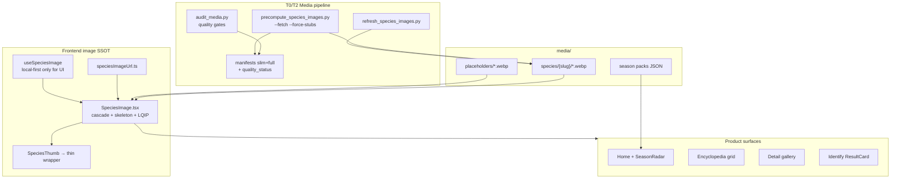
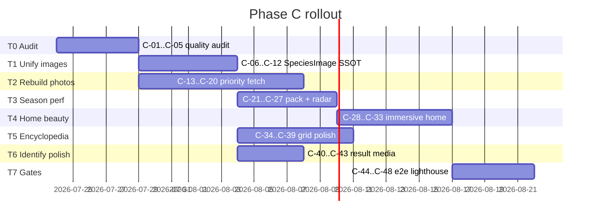
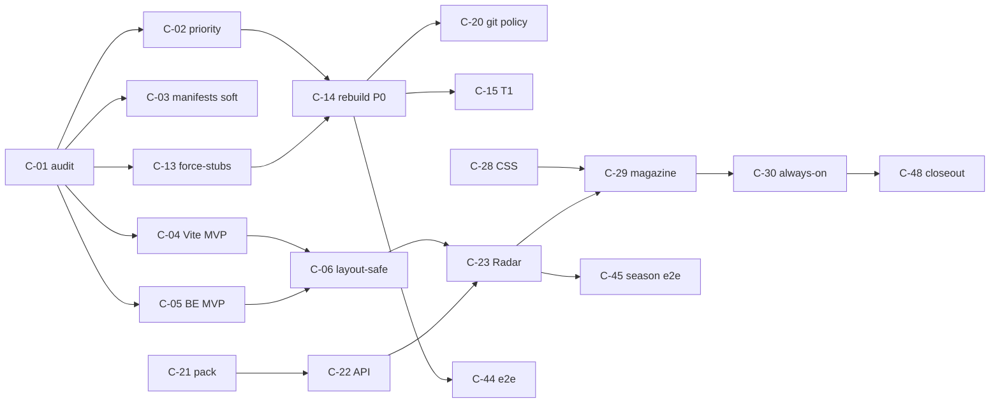

# VisionSetil Phase C — Media Reliability + Season Performance + Visual Beauty

| Campo | Valor |
| --- | --- |
| **Título** | Phase C: Fiabilidad de media, temporada rápida y belleza fotográfica |
| **Autor** | Engineering / Architecture |
| **Fecha** | 2026-07-23 |
| **Estado** | Draft v1.1.1 — residual dep hygiene + minNaturalWidth clarity |
| **Repo** | `C:\Users\Mariano\Documents\ALONSOO\VISIONSETIL` |
| **Branch tip** | `merge/best-of-both` (Phase B honesty shipped) |
| **Versión del plan** | **1.1.1** |
| **Audiencia** | Full-stack, product design, ops media |
| **Precedente** | Phase A (catálogo v2 ~520, `/media` + `SpeciesImage`); Phase B (Identify honesto) |
| **Docs relacionados** | `docs/MEGA_PLAN_PROFESSIONAL_UPGRADE.md`, `docs/WEB_PRODUCT_BAR.md`, `docs/PHASE_B_HONEST_IDENTIFY.md`, `docs/SAFETY_POLICY.md`, `frontend/src/styles/atelier.css`, `scripts/audit_media.py` |
| **Programa PR** | **48 PRs** canónicos (C-01…C-48), tracks **T0–T7** |

---

## Overview

Phase A y B dejaron un producto **técnicamente unificado** (catálogo SSOT v2, Identify honesto, media same-origin) pero el usuario sigue viendo **errores de foto**, muchas especies **sin imagen real**, y la sección **Temporada** se siente lenta. El diagnóstico verificado (2026-07-23) es claro:

| Hecho medido | Valor |
| --- | --- |
| Directorios `media/species/` | **520** |
| Archivos `card.webp` | **520** (0 missing) |
| Cards **tiny &lt;2 KB** (stubs decodables, solid-color WebP) | **386** (~74%); mean ≈ **884 B** |
| Cards mid **2–20 KB** | **7** |
| Cards ≥20 KB (size baseline) | **127** (~24%) |
| Cards que fallan corte stub D-C1 (&lt;8 KB) | **387** (386 tinies + 1 mid) |
| Legacy audit `real_photos` (meta ok, non-procedural) | **133** — **deprecated** as product KPI (see §KPI SSOT) |
| Suma total cards | **~6.1 MB** (6 389 782 B ≈ 6.09 MB) |
| Snapshot catálogo FE | **~841 KB** (`species_catalog_snapshot.json`, 861 461 B) |
| Season seeds | **4–7 taxones**/estación; **20 únicos** (no ~21); seed `Verpa bohemica` **no está en catalog v2** |

El usuario percibe «sin fotos» porque **stubs WebP con header RIFF** son **sólidos de color decodables** (no corruptos): pasan el audit actual (solo magic bytes), devuelven **HTTP 200 + `onLoad` success**, y se ven como manchas vacías. `SeasonRadar` bloquea el ready state en `ensureSeasonCatalog()` → `loadSpeciesCatalog()` (parse + hydrate de 520 spp) antes de pintar 4–7 thumbs; hoy Home **oculta** temporada detrás de accordion (`seasonOpen=false`), así que el cuello de botella se manifiesta al expandir — tras **D-C6 always-on** pasa al critical path de Home. Usa `SpeciesThumb` (hook `useSpeciesImage` → `speciesImageService`) en lugar de la cascada unificada de `SpeciesImage`.

**Tesis de producto Phase C:** cada superficie fotográfica debe ser **fiable** (placeholder de marca por riesgo, nunca icono roto), **rápida** (temporada sin esperar el catálogo completo) y **bella** (editorial nature/mycology, sin copiar marcas). Safety D16 se mantiene: **sin chrome food-safe green en Identify**.

### MVP camino crítico (canónico v1.1.1 — única lista)

Orden de merge **normativo** (cierra deps C-28, serve-stub, C-14+C-20, layout-safe thumb). **Hard deps only on PRs in this list** (C-25/C-27 are soft/fast-follow).

```text
C-01 → C-02 → C-04 → C-05 → C-13 → C-14 (+ C-20 concurrent) → C-06 → C-21 → C-22 → C-23 → C-28 → C-29 → C-30 → C-44 → C-45
```

| Paso | PR | Por qué es MVP |
| --- | --- | --- |
| Audit + priority | C-01, C-02 | Stubs medibles; lista P0 catalog-slug-only |
| Serve stub gates | **C-04, C-05** | Stubs dejan de “pintar éxito” en dev/prod **antes** de migrar UI (SSOT anti-stub) |
| Force-stubs + rebuild P0 | C-13, **C-14** | Priority non-stub + license-honest fetch |
| Git media policy | **C-20** | **Concurrent with C-14** (not optional bulk) |
| Thumb-safe SSOT | **C-06** | SpeciesImage compact; no minHeight 80 en listas 40–56px |
| Season pack path | C-21→C-23 | Sin full catalog; seeds ∈ v2; minimal ready mark in C-23 |
| Beauty CSS then markup | **C-28 → C-29 → C-30** | C-28 tokens **antes** de magazine strip; C-30 **no hard-dep C-25** |
| E2E | C-44, C-45 | Media quality + season timing; C-45 **no hard-dep C-27** |

**Fuera de MVP (fast-follow):** C-03 manifests (soft-dep C-13; W1), C-07 LQIP, **C-08** manifest skip FE, C-09–C-12 superficie completa, **C-15–C-19 bulk fetch/CI** (not C-20), **C-24–C-27** polish perf (C-25 Home catalog defer; C-27 extended marks — soft for C-30/C-45), C-31–C-48 resto.

---

## Background & Motivation

### Estado verificado en código (2026-07-23)

#### Media en disco y pipeline

| Área | Situación real |
| --- | --- |
| **Layout** | `media/species/{slug}/{thumb,card,detail,lqip}.webp` + `meta.json`; `media/placeholders/{default,toxic,deadly,unknown}.webp`; `media/manifests/species_images_{slim,v1}.json` |
| **Audit** | `scripts/audit_media.py`: solo `is_webp` (RIFF+WEBP magic). **No** mide tamaño mínimo, dimensiones, ni decodificabilidad. Reporta `ok` si existen 520 cards RIFF-válidos; `real_photos: 133` = meta `status=ok` y source no procedural (**no** byte quality). |
| **Precompute** | `scripts/precompute_species_images.py`: placeholders + fixtures + `generate_all_species` procedural; sólidos PNG→WebP **comprimen legítimamente a &lt;1 KB**. Existe `--force` (regenera si existe) pero **no** quality-aware `--force-stubs`. `only_missing=True` preserva tinies. `--fetch` con allowlist laxa; muchos `meta.license=wikipedia-page-image` (p.ej. `amanita-phalloides`) cuentan como ok sin CC real resuelto. |
| **Refresh/takedown** | `scripts/refresh_species_images.py`: HEAD source + license; revoca a `placeholder_only` y **borra** derivatives (no re-fetch quality). |
| **BE serve** | `backend/app/services/species_media.py`: `serve_species_variant` + fallback placeholder por risk del catálogo. |
| **FE dev serve** | `frontend/vite.config.ts` `serveRepoMediaPlugin`: `/media/*` desde monorepo; fallback placeholder heurístico por slug (deadly/toxic keywords). **No** detecta stub tiny. |
| **SW** | VitePWA CacheFirst `species-media` maxEntries **800**, 30d. |
| **Ejemplos tamaño** | Tiny: `russula-decolorans` **676 B**; real: `agaricus-freirei` **~129 KB**. Real bueno: `amanita-phalloides` con gallery 01–04 y meta `status=ok`. |

#### Dos caminos de imagen FE (divergencia crítica)

| Componente / path | Mecanismo | Superficies |
| --- | --- | --- |
| **`SpeciesImage`** | Cascada local: primary → card → thumb → `placeholderImageUrl(kind)` → `INLINE_PLACEHOLDER_SVG`; skeleton shimmer; `data-stage` | Enciclopedia (`SpeciesPhotoCard`, `MushroomCard`), lookalikes compare, global.css prediction thumbs |
| **`SpeciesThumb`** | `useSpeciesImage` → `resolveSpeciesImageSync/Async` (`speciesImageService`): local_media URL sin validar bytes; puede ir a wiki/iNat en eager; `onError` → SVG data-uri | **SeasonRadar**, ResultCard, LookalikeStudio, OfflinePack |
| **Home `DeadlyThumb`** | `useSpeciesImage` raw `` sin cascada SpeciesImage | Home alertas mortales |
| **`SpeciesGallery`** | Probe `detail`/`card` + gallery/01..04; API gallery JSON si FastAPI | Detail page |

Problema: un stub RIFF de 700 B puede devolver **HTTP 200** y decodificar a imagen casi vacía → `onLoad` success sin cascade; o decodificar mal → broken icon en thumbs sin skeleton profesional.

#### Season performance

```text
SeasonRadar mount
  → ensureSeasonCatalog() = loadSpeciesCatalog()
      → dynamic import species_catalog_snapshot.json (~841 KB)
      → map fromV2Record × 520 + optional merge speciesCatalog.json
  → setReady(true)
  → taxaForSeason(seeds 4–7) + SpeciesThumb × N
```

Los seeds (`SEASON_TAXON_SEEDS` en `frontend/src/lib/seasonRadar.ts`) son estáticos y pequeños; el bloqueo es **hidratar catálogo completo** solo para slug/common/risk. Home ya tiene patrón correcto en deadly: `HOME_DEADLY_SEED` síncrono + upgrade async.

#### Superficies con fotos

Home (hero, spin, features, deadly, season), Enciclopedia grid, Detail gallery, Identify results (`ResultCard` + `SpeciesThumb`), Lookalikes, Quiz, Offline pack, Spain map (SeasonRadar compact).

#### Design system existente (elevable, no reinventar)

- Tokens: `frontend/src/styles/tokens.css` (spacing, edibility D16 teal-not-green, skeleton)
- Atelier: `frontend/src/styles/atelier.css` (forest palette, Instrument Serif + Inter, glass header, season-radar, home-deadly, skeleton-atelier)
- Photo tiers: `photoTiers.ts` T0 (~20 icons) / T1 (Iberia+risk) / T2 rest
- KPI bar: `docs/WEB_PRODUCT_BAR.md` — hoy «fotos reales ≥133»; **Phase C v1.1 re-mapea** a KPI SSOT `ok_real` (ver §KPI SSOT)

### Pain points (usuario → causa raíz)

1. **«Muchas especies sin foto»** → stubs &lt;2 KB (WebP sólidos decodables) cuentan como card; audit no falla; UI muestra basura o vacío.
2. **«Errores de foto»** → dual path SpeciesThumb vs SpeciesImage; stubs; fallbacks inconsistentes (SVG data-uri vs placeholder.webp vs inline gradient).
3. **«Temporada lenta»** → full catalog hydrate antes de 4–7 items; además thumbs pueden disparar resolve async.
4. **«UI no es tan bonita como otras apps nature»** → bases atelier existen pero season es accordion lista plana; grid 1:1 sin masonry editorial; micro-interacciones incompletas en thumbs; mood image ausente.

### Motivación

En una app de micología, la **primera impresión es fotográfica**. Un catálogo de 520 taxones con 74% stubs erosiona confianza incluso con Identify honesto. Phase C cierra la brecha **media + percepción de calidad** sin reabrir Phase B safety.

---

## Goals & Non-Goals

### Goals

1. **Media reliability**
   - Detectar stub/tiny/corrupt WebP; tratarlos como **missing** en audit, manifests y (opcional) serve.
   - Rebuild prioritario: season seeds ∪ T0 ∪ deadly ∪ Iberian common (capa `data/species_catalog/layers/iberia_common.json`).
   - Pipeline crawl/refresh + **quality gate**: min bytes, dimensiones mínimas, RIFF válido, decode smoke (Pillow).
   - Unificar `SpeciesThumb` → `SpeciesImage` (o shared hook) con misma cascada + skeleton + opcional LQIP/blurhash.
   - Visual garantizado: nunca broken browser icon; placeholder brand por risk (`default|toxic|deadly|unknown`).
   - Audit script + CI gate: % cards ≥ N KB; report missing/stub.

2. **Season performance**
   - `SeasonRadar` **no** espera parse de 520 spp.
   - Bundle estático `season_pack_v1.json` (o TS seed enriquecido) con slug/common/risk/image URLs pre-resueltos.
   - Lazy load solo taxones de temporada; lista fija pequeña + LQIP/skeletons.
   - Prefetch thumbs de temporada siguiente.
   - **Targets (split cold/warm — ver §Perf):**
     - **Time-to-season-DOM** (pack sync, sin esperar imágenes): **&lt; 50 ms** p95 warm module; cold first JS eval no sujeto a 200 ms.
     - **Time-to-season-interactive (DOM + skeleton list):** **&lt; 200 ms** p95 **warm** (pack en bundle, no catalog parse).
     - **Time-to-first-season-thumb-complete:** **&lt; 800 ms** p95 warm (SW hit); cold 4G uncached **no** sujeto a 200 ms.
   - D-C6 always-on: re-baselinar **Home LCP** (hero + season strip); budget imagen temporada ≤ **4×15 KB** thumbs (≤60 KB).

3. **Beauty / product polish** (patrones inspirados — **no** copiar trademarks de iNaturalist, Seek, Picture Mushroom, Unsplash)
   - Hero cards photography-first, aspect ratios cinematográficos (4:5, 3:2, 16:9 mood).
   - Season inmersiva: full-bleed mood + magazine strip.
   - Enciclopedia masonry / staggered progressive images.
   - Micro-interacciones: shimmer, fade-in on load, `prefers-reduced-motion`.
   - Tipografía/spacing consistentes; empty states ilustrados.
   - Dark/light polish; mobile sticky filters.
   - Opcional: blurhash o CSS gradient LQIP desde color dominante.
   - **D16:** no food-safe green en Identify chrome.

4. **Programa PR** 48 PRs tracks T0–T7, mergeables e independientemente reviewables.

### Non-Goals

- Reentrenar modelo / reabrir quality gate Identify (Phase B cerrado).
- Commitear corpus completo de fotos reales a git (mantener budget fixtures; artifact/CDN en prod).
- Hotlink runtime a Wikipedia/iNat como path primario de grid (solo fuente de **ingesta** precompute).
- Copiar UI/assets de apps de terceros.
- Masonry virtualizada de 520 con scroll infinito perfecto en MVP (paginación actual `ENCYCLOPEDIA_FIRST_PAGE_SIZE=16` basta; virtualización es stretch T5).
- Blurhash obligatorio en todos los assets en v1 (opcional progressive).
- Traducir de nuevo todo el catálogo i18n (solo strings UI season/beauty).

### KPI SSOT — «foto real» (normativo v1.1)

Tres definiciones coexistían y **no deben mezclarse**:

| Label | Definición | Baseline 2026-07-23 | Uso |
| --- | --- | --- | --- |
| **`ok_real` (KPI producto)** | Decode OK **∧** `card_bytes ≥ 20_480` **∧** source class ∈ real (no `procedural_*`) **∧** `license` ∈ **LICENSE_ALLOWLIST** resuelta (Commons/GBIF file meta, no solo page summary) | **≤127** size-ok; **0–N** license-strict (muchas de las 133 meta-ok llevan `wikipedia-page-image` → **legacy_unverified**, no cuentan como `ok_real`) | **Única métrica** WEB_PRODUCT_BAR «Fotos reales», CI product gate, dashboards |
| **`ok_procedural`** | Decode OK **∧** bytes ≥ 8_192 **∧** source procedural brand | ~0 hoy (tinies fallan floor) | Interim non-priority OK; **no** es “foto real” |
| **`size_real_legacy`** | Solo bytes ≥ 20_480 + decode | **127** | Diagnóstico / transición |
| **`meta_real_legacy`** | `meta.status==ok` ∧ source not procedural (audit hoy) | **133** | **Deprecated**; C-01 emite como `legacy_real_photos` solo un release |

**Regla:** jamás marcar KPI «real» / `ok_real` sin license allowlisted. Assets con `license: wikipedia-page-image` = **`legacy_unverified`** hasta re-verificar vía Commons file metadata o reemplazo.

`docs/WEB_PRODUCT_BAR.md` se actualiza en C-01/C-18/C-48:

| KPI bar (nuevo) | Target |
| --- | --- |
| Fotos `ok_real` | baseline reportada post-C-01 → target **≥120** ship-soft, **≥200** Phase C stretch (license-honest) |
| Priority non-stub | **100%** (`ok_real` \|\| `ok_procedural` ≥ floor) |
| Stretch | **≥300** ok_real solo si yield Commons lo permite |

### Success metrics (cuantificados)

| Métrica | Baseline (2026-07-23) | Target Phase C |
| --- | --- | --- |
| Cards RIFF-valid | 520/520 | 520/520 |
| **`ok_real` (KPI SSOT)** | TBD post license audit (size-ok **127**; meta-legacy **133**) | Soft ≥120; stretch **≥200** license-honest |
| Stubs &lt;2 KB / &lt;8 KB | **386** / **387** | **0** en priority; corpus: stubs→`ok_procedural`≥8 KB o `ok_real` |
| Image render success (CI surfaces) | ~mixed | **≥99%** = img complete con `data-stage` ∈ {primary,card,thumb,**placeholder**,inline} — **placeholder cuenta como success** |
| Broken img unrecovered (CI) | unknown | **0** en e2e smoke; prod telemetry deferred |
| Season DOM ready | blocks on ~841 KB JSON | **0 catalog wait**; pack **static import** &lt;15 KB |
| Season interactive (DOM+list) warm | multi-100ms+parse | **&lt;200 ms** p95 warm |
| First season thumb complete warm | n/d | **&lt;800 ms** p95 SW-warm |
| Season strip image budget | n/d | ≤ **60 KB** (4 thumbs × ≤15 KB) o 7× si compact |
| Lighthouse Perf Home | n/d | Soft ≥70 post-D-C6 measure; hard **≥75** after C-47 baseline; stretch 85 deferred |
| Home LCP (always-on season) | n/d | Soft **&lt;3.0 s** 4G first; hard **&lt;2.5 s** after image budget pass |
| Git tracked media | 520 trees en working tree | C-20 **antes o con** C-14 flood; fixtures+placeholders policy |

---

## Proposed Design

### Arquitectura de alto nivel



### 1. Media quality model

#### Estados de asset (manifest)

```ts
// conceptual — media/manifests + FE types
type MediaQualityStatus =
  | 'ok_real'             // KPI: decode ∧ bytes≥20480 ∧ dims ∧ source real ∧ license allowlisted
  | 'ok_procedural'       // branded procedural ≥ 8192 B floor (interim)
  | 'legacy_unverified'   // photo-like / meta ok but license not allowlisted (e.g. wikipedia-page-image)
  | 'stub'                // RIFF OK but bytes < MIN or dims fail (solid-color WebP ~700–1000 B)
  | 'corrupt'             // bad header or decode fail
  | 'missing'
  | 'placeholder_only'    // revoked / intentionally no photo
```

#### Quality gate (normativo)

Constantes compartidas (Python/TS duplicados con comentario cruzado, o `media/manifests/quality_thresholds_v1.json`):

| Const | Card | Thumb | Detail |
| --- | --- | --- | --- |
| `MIN_BYTES` (stub cut) | **8192** | **1500** | **15000** |
| `OK_REAL_BYTES` (KPI floor) | **20480** | — | — |
| Min decode dims (Pillow) | ≥ 240×180 | ≥ 80×80 | ≥ 480×360 |
| Magic RIFF/WEBP | yes | yes | yes |

**Clasificación `ok_real`:** calidad de bytes/dims **y** `license_ok(meta.license)` tras resolve Commons/GBIF. No basta meta `status=ok` ni bytes solos.

**Cambio en `audit_media.py`:** fallar CI si:
- missing/corrupt/stub count &gt; 0 **en priority allowlist**, o
- `ok_real` ratio soft-gate configurable, o
- `stub_count > 0` cuando flag `--strict-stubs`.

Salida JSON ampliada (legacy + SSOT):

```json
{
  "catalog_count": 520,
  "quality": {
    "ok_real": 0,
    "ok_procedural": 0,
    "legacy_unverified": 133,
    "stub": 387,
    "corrupt": 0,
    "missing": 0
  },
  "legacy_real_photos": 133,
  "size_real_ge_20kb": 127,
  "priority": {
    "set_size": 48,
    "ok_real": 0,
    "non_stub": 0,
    "failing_slugs": ["..."]
  },
  "thresholds": { "min_card_bytes": 8192, "ok_real_card_bytes": 20480 }
}
```

#### Priority set (rebuild order)

1. **Season seeds** — `SEASON_TAXON_SEEDS` resueltos a **catalog v2 slugs only** (**20 únicos** tras fix Verpa; D-C21)
2. **HOME_DEADLY_SEED** + catalog deadly
3. **PHOTO_TIER_T0** (20)
4. **PHOTO_TIER_T1** high-risk first
5. Iberian common layer
6. Resto T1 → T2 opcional batch

### 2. Unificación de componentes de imagen

#### Layout contract (normativo — C-06 acceptance)

`SpeciesImage` hoy fuerza `minHeight: 80` y bloque 100% — **no es thumb-safe** para filas **40–56 px** (`ResultCard`, `SeasonRadar`, LookalikeStudio).

```tsx
// SpeciesImage remains SSOT
export type SpeciesImageLayout = 'fill' | 'fixed'

export interface SpeciesImageProps {
  scientificName: string
  slug?: string
  variant?: 'thumb' | 'card' | 'detail' | 'lqip'
  riskLevel?: PlaceholderKind
  alt: string
  className?: string
  priority?: boolean
  sizes?: string
  aspectRatio?: string
  /** fill = card/grid (default): minHeight 80 OK. fixed = list thumbs: NO minHeight; parent sets box. */
  layout?: SpeciesImageLayout
  width?: number
  height?: number
  lqip?: boolean
  /** If naturalWidth < min (default 8) → treat as error, advance cascade. */
  minNaturalWidth?: number
  showAttribution?: boolean
  attribution?: ImageAttributionMeta | null
  onStageChange?: (stage: string) => void
}

// SpeciesThumb — layout wrapper only (fixed box)
export function SpeciesThumb({ taxon, riskLabel, size = 48, ... }) {
  return (
    <span className="species-thumb" style={{ width: size, height: size, display: 'inline-block' }}>
      <SpeciesImage
        scientificName={taxon}
        variant="thumb"
        layout="fixed"
        width={size}
        height={size}
        riskLevel={riskToPlaceholder(riskLabel)}
        alt={taxon}
        className="species-thumb__img"
        minNaturalWidth={8}
      />
    </span>
  )
}
```

**CSS (C-06):**

- `.species-image[data-layout="fixed"]` → `min-height: 0` (override default 80); fill parent box only.
- `.species-image[data-layout="fill"]` → current card behavior.
- `.species-thumb .species-image` never expands row beyond `size`.

**Post-load check (C-06) — client last-line only:**

| Mechanism | What it catches | What it does **not** catch |
| --- | --- | --- |
| `minNaturalWidth` (default 8) | Broken decode, 0-dim, 1×1-ish failures | **Solid-color full-dim stubs** (e.g. 480×360 WebP ~700 B) — `naturalWidth ≫ 8` |
| **C-04 / C-05 serve size gate** | Tiny files → placeholder rewrite | — (**SSOT for solid stubs in MVP**) |
| Audit + `--force-stubs` entropy/bytes | Corpus quality | Runtime alone |
| C-08 slim manifest (fast-follow) | Known stub class without painting basura | Needs C-03 manifests |

**Normative:** implementers must **not** treat `minNaturalWidth` as stub detection. Solid stubs require **C-04/C-05 (or C-08)**; audit/rebuild entropy+bytes are corpus SSOT.

**MVP:** ship **C-04 + C-05 before or with C-06** so stubs no “pintan éxito” en HTTP 200.

#### Cascada (endurecer stub)

1. primary variant URL  
2. card  
3. thumb  
4. risk placeholder webp  
5. `INLINE_PLACEHOLDER_SVG`  

**Mejora (C-08 fast-follow):** slim manifest salta a placeholder si status ∈ {stub, corrupt, missing, placeholder_only}. **MVP** confía en **C-04/C-05** (serve); `minNaturalWidth` only for broken/zero-dim.

```mermaid
sequenceDiagram
  participant C as Component
  participant M as slim manifest optional
  participant Img as img element
  participant Media as /media

  C->>M: quality[slug]?
  alt stub or missing
    C->>Img: placeholder by risk
  else ok_real or unknown
    C->>Media: GET card.webp
    alt load error or naturalWidth lt min
      C->>Media: thumb → placeholder → SVG
    else ok
      C->>C: fade-in, clear skeleton
  end
```

#### `useSpeciesImage` / `speciesImageService`

- Path UI primary: **local media only** + placeholder (align with SpeciesImage).
- Remote wiki/iNat: **solo** precompute ingest (license-hard) — no grid; no SeasonRadar; no list eager upgrade.
- Home deadly / quiz: migrar a `SpeciesImage` con `layout` adecuado.

### 3. Season static pack + performance

#### Norma seeds ∈ catalog v2 (D-C21)

| Regla | Detalle |
| --- | --- |
| **Resolve required** | Cada seed de `SEASON_TAXON_SEEDS` **debe** resolver a un registro en `species_catalog_v2.json` (slug canónico). |
| **Fail closed** | `build_season_pack.py` y C-26 **fallan** si hay seed sin match (no inventar slug/`in_catalog: false` en pack). |
| **Alias map** | Opcional `SEASON_TAXON_ALIASES`: `{ "Verpa bohemica": "Verpa conica" }` — preferir **reemplazo directo** del seed. |
| **Fix v1.1** | Cambiar seed primavera **`Verpa bohemica` → `Verpa conica`** (`verpa-conica` en media/catalog). `Verpa bohemica` no tiene dir media ni fila v2 SSOT. |
| **Priority (C-02)** | Solo slugs de catálogo; nunca taxa huérfanos. |

#### Formato `frontend/src/data/generated/season_pack_v1.json` (generado por script)

```json
{
  "version": 1,
  "generated_at": "ISO",
  "seasons": {
    "otono": {
      "id": "otono",
      "labelEs": "Otoño",
      "months": "Septiembre – Noviembre",
      "note": "...",
      "moodImage": "/media/placeholders/default.webp",
      "taxa": [
        {
          "taxon": "Boletus edulis",
          "slug": "boletus-edulis",
          "common_name": "Boleto",
          "risk_label": "low",
          "placeholder_kind": "default",
          "urls": {
            "thumb": "/media/species/boletus-edulis/thumb.webp",
            "card": "/media/species/boletus-edulis/card.webp",
            "lqip": "/media/species/boletus-edulis/lqip.webp"
          },
          "media_status": "ok_real"
        }
      ]
    }
  },
  "disclaimer": "Radar educativo de temporada. No es guía de recolección ni permiso de consumo."
}
```

Tamaño objetivo: **&lt; 12–15 KB** gzip (4 estaciones × ≤7 taxa).

#### Generación

```text
scripts/build_season_pack.py
  reads SEASON_TAXON_SEEDS (+ aliases) + species_catalog_v2 + media meta
  FAIL if any seed unresolved in v2
  writes frontend/src/data/generated/season_pack_v1.json
  optional: writes media/manifests/season_priority_slugs.json for audit --priority
```

#### `SeasonRadar` refactor

```tsx
// Pseudocode — pack via static import (not dynamic catalog)
import pack from '../data/generated/season_pack_v1.json'

export function SeasonRadar({ seasonId, compact }) {
  const base = seasonRadarSnapshotSync(date, pack) // sync, no await
  const season = seasonId ? pack.seasons[seasonId] : base.season
  const taxa = season.taxa.slice(0, compact ? 4 : 7)
  // SpeciesImage layout="fixed" size 48|56

  useEffect(() => {
    prefetchSeasonThumbs(nextSeasonId(season.id)) // idle
  }, [season.id])

  return (/* magazine strip UI */)
}
```

- Eliminar `ensureSeasonCatalog` del critical path.
- **Static import** del pack (como patrón deadly seed) para warm path sin chunk async.
- Mantener `loadSpeciesCatalog` solo si usuario navega a ficha o Encyclopedia.
- Home D-C6: strip **siempre montado** (no accordion-only); ver presupuesto LCP abajo.

#### Perf definitions (cold vs warm)

| Término | Definición normativa |
| --- | --- |
| **Warm** | JS de app evaluado; season pack en módulo; thumbs de temporada actual en **SW CacheFirst** o HTTP disk cache |
| **Cold** | Primera visita; sin SW; thumbs uncached; fonts cold — **no** sujeto a umbral 200 ms |
| **time-to-season-DOM** | Desde mount `SeasonRadar` hasta lista taxa en DOM (skeletons OK) |
| **time-to-first-season-thumb-complete** | Primer `img` de strip con `complete && naturalWidth≥min` o stage placeholder |

#### Budget de carga Home (post D-C6 always-on)

| Asset | Target |
| --- | --- |
| season_pack JSON (static) | &lt;15 KB |
| Season strip images | ≤ **4×15 KB** thumbs preferidos (≤60 KB); max 7 en non-compact |
| Hero + spin + deadly | Existing; no bloquear por catalog |
| Full catalog | deferred until Encyclopedia/Detail/Quiz |
| time-to-season-DOM warm | &lt;50 ms p95 |
| time-to-season-interactive warm | &lt;200 ms p95 |
| first thumb complete warm | &lt;800 ms p95 |
| Home LCP 4G (soft→hard) | soft &lt;3.0 s post-C-30 measure; hard &lt;2.5 s after budget pass (C-47) |

### 4. Visual beauty system

#### Principios (extraídos, no copiados)

| Patrón | Aplicación VisionSetil |
| --- | --- |
| Photography-first cards | Large media, short copy below; risk chip over image with glass |
| Editorial aspect | Season mood 16:9; card strip 4:5; encyclopedia 3:4 or masonry 1:1 / 4:5 alternate |
| Quiet luxury forest | Already in atelier tokens — elevate consistency, reduce mixed radii |
| Progressive disclosure | LQIP blur → sharp card; skeleton shimmer forest-tinted |
| Safety chrome | Identify keeps risk reds/ambers; **no** excellent-green (D16 tokens already teal) |
| Empty states | Illustrated mushroom silhouette + clear CTA (re-use IconMushroom) |

#### Season immersive section

```
┌─────────────────────────────────────────────┐
│  [ full-bleed mood / gradient forest ]      │
│   Otoño · Sep–Nov                           │
│   nota educativa + disclaimer               │
│  ┌────┐ ┌────┐ ┌────┐ ┌────┐  horizontal   │
│  │ph  │ │ph  │ │ph  │ │ph  │  snap scroll  │
│  │name│ │    │ │    │ │    │               │
│  └────┘ └────┘ └────┘ └────┘               │
└─────────────────────────────────────────────┘
```

CSS: `.season-radar--immersive`, scroll-snap, mask edges, dark glass text.

#### Encyclopedia polish

- Sticky filter bar mobile (`position: sticky` under header).
- Progressive: first page 16 with `priority` on first 4 images.
- Optional CSS columns masonry (`column-count`) con `break-inside: avoid` — sin lib pesada en MVP.
- Fade-in: `.species-image__img--loaded { opacity: 1; transition }`.

#### Identify results (T6)

- `ResultCard` thumbs → `SpeciesImage` `layout="fixed"` size-constrained.
- Mantener framing honesty Phase B; solo polish visual de media.
- No food-safe green; **no** success-green en marcos de media.
- Merge gate: `identifyChromeSafety.test.ts` + `safetyCopy.test.ts` (B-35 suite) en C-40/C-43 y cualquier PR que toque ResultCard / Identify CSS / tokens de Identify.

#### Season beauty + harvest-permission risk

- Disclaimer siempre visible (D-C15).
- Copy: prohibido «seguro / recolectar / comestible excelente» en chrome de temporada (C-29/C-30 acceptance + `safetyCopy` donde aplique).
- Risk chips por **riesgo**, no por glamour culinario; taxa low-risk se presentan como educativos, no “elección del chef”.

### 5. Backend / Vite stub treatment (**MVP required** — C-04/C-05)

| Layer | Behavior |
| --- | --- |
| `audit_media.py` | Detect + report stubs |
| `precompute --force-stubs` | Rewrite stubs with entropy floor ≥8192 B |
| Vite `serveRepoMediaPlugin` | If variant file size &lt; `MIN_BYTES[variant]`, serve placeholder (dev parity) |
| FastAPI `species_media` | Same size gate; `fallback=1` (default) → placeholder; **`fallback=0`** → 404 si stub/missing (no rewrite) |
| Manifest slim | `status: stub` → FE skips (C-08 fast-follow) |

**Detalles de cache / headers:**

| Response | Cache-Control | Header |
| --- | --- | --- |
| Real `ok_*` asset | `public, max-age=604800` (existente si `v=`) | `X-Media-Quality: ok_real` \| `ok_procedural` \| `legacy_unverified` |
| Stub → placeholder rewrite | **`public, max-age=300`** (corto — evita SW envenenado 30d) | `X-Media-Quality: stub_fallback` |
| `fallback=0` missing/stub | 404 | — |

**CDN/SEO note (A7):** prefer **rewrite placeholder 200** same-origin (app UX) vs raw 404 for browser ``; ops/CDN may HEAD and treat `X-Media-Quality: stub_fallback` as miss for purge metrics. Do not 404 by default on FE img paths.

**Severidad:** sin C-04/C-05, C-06 migration pinta stubs como éxito en HTTP 200.

### 5b. Precompute flags + procedural entropy (C-13)

| Flag | Comportamiento |
| --- | --- |
| `--force` | Regenera aunque exista card (legacy; puede recrear tinies si encoder sin floor) |
| `--force-stubs` | Solo reescribe cards con quality class stub/corrupt o bytes &lt; MIN |
| `--fetch --force` | Re-descarga fuentes; **hard-fail** si license no allowlisted post-Commons resolve |
| Pillow | **Required** en ops runbook para media jobs; PNG-bytes-as-`.webp` fallback **prohibido** en CI media |

**Acceptance C-13:** tras force-stubs en priority, **0 cards &lt; 8192 B**; procedural encoder inyecta ruido/gradiente/detalle suficiente para no comprimir bajo el floor (test tmp dir).

### 6. Observability

**MVP (ship):** CI + Playwright only — no vendor analytics required.

| Signal | Sink |
| --- | --- |
| `audit_media.py --json` | CI artifact |
| Playwright `naturalWidth` / `data-stage` | C-44 |
| `performance.mark('season-radar-ready')` / thumb-complete | C-23 (minimal ready); C-27 extends; C-45 e2e |
| `species_image_stage` counters | **Deferred** prod; optional `import.meta.env.DEV` console debug |

**Render success (explícito):** `data-stage` ∈ {primary, card, thumb, **placeholder**, inline} con img complete — **placeholder = success** (nunca broken icon).

---

## API / Interface Changes

### Frontend modules

| Module | Change |
| --- | --- |
| `frontend/src/lib/speciesImageUrl.ts` | Optional `?v=` cache bust from meta; export MIN helpers if needed |
| `frontend/src/lib/speciesImageService.ts` | Prefer local; respect slim quality map; reduce remote for list UIs |
| `frontend/src/components/SpeciesImage.tsx` | LQIP layer, sizes, stage skip via manifest |
| `frontend/src/components/SpeciesThumb.tsx` | Wrapper over SpeciesImage |
| `frontend/src/lib/seasonRadar.ts` | Pack-first sync API; deprecate catalog gate |
| `frontend/src/data/generated/season_pack_v1.json` | **New** |
| `frontend/src/components/SeasonRadar.tsx` | Immersive UI + pack |
| `frontend/src/pages/HomePage.tsx` | Season always visible / redesign; DeadlyThumb → SpeciesImage |
| `frontend/src/styles/atelier.css` + `tokens.css` | Beauty tokens, season immersive, masonry |
| `frontend/e2e/media-smoke.spec.ts` | Quality + season timing |

### Backend

| Module | Change |
| --- | --- |
| `backend/app/services/species_media.py` | Stub-size gate → placeholder; optional quality header `X-Media-Quality` |
| `backend/app/tests/test_media_and_catalog.py` | Stub fixture cases |
| Routes media | Unchanged path contract `/media/species/{slug}/{variant}.webp` |

### Scripts

| Script | Change |
| --- | --- |
| `scripts/audit_media.py` | Quality dimensions, stub buckets, `--priority`, `--min-bytes`, CI exit codes |
| `scripts/precompute_species_images.py` | `--force-stubs`, quality reject after fetch, min size encode |
| `scripts/build_season_pack.py` | **New** generator |
| `scripts/refresh_species_images.py` | Optional re-fetch on stub; not only revoke |
| `scripts/run_dev.ps1` | Call audit with quality warn |

### No breaking API for clients

URL scheme and placeholder kinds stay stable. Manifest gains fields (backward compatible).

---

## Data Model Changes

### `meta.json` (per species)

Campos nuevos / endurecidos:

```json
{
  "slug": "boletus-edulis",
  "status": "ok",
  "quality": {
    "card_bytes": 48210,
    "card_w": 480,
    "card_h": 360,
    "class": "ok_real",
    "checked_at": "ISO"
  },
  "source": "wikipedia_es",
  "license": "...",
  "sha256_derivatives": { "card": "..." }
}
```

### Slim manifest v2 (additive)

```json
{
  "version": 2,
  "species": {
    "amanita-phalloides": { "status": "ok_real", "ph": "deadly" },
    "russula-decolorans": { "status": "stub", "ph": "default" }
  }
}
```

### Season pack

Ver §3. Generado; no editar a mano en steady-state.

### Catalog v2

Sin cambio de schema obligatorio. Opcional: `image_quality` denormalizado para tooling (no bloquear UI).

---

## Alternatives Considered

### A1 — Solo mejorar `onError` en SpeciesThumb (mínimo)

- **Pros:** pocos archivos, rápido.
- **Cons:** stubs cargan con 200 y no disparan error; season sigue lento; dual path permanece.
- **Decisión:** **rechazado** como solución completa; útil solo como parche temporal.

### A2 — CDN remoto + hotlink runtime (iNat/Wiki en cliente)

- **Pros:** menos storage local.
- **Cons:** ToS, CORS, offline pack, rate limits, inconsistencia con Phase A media store.
- **Decisión:** **rechazado** como primario; OK como fuente **offline precompute**.

### A3 — Inline full season enrichment en TS sin JSON pack

- **Pros:** sin script build.
- **Cons:** drift vs catalog; i18n names stale; peor que generate-from-SSOT.
- **Decisión:** **rechazado** frente a `build_season_pack.py` desde `species_catalog_v2.json`.

### A4 — Virtualizar toda la enciclopedia con react-window ya

- **Pros:** scroll 520 suave.
- **Cons:** dependencia + reflow masonry; page size 16 ya acota.
- **Decisión:** **defer** a stretch PR en T5; no bloquea MVP.

### A5 — Servir placeholders para todos los stubs sin rebuild de fotos reales

- **Pros:** UX inmediata «nunca roto».
- **Cons:** no resuelve «quiero ver la seta»; KPI real_photos no sube.
- **Decisión:** **fase 0 aceptable** (gate serve) **en paralelo** a rebuild priority (no en vez de).

### A6 — Blurhash obligatorio en meta para todas las especies

- **Pros:** LQIP elegante sin extra request de lqip.webp.
- **Cons:** coste encode + FE lib; ya existe `lqip.webp` variant.
- **Decisión:** **opcional T1/T4**; preferir `lqip.webp` existente primero.

### A7 — HTTP 404 en stubs vs rewrite placeholder 200

- **404:** útil para CDN purge metrics / ops HEAD; rompe `` si FE no maneja.
- **Rewrite 200 placeholder:** mejor UX app; cache corto (300s) + `X-Media-Quality`.
- **Decisión:** **rewrite por defecto** (`fallback=1`); 404 solo `fallback=0`.

---

## Security & Privacy Considerations

| Tema | Tratamiento | Severidad si se ignora |
| --- | --- | --- |
| **Licencias media (D-C22)** | Hard-fail fetch sin license ∈ allowlist **tras** Commons file metadata (no Wikipedia REST summary alone). `wikipedia-page-image` / `commons-unknown` → **legacy_unverified**, no `ok_real`. Re-verify corpus antes de C-14 batch. | **Critical** legal/KPI honesty |
| **Attribution** | Detail `ImageAttribution` required fields en meta; list/season OK sin UI attribution si licencia lo permite; meta completa para takedown | **High** |
| **Bot / ToS** | UA con **contact email/URL real** (no `media@visionsetil.local`); RPS ≤1 Wikimedia / documentado en runbook (~0.3–0.4s sleep code); rate + backoff | **High** |
| **Refresh** | C-17: re-resolve license + re-fetch; no republicar sin allowlist | **High** |
| **Git corpus (C-20)** | Working tree ya tiene 520 dirs — policy **antes o con** C-14; no flood git | **High** |
| **Path traversal** | `_safe_under` BE + Vite safeResolve | **Critical** |
| **Safety D16** | Beauty no introduce green «seguro comer» en Identify; CI `identifyChromeSafety.test.ts` | **High** product/safety |
| **Season disclaimer / harvest UX** | Siempre visible; no copy de permiso recolección (D-C15) | **High** |
| **CDN open redirect** | Host allowlist existente `species_media_cdn_base` | Medium |
| **SW cache poisoning** | Same-origin; short max-age on stub_fallback; `?v=sha` post-rebuild en C-14 closeout | Medium |

---

## Observability

### Métricas / eventos FE

| Name | Type | MVP? | Labels / notes |
| --- | --- | --- | --- |
| Playwright stage/naturalWidth | e2e assert | **Yes** | C-44 |
| `performance.mark('season-radar-ready')` | User Timing | **Yes** | C-23 MVP; C-27 extends |
| `performance.mark('season-thumb-complete')` | User Timing | **Yes** | first thumb |
| `species_image_stage` | counter | Defer prod | DEV console optional |
| `species_image_error` | counter | Defer prod | — |
| `catalog_load_ms` | histogram | Defer | not on Home critical path |

### CI artifacts

- `audit_media.py --json > artifacts/media_audit.json` (emits `ok_real`, `legacy_real_photos`, `size_real_ge_20kb`)
- Fail job if priority set not 100% non-stub (`ok_real|ok_procedural`)
- Soft-warn `ok_real` count until license re-verify lands
- Playwright HTML report season timing (warm pre-seed)

### Logging BE

- Optional debug: stub_fallback count per process (no PII)

---

## Rollout Plan

### Fases de entrega



### MVP critical path (orden merge) — **única lista canónica v1.1.1**

```text
C-01 → C-02 → C-04 → C-05 → C-13 → C-14 (+ C-20 concurrent) → C-06 → C-21 → C-22 → C-23 → C-28 → C-29 → C-30 → C-44 → C-45
```

1. **C-01** audit quality + KPI SSOT fields  
2. **C-02** priority allowlist (**catalog slugs only**; Verpa→conica)  
3. **C-04 + C-05** serve stub→placeholder (short cache) — **SSOT anti solid-stub at runtime**  
4. **C-13** `--force-stubs` + entropy floor + license hard-fail on fetch  
5. **C-14** rebuild priority (license-honest); cache-bust; **C-20 concurrent (MVP, not bulk)**  
6. **C-06** SpeciesThumb→SpeciesImage **layout=fixed**; minNaturalWidth = last-line only  
7. **C-21→C-23** season pack static + radar; **C-23 includes minimal `season-radar-ready` mark** (C-27 extends only)  
8. **C-28 → C-29 → C-30** CSS → magazine → always-on; **C-30 hard-deps C-29 only** (C-25 soft)  
9. **C-44 + C-45** media + season e2e; **C-45 hard-deps C-23** (C-27 soft / optional marks)

**Hard-dep rule:** no MVP PR may list a hard Dep on a non-MVP PR. Soft-deps allowed for polish.

**Nota operabilidad:** 48 micro-PRs asumen paralelismo multi-dev; single-threaded se permite squash de CSS/docs (C-28+C-29, C-14+C-20) sin cambiar semántica.

### Feature flags

| Flag | Default | Uso |
| --- | --- | --- |
| `VITE_FEATURE_SPECIES_MEDIA` | true (existing) | master media |
| `VITE_FEATURE_SEASON_PACK` | true when pack ships | fallback catalog path |
| `VITE_FEATURE_MEDIA_MANIFEST_SKIP` | false → true | skip stub URLs |
| `VITE_FEATURE_HOME_SEASON_IMMERSE` | true post C-30 | beauty |

### Rollback

- Pack flag off → previous `ensureSeasonCatalog` path (kept one release).
- Manifest skip off → cascade-only.
- Media: restore previous card.webp from artifact if bad fetch.

### Risks

| Risk | Severity | Mitigation |
| --- | --- | --- |
| Fetch yield / license-strict `ok_real` &lt; 200 | **High** | Procedural ≥8 KB interim; progressive Commons fetch; soft KPI then hard |
| Wikipedia `wikipedia-page-image` debt counted as real | **Critical** | legacy_unverified; re-verify before C-14 KPI claims |
| Git bloat (520 trees already present) | **High** | C-20 **with** C-14; artifacts |
| Season pack drift / Verpa seed | **Medium** | D-C21 fail closed; seed → Verpa conica |
| SW stale stubs | **Medium** | short cache on fallback; `?v=sha` on rebuild |
| D-C6 Home LCP regression | **High** | image budget ≤60 KB strip; soft Lighthouse first |
| Shared CSS reintroduces Identify greens | **Medium** | identifyChromeSafety on touched PRs |
| Dual path leftover ResultCard | **Medium** | C-10 + grep gate |
| SpeciesImage minHeight blows list rows | **Critical if ignored** | layout=fixed in C-06 AC |

---

## Open Questions

1. **¿Cuántas fotos reales se commitean al monorepo local vs solo artifact?**  
   **Decidido (provisional):** priority set (~40–60) en working tree para dev; full corpus artifact/local untracked — **C-20 obligatorio con C-14**.
2. **¿Mood images de temporada son fotos reales de habitat o gradients brand?**  
   **Decidido:** gradients + `MEDIA.heroForest` genérico (license-safe).
3. **¿Abrir Season por defecto en Home?**  
   **Decidido D-C6:** strip always-on; medir LCP; no accordion-only.
4. **¿Blurhash en meta o solo lqip.webp?**  
   **Decidido:** lqip first; blurhash experimental post-MVP.
5. **¿Vite/BE stub gate en MVP?**  
   **Decidido:** **sí — C-04/C-05 en MVP** antes de C-06 amplio.
6. **Target ok_real 200 vs 300** — re-evaluar tras primer batch license-honest fetch.
7. **¿Contact email bot producción?** — resolver en C-18 runbook (bloquea bulk fetch ético).

---

## References

- `scripts/audit_media.py`, `scripts/precompute_species_images.py`, `scripts/refresh_species_images.py`
- `frontend/src/components/SpeciesImage.tsx`, `SpeciesThumb.tsx`, `SeasonRadar.tsx`, `SpeciesPhotoCard.tsx`
- `frontend/src/lib/seasonRadar.ts`, `speciesImageUrl.ts`, `speciesImageService.ts`
- `frontend/src/data/speciesCatalog.ts`, `photoTiers.ts`
- `frontend/src/pages/HomePage.tsx`, `EncyclopediaPage.tsx`
- `frontend/src/styles/atelier.css`, `tokens.css`
- `backend/app/services/species_media.py`
- `docs/MEGA_PLAN_PROFESSIONAL_UPGRADE.md` §Image Reliability
- `docs/WEB_PRODUCT_BAR.md`, `docs/PHASE_B_HONEST_IDENTIFY.md` (D16, honesty)
- `frontend/e2e/media-smoke.spec.ts`
- Media corpus stats verified 2026-07-23 (520 cards; 386 &lt;2KB; 127 ≥20KB size; ~6.1 MB; 387 &lt;8KB; meta legacy 133)

---

## Key Decisions

| ID | Decision | Rationale |
| --- | --- | --- |
| **D-C1** | Stubs = quality failure: min **8192** bytes card; size floor for photos **20480** | Magic-only audit miente; 386 tinies / 387 &lt;8KB |
| **D-C2** | `SpeciesImage` SSOT; `SpeciesThumb` wrapper **`layout="fixed"`** (no minHeight 80) | List 40–56px safe; dual cascade ends |
| **D-C3** | Season pack **static import** from SSOT; **no** `loadSpeciesCatalog` on critical path | Seeds 4–7 ≠ 841 KB JSON |
| **D-C4** | Priority rebuild: season ∪ deadly ∪ T0 before bulk T2 | Max UX per fetch |
| **D-C5** | `--force-stubs` + entropy floor + quality reject; distinct from bare `--force` | `only_missing` + solid WebP recreate tinies |
| **D-C6** | Season strip always-on Home; **re-budget Home LCP** | Discovery; perf-affecting |
| **D-C7** | Slim manifest skip FE = **fast-follow** (C-08); MVP uses serve gates | C-04/C-05 first |
| **D-C8** | BE + Vite stub size fallback **in MVP**; short cache on rewrite | Parity; no SW poison 30d |
| **D-C9** | Remote wiki/iNat **no** en list/season UIs | Reliability + license |
| **D-C10** | Beauty eleva atelier; no nuevo design system | Speed + consistency |
| **D-C11** | D16 intact; **CI identifyChromeSafety** on Identify/shared chrome PRs | Safety &gt; aesthetics |
| **D-C12** | Git no es CDN; **C-20 with C-14** | 520 trees already local |
| **D-C13** | LQIP via `lqip.webp` before blurhash | Menos deps |
| **D-C14** | CI: `audit_media --priority` fail closed on non-stub | Anti-regression |
| **D-C15** | Disclaimer temporada always; no harvest-permission copy | Educational |
| **D-C16** | Feature flag season pack one-release rollback | Safety net |
| **D-C17** | Prefetch next season thumbs idle | Perceived perf |
| **D-C18** | Magazine horizontal snap; masonry optional encyclopedia | Mobile-first |
| **D-C19** | Procedural ≥8 KB interim non-priority OK | Nunca 700 B RIFF |
| **D-C20** | Phase C metrics orthogonal to Phase B gate | Separate programs |
| **D-C21** | Season seeds **must ∈ catalog v2**; **Verpa bohemica → Verpa conica** | Fail-closed pack parity |
| **D-C22** | **`ok_real` requires allowlisted license**; wikipedia-page-image = legacy_unverified | KPI + legal honesty |
| **D-C23** | KPI SSOT = `ok_real` (bytes∧decode∧real source∧license); deprecate meta 133 | WEB_PRODUCT_BAR alignment |
| **D-C24** | Perf: split DOM vs thumb-complete; warm = SW+module; cold exempt from 200 ms | Realistic targets |
| **D-C25** | MVP list única (C-04/05/14/20/28 included); C-03 soft-dep C-13; **no hard-deps to non-MVP** (C-25/C-27 soft) | Review Issue 5 + R1 |

---

## PR Plan

**48 PRs** · Tracks **T0–T7** · Naming `C-NN` · Cada PR: título, archivos, deps, descripción.

### Track T0 — Media audit + quality metrics (C-01 … C-05)

#### C-01 — `feat(media): quality-aware audit_media (bytes, dims, stub buckets, KPI SSOT)`
- **Deps:** none
- **Files:** `scripts/audit_media.py`, docs KPI note in `docs/WEB_PRODUCT_BAR.md`
- **Desc:** Size + Pillow dims; buckets `ok_real|ok_procedural|legacy_unverified|stub|corrupt|missing`. Emit `legacy_real_photos` (old meta-133) + `size_real_ge_20kb` + `ok_real` (requires license_ok when meta present). Exit: 1 missing/corrupt; 2 `--strict-stubs`. Baseline stub≈387 (&lt;8KB). Document D-C23.

#### C-02 — `feat(media): priority slug set for season+deadly+T0 (catalog slugs only)`
- **Deps:** C-01
- **Files:** `media/manifests/priority_slugs_v1.json` (or layer path), `scripts/audit_media.py` (`--priority`), seed fix `seasonRadar.ts` **Verpa conica**
- **Desc:** P0 slugs from resolved seeds+deadly+T0 only. Fail if seed not in v2. `priority.failing_slugs`. WEB_PRODUCT_BAR linkage to `ok_real`.

#### C-03 — `feat(media): write quality fields into meta.json + manifests`
- **Deps:** C-01
- **Files:** `scripts/precompute_species_images.py` (`write_manifests`, meta writer), manifests slim/full
- **Desc:** `quality.class` incl. `legacy_unverified`. Slim v2 additive. **Soft-dep for C-13** (not MVP-blocking). Flag `--manifests-only` optional. Enables C-08.

#### C-04 — `feat(media): Vite serveRepoMediaPlugin stub→placeholder` **[MVP]**
- **Deps:** C-01
- **Files:** `frontend/vite.config.ts`, comment-link to MIN thresholds
- **Desc:** Per-variant MIN (card 8192, thumb 1500). Tiny → placeholder. **Cache-Control max-age=300** on rewrite. Log once dev. `X-Media-Quality: stub_fallback` if possible via header.

#### C-05 — `feat(media): FastAPI species_media stub size fallback` **[MVP]**
- **Deps:** C-01
- **Files:** `backend/app/services/species_media.py`, `backend/app/tests/test_media_and_catalog.py`
- **Desc:** Size/meta stub → placeholder when `fallback=1`; **404 when `fallback=0`**. Short max-age on stub_fallback. `X-Media-Quality` header. Tests with tmp tiny webp.

---

### Track T1 — Image component unification + skeletons (C-06 … C-12)

#### C-06 — `refactor(fe): SpeciesThumb wraps SpeciesImage (layout=fixed, thumb-safe)` **[MVP]**
- **Deps:** **C-04 + C-05 recommended before merge to main surfaces**; can code-parallel
- **Files:** `SpeciesImage.tsx`, `SpeciesThumb.tsx`, `atelier.css` / `tokens.css`, unit tests
- **Desc:** **AC:** `layout="fill"|"fixed"`; fixed **removes minHeight:80**; parent 40–56px rows unchanged; `data-layout` attr; SpeciesThumb only wrapper; `data-testid` preserved; CSS nesting `.species-thumb .species-image`. **`minNaturalWidth` (default 8) catches broken/zero-dim only — does NOT detect solid-color full-dim stubs; solid stubs require C-04/C-05 (or C-08). Serve/audit entropy+bytes are SSOT for tinies.**

#### C-07 — `feat(fe): SpeciesImage LQIP underlay + sizes + fade polish`
- **Deps:** C-06 preferred
- **Files:** `frontend/src/components/SpeciesImage.tsx`, `frontend/src/styles/tokens.css`
- **Desc:** Optional `lqip`; `sizes`; `prefers-reduced-motion`. Fast-follow MVP.

#### C-08 — `feat(fe): slim manifest quality skip in SpeciesImage` (fast-follow)
- **Deps:** C-03, C-06
- **Files:** `mediaManifest.ts`, `SpeciesImage.tsx`, `featureFlags.ts`
- **Desc:** Skip primary if stub/missing/legacy. Flag `VITE_FEATURE_MEDIA_MANIFEST_SKIP`. Not MVP if C-04/C-05 shipped.

#### C-09 — `refactor(fe): Home DeadlyThumb → SpeciesImage`
- **Deps:** C-06
- **Files:** `frontend/src/pages/HomePage.tsx`, `atelier.css` home-deadly
- **Desc:** SpeciesImage layout fixed/fill as designed; keep HOME_DEADLY_SEED sync.

#### C-10 — `refactor(fe): ResultCard + OfflinePack + LookalikeStudio thumbs`
- **Deps:** C-06
- **Files:** `ResultCard.tsx`, `OfflinePackPage.tsx`, `LookalikeStudioPage.tsx`
- **Desc:** 40px boxes; **run identifyChromeSafety** if ResultCard CSS touched; D16.

#### C-11 — `refactor(fe): FeaturedMushroomCard + QuizGame use SpeciesImage`
- **Deps:** C-06
- **Files:** `FeaturedMushroomCard.tsx`, `QuizGamePage.tsx`
- **Desc:** Drop divergent hook-only paths for display.

#### C-12 — `test(fe): unit + vitest cascade/stub stage behavior`
- **Deps:** C-06, C-07, C-08
- **Files:** new `SpeciesImage.test.tsx`, update `photoTiers.test.ts` / `mycologyData.test.ts` as needed
- **Desc:** Mock img error advances stage; manifest stub skips primary; no network on grid.

---

### Track T2 — Rebuild / refetch real photos pipeline (C-13 … C-20)

#### C-13 — `feat(media): precompute --force-stubs, entropy floor, license hard-fail` **[MVP]**
- **Deps:** C-01 (**C-03 soft** — manifests nice-to-have, not hard)
- **Files:** `scripts/precompute_species_images.py`
- **Desc:** `--force-stubs` vs `--force` documented; min bytes; procedural entropy so encode ≥8192; reject fetch if dims/bytes fail; **hard-fail if license not allowlisted after Commons file meta resolve** (no wikipedia-page-image as ok_real). Pillow required. Unit test tmp dirs. Fix `only_missing` footgun.

#### C-14 — `ops(media): rebuild priority set season+deadly+T0 (license-honest)` **[MVP]**
- **Deps:** C-02, C-13; **pair with C-20**
- **Files:** `media/species/{priority}/*`, WEB_PRODUCT_BAR / runbook, cache-bust note
- **Desc:** Fetch/rebuild P0; goal **100% non-stub**; `ok_real` only if license_ok; re-verify legacy wikipedia-page-image assets; emit `?v=` or SW cache version. Do not claim KPI real without allowlist.

#### C-15 — `feat(media): fetch batch T1 Iberian + high-risk`
- **Deps:** C-14
- **Files:** media species for T1, manifests
- **Desc:** Same license-hard path; rate limit; report yield ok_real vs skipped.

#### C-16 — `feat(media): regenerate non-priority stubs as quality procedural`
- **Deps:** C-13
- **Files:** `precompute_species_images.py`, bulk media
- **Desc:** Branded procedural ≥8 KB; status `ok_procedural`. Acceptance: zero priority/card corpus under floor after pass.

#### C-17 — `feat(media): refresh job re-resolve license + re-fetch`
- **Deps:** C-13
- **Files:** `scripts/refresh_species_images.py`
- **Desc:** Beyond revoke: re-resolve Commons license; re-fetch if allowlisted; else placeholder_only + takedown log.

#### C-18 — `docs(media): MEDIA_QUALITY_RUNBOOK.md`
- **Deps:** C-01, C-13
- **Files:** `docs/MEDIA_QUALITY_RUNBOOK.md`
- **Desc:** Audit, force-stubs, KPI SSOT, license resolve, bot contact URL/email real, RPS, takedown SLA, Pillow required, git budget.

#### C-19 — `ci(media): audit_media in CI with priority fail-closed`
- **Deps:** C-02, C-14
- **Files:** CI workflow, `scripts/run_dev.ps1`
- **Desc:** `--priority --json`; fail non-stub gaps; soft-warn ok_real until license pass; soft full-corpus stubs until C-16.

#### C-20 — `chore(media): git media budget policy + LFS/artifact note` **[MVP concurrent with C-14]**
- **Deps:** concurrent **C-14** (same wave; not optional bulk)
- **Files:** `.gitignore`, runbook, `check_media_size`
- **Desc:** Fixtures vs local 520-tree reality; prevent flood commits. **MVP** — do not group with C-15–C-19 bulk.

---

### Track T3 — Season static pack + performance (C-21 … C-27)

#### C-21 — `feat(media): build_season_pack.py generator` **[MVP]**
- **Deps:** C-02, catalog v2
- **Files:** `scripts/build_season_pack.py`, `frontend/src/data/generated/season_pack_v1.json`, seed list with **Verpa conica**
- **Desc:** Seeds+aliases+catalog+media; **exit non-zero if unresolved seed**; deterministic; disclaimer.

#### C-22 — `feat(fe): seasonRadar pack-first sync API` **[MVP]**
- **Deps:** C-21
- **Files:** `frontend/src/lib/seasonRadar.ts`, `seasonRadar.test.ts`
- **Desc:** **Static import** pack; `taxaForSeason` from pack; deprecate catalog gate; flag fallback.

#### C-23 — `feat(fe): SeasonRadar remove catalog ready gate` **[MVP]**
- **Deps:** C-22, C-06
- **Files:** `frontend/src/components/SeasonRadar.tsx`
- **Desc:** Immediate render; SpeciesImage `layout="fixed"`; per-image skeleton only. **Includes minimal `performance.mark('season-radar-ready')` after pack sync paint** so C-45 does not need C-27. (C-27 adds thumb-complete + budgets docs.)

#### C-24 — `feat(fe): prefetch next season thumbs on idle`
- **Deps:** C-23
- **Files:** `seasonRadar.ts` or small `prefetchMedia.ts`, SeasonRadar effect
- **Desc:** `requestIdleCallback` / `link rel=prefetch` for next season thumb URLs.

#### C-25 — `perf(fe): Home defer full catalog for deadly upgrade only` (fast-follow)
- **Deps:** C-09, C-23 (soft for Home polish)
- **Files:** `HomePage.tsx`
- **Desc:** Ensure catalog load never blocks season; keep deadly seed; catalog only upgrades count + deadly list. **Not hard-dep of C-30** — after C-23, season is already pack-first; C-25 is hygiene for deadly/count async only.

#### C-26 — `test(fe): season pack parity vs seeds + catalog`
- **Deps:** C-21, C-22
- **Files:** `seasonRadar.test.ts`, CI check
- **Desc:** **Fail closed** unresolved seeds; every seed ∈ v2; Verpa conica present; no bohemica orphan.

#### C-27 — `feat(fe): season ready performance marks (DOM vs thumb) extended` (fast-follow)
- **Deps:** C-23
- **Files:** SeasonRadar, docs
- **Desc:** Extends C-23 mark with first-thumb-complete + warm budget docs (D-C24). **Soft-dep for C-45** — e2e can assert no catalog wait + C-23 mark without this PR.

---

### Track T4 — Home beauty redesign (C-28 … C-33)

#### C-28 — `feat(ui): season immersive layout tokens + CSS` **[MVP before C-29]**
- **Deps:** none (parallel W0)
- **Files:** `frontend/src/styles/atelier.css`, `tokens.css`
- **Desc:** `.season-radar--immersive`, mood veil, snap strip, glass, dark. Reduced motion. **No Identify selectors.**

#### C-29 — `feat(ui): SeasonRadar magazine strip markup` **[MVP]**
- **Deps:** C-23, **C-28**
- **Files:** `SeasonRadar.tsx`
- **Desc:** Full-bleed, 4:5 cards, risk chip, name block; disclaimer visible; **no harvest copy**; compact Spain map.

#### C-30 — `feat(ui): Home season always-on strip` **[MVP]**
- **Deps:** **C-29** (hard). **C-25 soft** — nice-to-have; season already pack-first after C-23; do not block merge on C-25.
- **Files:** `HomePage.tsx`
- **Desc:** D-C6 always-on; safety copy review; measure Home LCP soft baseline. Catalog upgrade for deadly/count remains async (HOME_DEADLY_SEED) without requiring C-25.

#### C-31 — `feat(ui): Home deadly row cinematic polish`
- **Deps:** C-09, C-28
- **Files:** `HomePage.tsx`, `atelier.css`
- **Desc:** Larger thumbs, fade-in, consistent radius/shadow with season.

#### C-32 — `feat(ui): Home hero/spacing hierarchy pass`
- **Deps:** C-30
- **Files:** `HomePage.tsx`, `atelier.css`
- **Desc:** Typography scale, section rhythm `--space-*`, CTA contrast; no emoji chrome.

#### C-33 — `feat(ui): empty/error illustrated states shared`
- **Deps:** none
- **Files:** `EmptyState.tsx`, icons, pages using empty filters
- **Desc:** Reuse for encyclopedia zero results; season empty edge case.

---

### Track T5 — Encyclopedia + detail gallery polish (C-34 … C-39)

#### C-34 — `feat(ui): encyclopedia sticky filters mobile`
- **Deps:** none
- **Files:** `EncyclopediaPage.tsx`, `atelier.css` / `global.css`
- **Desc:** Sticky bar under header; horizontal chip scroll; safe-area.

#### C-35 — `feat(ui): photo grid progressive priority + fade`
- **Deps:** C-07
- **Files:** `SpeciesPhotoCard.tsx`, `EncyclopediaPage.tsx`
- **Desc:** First 4 cards `priority`; aspect polish 4:5 option; loaded fade.

#### C-36 — `feat(ui): optional CSS masonry grid`
- **Deps:** C-35
- **Files:** encyclopedia CSS, feature flag optional
- **Desc:** `column-count` masonry; fallback grid. No heavy lib.

#### C-37 — `feat(ui): SpeciesGallery lightbox polish + LQIP`
- **Deps:** C-07
- **Files:** `SpeciesGallery.tsx`, detail page styles
- **Desc:** Smoother transitions; attribution glass; skeleton while probe.

#### C-38 — `feat(ui): SpeciesDetailPage hero photography layout`
- **Deps:** C-37
- **Files:** `SpeciesDetailPage.tsx`, CSS
- **Desc:** Cinematic hero, risk chip, name hierarchy; catalog still async ok.

#### C-39 — `perf(fe): encyclopedia first page image budget`
- **Deps:** C-35, C-08
- **Files:** `photoTiers.ts` (constants), EncyclopediaPage
- **Desc:** Cap concurrent; prefer ok_real from manifest when sorting optional boost.

---

### Track T6 — Identify results photo polish (C-40 … C-43)

#### C-40 — `feat(ui): ResultCard media layout polish via SpeciesImage`
- **Deps:** C-10
- **Files:** `ResultCard.tsx`, `global.css` prediction-thumb rules
- **Desc:** 56–72px `layout=fixed`; no food-safe / success-green frames; honesty banners untouched. **CI:** identifyChromeSafety.

#### C-41 — `feat(ui): LookalikeCompare visual rhythm`
- **Deps:** C-06
- **Files:** `LookalikeCompare.tsx`, CSS
- **Desc:** Side-by-side photo emphasis; risk clarity.

#### C-42 — `feat(ui): identify blocked/educational shell media accents`
- **Deps:** Phase B components, C-40
- **Files:** Identify educational shells if any images
- **Desc:** Placeholders brand-aligned; no fake species photos when blocked.

#### C-43 — `test(fe): identify media still honest (no regression)`
- **Deps:** C-40
- **Files:** e2e `identify-*.spec.ts`, **`identifyChromeSafety.test.ts`**, **`safetyCopy.test.ts`** (B-35 suite)
- **Desc:** Must run existing Phase B safety unit suite, not only e2e; no food chips misuse.

---

### Track T7 — E2E visual smoke + Lighthouse budgets (C-44 … C-48)

#### C-44 — `test(e2e): media quality smoke + naturalWidth assertions` **[MVP]**
- **Deps:** C-06, C-14, C-04|C-05
- **Files:** `frontend/e2e/media-smoke.spec.ts`
- **Desc:** complete && naturalWidth≥min **or** stage placeholder/inline (**placeholder = success**); priority cards &gt;8KB via fetch (or placeholder if intentional).

#### C-45 — `test(e2e): season pack path no full-catalog wait` **[MVP]**
- **Deps:** **C-23** (hard). **C-27 soft** — optional richer marks; not required to merge.
- **Files:** `frontend/e2e/season-radar.spec.ts`
- **Desc:** Block/mock catalog chunk; assert list visible without full catalog; use C-23 `season-radar-ready` mark if present; warm pre-seed thumbs optional; cold path documented, not gated to 200 ms.

#### C-46 — `test(e2e): home + encyclopedia visual smoke both themes`
- **Deps:** C-30, C-34
- **Files:** e2e visual or screenshot smoke (light/dark)
- **Desc:** Basic visibility of immersive season + sticky filters; not full Percy unless available.

#### C-47 — `ci(perf): Lighthouse CI budgets Home + Encyclopedia`
- **Deps:** C-30, C-35
- **Files:** `lighthouserc` or workflow, docs budgets
- **Desc:** Performance ≥75 Home; LCP budget; fail soft then hard.

#### C-48 — `docs(phase-c): PHASE_C closeout + KPI dashboard`
- **Deps:** C-19, C-44–C-47
- **Files:** `docs/PHASE_C_MEDIA_BEAUTY.md` or update WEB_PRODUCT_BAR, MEMORY.md snippet
- **Desc:** Record final stub count, real_photos, season timing, open follow-ups. Mark Phase C ship checklist.

---

### Dependency graph (summary)



### Parallelism guidance

| Wave | PRs | Notes |
| --- | --- | --- |
| W0 | C-01, C-28 | Audit + CSS tokens |
| W1 | C-02, C-04, C-05, C-13 | Priority + **serve gates** + force-stubs (C-03 optional) |
| W2 | C-14+C-20 (MVP), C-06, C-21 | Rebuild P0 + git policy + thumb-safe + pack gen |
| W3 | C-22–C-23, C-29–C-30, C-44–C-45 | Season path + beauty + e2e MVP (no C-25/C-27 hard) |
| W4 | C-07–C-12, C-15–C-19, C-24–C-27 | Fast-follows (C-25, C-27 soft polish) |
| W5 | C-31–C-43, C-46–C-48 | Polish + Lighthouse hard |

### MVP subset (ship narrative) — **v1.1.1 canónico**

```text
C-01 → C-02 → C-04 → C-05 → C-13 → C-14 (+ C-20 concurrent) → C-06 → C-21 → C-22 → C-23 → C-28 → C-29 → C-30 → C-44 → C-45
```

Hard deps stay inside this list (C-30↛C-25, C-45↛C-27). C-20 is MVP-with-C-14, not C-15–C-19 bulk.

Todo lo demás amplía cobertura (C-03/C-08, C-25/C-27, T1 full, masonry, Lighthouse hard, identify polish).

---

## Appendix A — Critical code anchors

### Season blocks on full catalog (today)

```22:29:frontend/src/components/SeasonRadar.tsx
export function SeasonRadar({ seasonId, date, compact, className = '' }: Props) {
  const [ready, setReady] = useState(false)
  useEffect(() => {
    void ensureSeasonCatalog().then(() => setReady(true))
  }, [])
  const base = seasonRadarSnapshot(date)
  const season = seasonId ? SEASON_META[seasonId] : base.season
  const taxa = ready ? taxaForSeason(season.id, compact ? 4 : 7) : []
```

### Dual image path (today)

```13:24:frontend/src/components/SpeciesThumb.tsx
export function SpeciesThumb({
  taxon,
  riskLabel,
  ...
}: Props) {
  const { url, loading } = useSpeciesImage(taxon, {
    riskLabel: riskLabel || undefined,
    context: 'eager',
  })
```

vs `SpeciesImage` cascade stages `primary|card|thumb|placeholder|inline`.

### Audit magic-only (today)

```23:27:scripts/audit_media.py
def is_webp(path: Path) -> bool:
    if not path.exists() or not path.is_file():
        return False
    head = path.read_bytes()[:12]
    return head[:4] == b"RIFF" and head[8:12] == b"WEBP"
```

### Catalog weight (today)

`loadSpeciesCatalog` dynamic-imports `./generated/species_catalog_snapshot.json` (~841 KB) then maps 520 records — acceptable for Encyclopedia, **not** for SeasonRadar first paint.

### SpeciesImage minHeight (today — layout risk)

`SpeciesImage.tsx` wrapper style includes `minHeight: 80` — unsafe for 40–56px thumbs until C-06 `layout="fixed"`.

### Seed drift (today)

`SEASON_TAXON_SEEDS.primavera` includes `Verpa bohemica` — **not** in `species_catalog_v2` (only `Verpa conica`). Fix in C-02/C-21.

---

## Appendix B — Copy guidelines (ES)

- Temporada: «Radar educativo», nunca «para recolectar» / «seguras».
- Placeholders: sin texto «comestible».
- Empty encyclopedia: «No hay fichas con esos filtros» + CTA limpiar.
- Errors de media: silenciosos al usuario (placeholder); telemetría interna.

---

*Fin del diseño Phase C **v1.1.1** — 48 PRs, tracks T0–T7; residual R1 dep hygiene + R2 minNaturalWidth clarity.*
