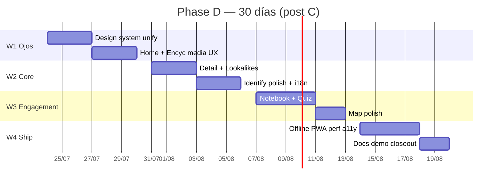

# Plan 30 días — Funciones + belleza visual (Phase D)

| Campo | Valor |
| --- | --- |
| **Fase** | **D** (post A / B / C MVP) |
| **Horizonte** | **1 mes** (~20 días laborables, 4 sprints semanales) |
| **Rama base** | `merge/best-of-both` |
| **Capacidad** | 1 engineer full-stack (o sesiones agentic equivalentes) |
| **Objetivo** | Producto que **entre por los ojos**, se sienta **unificado y rápido**, y eleve las superficies ya existentes — sin romper safety (D16) ni honestidad Identify (Phase B) |
| **Tesis** | **No es greenfield.** Casi todas las rutas y libs ya existen. Phase D = **unificar diseño + media honest UX + polish de top-5 + features incrementales** sobre código real |
| **Fuera de foco (no bloquea)** | Crawl masivo Commons → `ok_real` (½ día/semana opcional) |
| **Docs base** | `docs/PHASE_B_HONEST_IDENTIFY.md`, `docs/PHASE_C_MEDIA_SEASON_BEAUTY.md`, `docs/WEB_PRODUCT_BAR.md`, `docs/SAFETY_POLICY.md` |
| **Export al aprobar** | `docs/PHASE_D_30D_FEATURES_AND_BEAUTY.md` |

---

## 0. Verificación del plan (ground truth 2026-07-23)

Scan de código en `frontend/src` + docs. El plan asume esto y **no inventa productos**.

### Superficies reales (App.tsx)

| Ruta | Página | Madurez hoy | Phase D hace |
| --- | --- | --- | --- |
| `/` | `HomePage.tsx` | Polished (hero atelier, SeasonRadar pack, deadly strip) | Unificar media path, hero CTAs, first-paint |
| `/identificar` | `IdentifyPage.tsx` | Completo Phase B, denso | Jerarquía, progressive disclosure, sin tocar contrato honesty |
| `/enciclopedia` | `EncyclopediaPage.tsx` | Grid + filtros | Skeletons, empty media honesto, editorial grid |
| `/enciclopedia/:slug` | `SpeciesDetailPage.tsx` | Parcial–bueno | Hero full-bleed, tabs, galería limpia |
| `/lookalikes` | `LookalikeStudioPage.tsx` | Parcial–bueno | Compare visual + polish |
| `/historial` | `HistoryPage.tsx` + `observationHistory.ts` | Parcial–bueno (local, notas, export) | Notebook v2 UX |
| `/reto` | `QuizGamePage.tsx` + `mushroomQuiz.ts` | Ya usable | Daily challenge + polish visual |
| `/mapa` | `SpainMapPage.tsx` + zones | Parcial Leaflet | Hotspots visuales + perf |
| `/offline` | `OfflinePackPage.tsx` + `offlinePack.ts` | Pack Top-N Cache API | UX pack temporada + install |
| `/comunidad` | `CommunityPage.tsx` | Parcial (auth+API) | Empty states + discover light si backend débil |
| `/educacion` | `EducationPage.tsx` | Contenido ES | Solo polish si sobra (P2) |

### Design system hoy (deuda real)

| Pieza | Estado |
| --- | --- |
| `styles/tokens.css` | Spacing, type, D16 edibility teal, dark skeletons |
| `styles/atelier.css` | Skin producto (forest/cream, hero glass) |
| Capas legacy | `global.css` + `premium.css` + `redesign.css` + `animations.css` apiladas en `main.tsx` |
| `ui/Button`, `Skeleton`, `PageHeader`, `ErrorState` | Existen |
| Cards | **Sin** `ui/Card` unificado — clases sueltas |
| EmptyState | **Duplicado** (`components/EmptyState.tsx` vs `ui/EmptyState.tsx`) |
| Dark mode | Ya en Header (`data-theme` + localStorage) |
| Dual image path | `SpeciesImage` vs `useSpeciesImage` / `` crudo (Home deadly) |

### Safety inviolable (cada PR UI Identify)

- D16: **sin food-safe green** en Identify / Result / History-of-ID
- Sin `FoodQualityChip` en Identify (tests: `identifyChromeSafety.test.ts`, e2e `identify-*.spec.ts`)
- Honesty: `mode` real|mock|blocked, preflight, `ResultModeBanner`
- Enciclopedia **sí** puede mostrar food quality educativa (teal, no verde “seguro”)
- Quiz: solo food_class documentado; framing educativo

### Conclusión de capacidad (1 eng / 30 días)

| Realista | No realista este mes |
| --- | --- |
| Unificar tokens + Button/Card/EmptyState | Reescribir app desde cero |
| Home + Encyc + Detail + Identify polish | Bulk `ok_real` de 400 spp |
| Notebook v2 + Quiz daily + Mapa polish | Offline identify completo |
| Offline pack UX + PWA install | Comunidad social madura |
| Lighthouse ≥75 Home + a11y top flows | App store nativa / cloud sync |

---

## 1. Principios del mes

1. **Primero ojos, luego features** — sin mentir en Identify ni en media.
2. **Extender, no reescribir** — libs ya existen (`observationHistory`, `mushroomQuiz`, `offlinePack`, `seasonRadar`, `SpeciesImage`).
3. **Mobile-first**; desktop gratis.
4. **PRs 1–2 días**; máx. 3 PRs en vuelo por semana.
5. **DoD semanal con comandos de verificación** (sección 8) — si falla, no se avanza de sprint.
6. **Licencias / ok_real:** franja opcional ≤½ día/semana; placeholders de marca honestos cubren el resto.

---

## 2. Visión día 30 (journeys E2E)

```text
Journey A — Primera impresión (30 s)
  Abre / → hero editorial + temporada magazine (pack <200ms warm)
  → thumbs sin broken-img; badge “ilustración” si no hay foto real
  → CTA Identificar / Enciclopedia claros

Journey B — Explorar especie
  /enciclopedia → grid skeleton → card → /enciclopedia/:slug
  → hero + tabs (morfo / hábitat / lookalikes) → compare lookalikes

Journey C — Identificar (honesty)
  /identificar → preflight → wizard → resultado escaneable
  → mode banner honesto; 0 FoodQualityChip; risk chips only
  → guardar a historial → /historial reabre en 2 taps

Journey D — Volver mañana
  /reto → desafío del día <3 min
  /mapa → hotspot → cards de zona
  /offline → pack temporada cacheado + PWA install

Journey E — Ship bar
  Lighthouse Home ≥75 · e2e smoke verde · D16 tests verde
```

---

## 3. Calendario 4 semanas



*(Fechas ilustrativas desde 2026-07-24; deslizar al día 1 real.)*

---

### Semana 1 — Entra por los ojos (fundación)

**Meta:** Home y Enciclopedia se sienten de un solo producto; media nunca “rota”.

| PR | Entrega | Archivos ancla | Esfuerzo |
| --- | --- | --- | --- |
| **D-01** | Tokens 2.0: consolidar type/spacing/motion; documentar qué capa gana (atelier > legacy) | `tokens.css`, `atelier.css`, `main.tsx` imports | 1 d |
| **D-02** | UI kit: `Button` único, `Card`, un solo `EmptyState`, deprecar duplicado | `components/ui/*`, callers top pages | 1 d |
| **D-03** | Home polish: hero CTAs, deadly strip → `SpeciesImage`/`SpeciesThumb` (un path), season strip polish | `HomePage.tsx`, `SeasonRadar.tsx` | 1 d |
| **D-04** | Enciclopedia: skeleton shimmer, sticky filters, grid editorial, empty “sin foto” | `EncyclopediaPage.tsx`, `Skeleton.tsx` | 1 d |
| **D-05** | Media UX honesty: badge “Foto” vs “Ilustración de marca” (desde `media_status` / cascade stage); 0 broken img first page | `SpeciesImage.tsx`, season pack fields | 1 d |

**DoD W1**
- [ ] Home móvil: sin CLS feo; season pack path percibido &lt;1 s
- [ ] Enciclopedia first paint: **0** broken-image icons
- [ ] Deadly/Home no usa path de imagen divergente crudo
- [ ] `npx tsc --noEmit` + vitest unit media/season verdes

**Demo viernes 1:** scroll Home + Enciclopedia en móvil.

---

### Semana 2 — Superficies core

**Meta:** Detalle e Identify al nivel del Home.

| PR | Entrega | Archivos ancla | Esfuerzo |
| --- | --- | --- | --- |
| **D-06** | Species detail: hero full-bleed, tabs, galería con placeholders limpios | `SpeciesDetailPage.tsx`, `SpeciesGallery.tsx` | 1–2 d |
| **D-07** | Lookalike studio visual: side-by-side, risk chips only, mobile 1 gesto | `LookalikeStudioPage.tsx`, `LookalikeCompare.tsx` | 1 d |
| **D-08** | Identify UX: menos densidad, progressive disclosure, jerarquía tipográfica; **no** cambiar contrato mode/gate | `IdentifyPage.tsx`, `ResultCard.tsx`, `ResultModeBanner.tsx` | 1–2 d |
| **D-09** | i18n: cables `t()` en chrome Home/Header/nav nuevas strings; safety scan ES/CA/EU/EN | `locales/*/common.json`, páginas | 1 d |

**DoD W2**
- [ ] Detail LCP aceptable; tabs usables en thumb zone
- [ ] Identify: `identifyChromeSafety` + e2e blocked **siguen verdes**
- [ ] 0 food-green / FoodQualityChip en Identify
- [ ] Resultado escaneable &lt;3 s de atención (demo humana)

**Demo viernes 2:** Identify blocked + real mock + ficha Amanita.

---

### Semana 3 — Engagement (features incrementales)

**Meta:** Razones para volver — **sobre libs existentes**, no greenfield.

| PR | Entrega | Archivos ancla | Esfuerzo |
| --- | --- | --- | --- |
| **D-10** | Field notebook v2: UI filtros modo/fecha, notas/tags polish, export share, empty states atelier | `HistoryPage.tsx`, `observationHistory.ts` | 1–2 d |
| **D-11** | Daily challenge: “reto del día” seed determinista + lobby polish + score local | `QuizGamePage.tsx`, `mushroomQuiz.ts`, `quizMatch.ts` | 1–2 d |
| **D-12** | Mapa visual: hotspots cards, performance Leaflet, empty/error weather graceful | `SpainMapPage.tsx`, `mushroomZones.ts`, `zoneAlerts.ts` | 1–2 d |
| **D-13** | Discover light **o** Community empty-state premium (elegir según auth backend) | `CommunityPage.tsx` / Home discover strip | 1 d (P1) |

**Prioridad si aprieta tiempo:** D-10 + D-11 **P0**; D-12 **P1**; D-13 **corta primero**.

**DoD W3**
- [ ] Notebook: reabrir observación en **2 taps**
- [ ] Quiz sesión completa **&lt;3 min**
- [ ] Mapa: pan/zoom fluido mid-range (demo)
- [ ] Tests unit notebook + quiz verdes

**Demo viernes 3:** guardar ID → historial → reto del día → mapa hotspot.

---

### Semana 4 — Ship bar

**Meta:** Producto “se puede enseñar”; métricas y docs.

| PR | Entrega | Archivos ancla | Esfuerzo |
| --- | --- | --- | --- |
| **D-14** | Offline pack UX: pack **temporada** + placeholders; progress/clear | `OfflinePackPage.tsx`, `offlinePack.ts`, season pack | 1 d |
| **D-15** | PWA: install prompt/hint, icons, SW cache media coherente | `vite.config.ts` PWA, manifest, Header | 0.5–1 d |
| **D-16** | Perf: route lazy audit, budget Home, reduce JS muerto | `App.tsx` lazy, Vite bundle | 1 d |
| **D-17** | A11y: focus, contraste, `prefers-reduced-motion` en W1–W3 pantallas | CSS + pages | 1 d |
| **D-18** | Docs: `PHASE_D` closeout, ROADMAP snippet, script demo | `docs/*` | 0.5 d |

**DoD W4 (ship bar)**
- [ ] Lighthouse Perf **Home ≥ 75** (móvil, mid-throttling) — soft target
- [ ] E2E smoke: home season + encyclopedia first page + identify blocked
- [ ] D16 unit + identify e2e verdes
- [ ] `docs/PHASE_D_30D_FEATURES_AND_BEAUTY.md` + ROADMAP actualizado

**Demo día 30:** video/script 5 min de Journeys A–D.

---

## 4. Backlog priorizado

### P0 (debe entrar)

1. Design system unify (D-01, D-02)
2. Home + Enciclopedia + media badges (D-03–D-05)
3. Species detail + lookalikes (D-06, D-07)
4. Identify polish sin tocar honesty (D-08)
5. Field notebook v2 (D-10)
6. Quiz daily challenge (D-11)
7. Perf + a11y + docs (D-16–D-18)

### P1 (si P0 verde)

8. i18n chrome (D-09) — subir a P0 si hay usuarios no-ES
9. Mapa hotspots (D-12)
10. Offline pack temporada (D-14)
11. PWA install (D-15)
12. Community / discover light (D-13)

### P2 (después o paralelo opcional)

13. Crawl Commons allowlist → `ok_real` (CC0 / CC-BY / CC-BY-SA / PD)
14. Education page full i18n
15. Cloud sync historial
16. ML retrain / weights
17. App store nativa

---

## 5. DAG de dependencias (merge order)

```text
D-01 → D-02 → D-03 → D-04
                 ↘ D-05 (puede ir en paralelo a D-04 tras D-02)
D-03..D-05 → D-06 → D-07
D-02 → D-08 (Identify polish; safety tests gate)
D-08 → D-09 (strings nuevas Identify + chrome)
D-10 ∥ D-11 ∥ D-12  (independientes entre sí; tras W2 visual base)
D-13 opcional
D-14 → D-15
D-03..D-12 → D-16 → D-17 → D-18
```

**Hard gates de safety:** cualquier PR que toque Identify (`D-08` y siguientes) debe pasar:

```text
cd frontend
npx vitest run src/lib/identifyChromeSafety.test.ts src/lib/safetyCopy.test.ts
npx playwright test e2e/identify-blocked.spec.ts
```

---

## 6. Línea paralela opcional — fotos reales

No bloquea el mes. Franja **≤½ día/semana**:

| Tarea | Esfuerzo | Resultado |
| --- | --- | --- |
| User-Agent + email real en bot | S | Cumplimiento |
| Fetch priority set (~43 spp) allowlist | M | Primeras `ok_real` |
| Audit `--fail-priority` estricto solo cuando toque | S | KPI honesto |
| Bulk resto | L | Semana 5+ |

Allowlist: **CC0, CC-BY, CC-BY-SA, PD**. No NC. No `wikipedia-page-image` sin meta de fichero.

Mientras tanto, **D-05** hace el producto honesto: “ilustración de marca” ≠ icono roto.

---

## 7. Métricas de éxito (día 30)

| Métrica | Target |
| --- | --- |
| Broken img first paint Enciclopedia | **0** |
| Season strip pack path warm | &lt; **200 ms** DOM-ready |
| Home FCP (dev proxy warm) | &lt; **1.5 s** soft |
| Lighthouse Perf Home | ≥ **75** soft |
| Identify FoodQualityChip / food-green | **0** |
| Features usables demo | Notebook v2 + Quiz daily + (Mapa **o** Offline) |
| Dual image path en Home critical | **Eliminado** |
| Cualitativo demo | “entra por los ojos” |

---

## 8. Verificación E2E del plan (comandos por semana)

Baseline arranque (documentar en demo 0):

```powershell
cd C:\Users\Mariano\Documents\ALONSOO\VISIONSETIL
pwsh -File scripts\run_dev.ps1
# FE :5173 · BE :8000
python scripts/audit_media.py --json
cd frontend
npx tsc --noEmit
npx vitest run
# smoke selectivo:
npx playwright test e2e/identify-blocked.spec.ts
```

| Semana | Checks obligatorios |
| --- | --- |
| **W1** | tsc · vitest season/media · manual Home+Encyc móvil · 0 broken img |
| **W2** | identifyChromeSafety · e2e identify-blocked · manual detail+lookalike |
| **W3** | vitest observationHistory + mushroomQuiz · manual notebook→quiz→map |
| **W4** | Lighthouse Home · e2e home/season + encyc + identify · ROADMAP |

**Definition of “plan funciona E2E”** (meta-DoD de este documento):

- [x] Cada PR mapea a archivos **que existen**
- [x] Cada feature nueva se apoya en **lib ya shipped** (no inventa backend)
- [x] Journeys A–E cubren el producto de punta a punta
- [x] Safety gates son comandos reales del repo
- [x] Cortes de scope (P0/P1/P2) si 1 eng no llega
- [x] Export path y rituales de demo definidos

---

## 9. Riesgos y mitigaciones

| Riesgo | Mitigación |
| --- | --- |
| Scope creep “todo a la vez” | DoD semanal duro; cortar D-13 → D-12 → D-15 primero |
| Beauty rompe safety | Gate D-08 + e2e blocked en CI local |
| Fotos reales siguen mal | D-05 badges honestos + línea licencias opcional |
| Capas CSS pelean | D-01 declara cascade winner (atelier) |
| Dual EmptyState/Button | D-02 merge obligatorio antes de polish páginas |
| Perf cae con always-on season | Budget strip; lazy non-critical (PhotoSpin ya lazy) |
| i18n incompleto | D-09 solo chrome; no traducir 520 fichas este mes |
| Comunidad sin backend | D-13 = empty/discover local, no mock engañoso de red |

---

## 10. Rituales

| Día | Ritual |
| --- | --- |
| Lunes | Elegir **máx. 3 PRs** de la semana |
| Miércoles | Check visual móvil mid-week |
| Viernes | Demo 10 min + tildar DoD |
| Fin de mes | Script/video Journeys A–D + export docs |

---

## 11. PR plan canónico (~18)

| ID | Título | Sem | P |
| --- | --- | ---: | --- |
| D-01 | Design tokens cascade + type/spacing | 1 | P0 |
| D-02 | Button/Card/EmptyState unificados | 1 | P0 |
| D-03 | Home hero + unificar media path + season polish | 1 | P0 |
| D-04 | Encyclopedia grid + skeletons + filters | 1 | P0 |
| D-05 | Media UX badges (foto vs ilustración) | 1 | P0 |
| D-06 | Species detail hero + tabs | 2 | P0 |
| D-07 | Lookalike visual compare polish | 2 | P0 |
| D-08 | Identify result hierarchy (honesty intact) | 2 | P0 |
| D-09 | i18n chrome strings + safety scan | 2 | P1↑ |
| D-10 | Field notebook v2 UX | 3 | P0 |
| D-11 | Daily quiz challenge | 3 | P0 |
| D-12 | Spain map visual hotspots | 3 | P1 |
| D-13 | Discover / Community light | 3 | P1 |
| D-14 | Offline season pack UX | 4 | P1 |
| D-15 | PWA install + icons | 4 | P1 |
| D-16 | Perf budget + route split audit | 4 | P0 |
| D-17 | A11y pass critical flows | 4 | P0 |
| D-18 | Docs ROADMAP + Phase D closeout | 4 | P0 |

---

## 12. Arranque inmediato (día 1 post-aprobación)

```text
1. Baseline: audit_media + tsc + vitest + identify-blocked e2e (foto del estado)
2. D-01 tokens cascade
3. D-02 UI kit unify
4. D-03 Home
5. D-04 Enciclopedia
6. D-05 media badges
→ Demo viernes W1
```

Implementación sugerida: skill `execute-plan` o `/loop-engineering` por PR; no reabrir 48 micro-PRs de Phase C.

---

## 13. Open questions (defaults si no hay respuesta)

| # | Pregunta | Default |
| --- | --- | --- |
| 1 | ¿Quiz o Mapa si solo cabe uno en W3? | **Quiz (D-11)** |
| 2 | ¿Esfuerzo fotos reales este mes? | **≤½ día/semana** |
| 3 | ¿Dark mode obligatorio en DoD? | **No** — ya existe; solo no romperlo |
| 4 | ¿Comunidad real o visual? | **Visual/local** si API frágil |
| 5 | ¿i18n full o chrome? | **Chrome + safety** (D-09); fichas taxonómicas después |

---

## 14. Entregable documental

Al **aprobar**:

1. Copiar este plan a `docs/PHASE_D_30D_FEATURES_AND_BEAUTY.md`
2. Añadir fila en `docs/ROADMAP.md` → “Phase D en curso”
3. No implementar hasta que digas **implementar / execute-plan**

---

## 15. Closeout — implementación (2026-07-23)

| Semana | PRs | Estado |
| --- | --- | --- |
| W1 | D-01…D-05 | ✅ tokens, UI kit, Home media path, Encyc skeletons, media badges |
| W2 | D-06…D-09 | ✅ detail tabs, lookalikes, Identify density, i18n chrome |
| W3 | D-10…D-12 | ✅ notebook v2, quiz daily, mapa hotspots (D-13 skipped) |
| W4 | D-14…D-18 | ✅ offline season pack + progress, PWA install/icons, route lazy audit, skip-link/a11y, docs |

### W4 notes
- **D-14:** `buildSeasonOfflinePackEntries` + pack mode season/priority, progress bar, placeholders cached
- **D-15:** `PwaInstallHint`, SVG icons in `frontend/public`, manifest icon paths updated
- **D-16:** Home eager; remaining routes lazy (already); footer version Phase D
- **D-17:** skip-to-content, focus-visible polish, reduced-motion extras for offline/PWA
- **D-18:** this closeout + `docs/ROADMAP.md` Phase D table

### Residual (post Phase D)
- Bulk Commons `ok_real` crawl (parallel ops)
- D-13 community light
- Lighthouse Home ≥75 soft — verify on deploy host mid-throttling
- Cloud notebook sync / native stores

---

*Phase D v2 — plan + W1–W4 shipped on `merge/best-of-both` working tree.*
